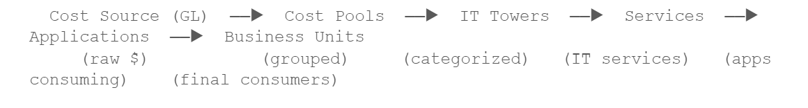
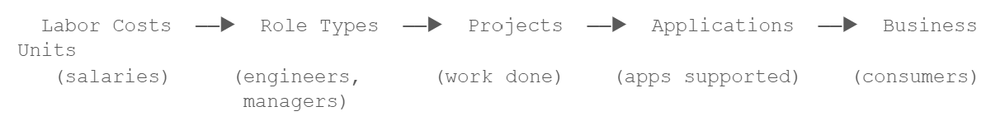
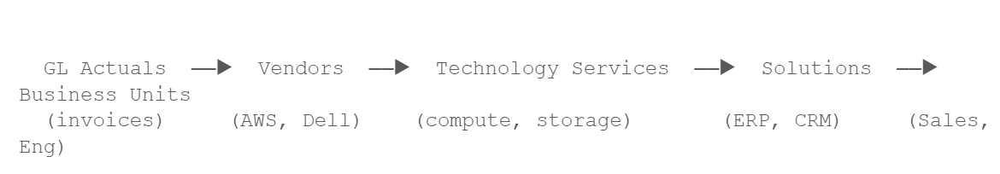

# Objetos y relaciones del modelo

## ¿Qué es un objeto modelo?

Un objeto de modelo es el componente básico de un modelo de costes. Piensa en ello como un contenedor que alberga datos de costes en un nivel concreto de la estructura de costes de tu organización.

Cada objeto de modelo cuenta con una tabla de transformación en « Data Studio ». La tabla de transformación proporciona los datos sin procesar (filas con registros de costes, información de proveedores, detalles de las solicitudes, etc.), y el objeto modelo define cómo participan esos datos en el motor de asignación. Añadir un paso de modelo a un flujo de transformación de tablas es lo que lo convierte en un objeto de modelo.

Nota:

**Concepto clave: Los objetos como contenedores**

Un objeto de modelo no almacena los costes de forma independiente. Hace referencia a una tabla de transformación y le añade un comportamiento de asignación. La tabla de transformación es la «fuente»; el objeto modelo es la «función» que desempeñan los datos en el flujo de costes.

**Propiedades clave de un objeto modelo:**

- **Nombre:** una etiqueta descriptiva (por ejemplo, «Fuente de costes», «Proveedores», «Unidades de negocio»)
- **Fuente de datos:** la tabla de transformación que proporciona los datos subyacentes
- **Métricas:** Las métricas modeladas en las que participa (coste, presupuesto, previsión, etc.)
- **Factores:** factores de unidad o de asignación que alimentan el objeto
- **Asignaciones:** Reglas que distribuyen los costes a otros objetos posteriores
- **Descripción:** Documentación sobre la finalidad y el uso previsto del objeto

## Tipos de objetos por función

Aunque TBM Studio no impone etiquetas de «tipo» rígidas a los objetos del modelo, estos se clasifican de forma natural en tres categorías según su posición en el flujo de costes:

|  |  |  |
| --- | --- | --- |
| **Función del objeto** | **Descripción** | **Ejemplo** |
| Objetos de origen | De dónde proceden los costes. Estas se sitúan en la base del modelo y reciben datos directamente del libro mayor, la facturación u otras fuentes financieras. | Fuente de costes, datos reales del libro mayor |
| Objetos intermedios | Puntos de referencia o rutas de asignación de costes. Los costes pasan por estos objetos en su camino hacia su destino final. Añaden un nivel de categorización o agrupación. | Proveedores, mano de obra, centros de TI, servicios tecnológicos |
| Objetos de destino | Destinos de coste final. Estas entidades son las que, en última instancia, «asumen» los costes a efectos de presentación de informes y de reembolso. | Unidades de negocio, aplicaciones, soluciones |

Un mismo objeto puede ser tanto un destino (que recibe costes de las fases anteriores) como una fuente (que asigna costes a las fases posteriores). Por ejemplo, el objeto «Proveedores» recibe los costes de «Fuente de costes» y, a continuación, los distribuye a «Servicios tecnológicos». Esta doble función es la que permite las cadenas de asignación de varios niveles.

## Relaciones entre objetos

Los objetos del modelo se conectan mediante asignaciones. Cuando se crea una asignación del objeto A al objeto B, se establece una relación que indica: «Parte o la totalidad de los costes de A deben transferirse a B, distribuidos según unas reglas específicas»

**Características de la relación:**

- **Dirección:** Los costes siempre fluyen de la fuente al destino, es decir, del objeto «De» al objeto «A». El gráfico del modelo no debe contener ciclos (dependencias circulares).
- **Uno a muchos:** un único objeto de origen puede asignarse a varios objetos de destino. Por ejemplo, una fuente de costes puede asignarse simultáneamente a mano de obra, proveedores e instalaciones.
- **Muchos a uno:** varios objetos de origen pueden asignarse al mismo destino. Tanto los proveedores como el personal podrían imputar costes a los servicios tecnológicos.
- **Navegabilidad:** En el Modelador de objetos individuales, al hacer clic en un objeto de destino se accede a la configuración de dicho objeto, lo que permite seguir la cadena de asignación de forma interactiva.

## Jerarquía de modelos

Un modelo bien diseñado organiza los objetos en una jerarquía que refleja la estructura de costes de tu organización. El motor de asignación de TBM Studio procesa esta jerarquía de abajo hacia arriba, distribuyendo los costes desde los objetos de origen a través de capas intermedias hasta los destinos finales.

**Patrones jerárquicos típicos**

**Modelo 1: Flujo completo de la taxonomía TBM**

**Modelo 2: Flujo de costes laborales**

**Modelo 3: Flujo de costes de infraestructura**

Nota:

**Buenas prácticas: Diseño de jerarquías**

Intenta que tu jerarquía sea lo menos profunda posible. Cada nivel adicional aumenta la complejidad y puede dificultar el seguimiento de los costes. La mayoría de las organizaciones utilizan entre tres y cinco niveles. Empieza por lo básico y añade capas intermedias solo cuando aporten información relevante.

Asegúrate de que la granularidad sea coherente dentro de cada objeto. Si una fila del objeto «Proveedor» representa a un único proveedor, todas las filas deben representar a proveedores individuales; no mezcles datos a nivel de proveedor y a nivel de factura en el mismo objeto.
