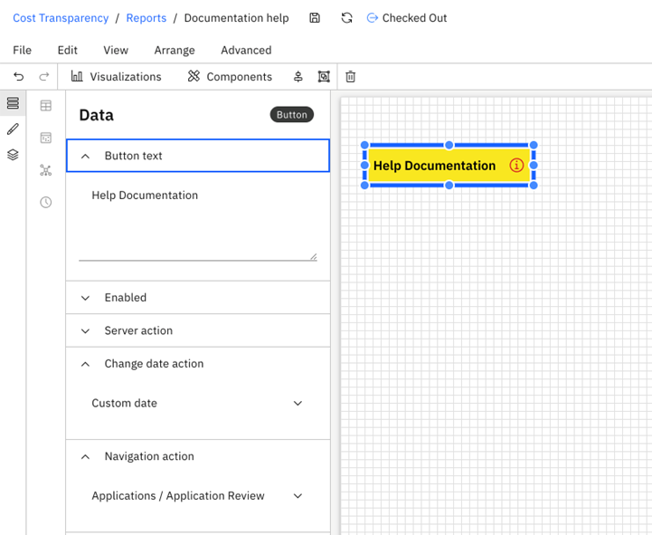
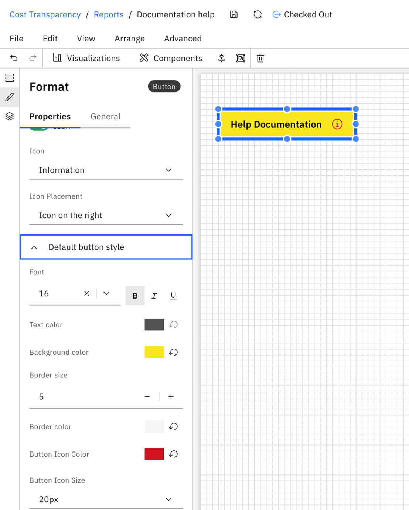

# Componente de botón

El componente «Botón» permite a los usuarios activar acciones directamente desde un informe, lo que facilita flujos de trabajo interactivos y dinámicos. Los botones se pueden configurar para realizar tareas como ir a otro informe, ejecutar scripts o actualizar el contexto del informe (por ejemplo, cambiar la fecha).

## Cuándo utilizar botones

Utiliza los botones cuando quieras:

- Permitir a los usuarios navegar entre informes
- Activar acciones o scripts predefinidos
- Ofrece interacciones rápidas sin necesidad de recurrir a filtros ni menús
- Simplifica los flujos de trabajo incluyendo elementos claros que inciten a la acción

## Añadir un botón a un informe

Para añadir un botón a tu informe:

1. Abre el informe en el editor.
2. En el panel «Componentes» de la barra de herramientas, arrastra y suelta el botón en el lienzo.
3. Selecciona el botón para configurar sus propiedades mediante los paneles «Datos» y «Formato».

**Ejemplo**

**Panel de datos de botones**

Utiliza el panel «Datos» para definir el comportamiento del botón:

- **Texto del botón** : configura el texto que se muestra en el botón.
- **Habilitado** : por defecto, el botón está habilitado. Puedes definir una regla de habilitación para desactivar el botón de forma condicional.
- **Acción del servidor** : adjunta un script del lado del servidor que se ejecute al hacer clic en el botón.
- **Acción «Cambiar fecha** »: configura una fecha concreta para que, al hacer clic en el botón, el informe se actualice a esa fecha.
- **Acción de navegación** : selecciona el informe de destino al que se accederá al hacer clic en el botón.

**Panel de formato**

**Pestaña «Propiedades»**

Personaliza el aspecto y la disposición del botón:

- **Alternar icono**
- Activa esta opción para incluir un icono.
  - Icono predeterminado: Icono de información
  - Selecciona uno de los iconos disponibles en la lista desplegable
  - Establecer la ubicación del icono: a la izquierda o a la derecha
- **Estilo predeterminado del botón**
- Personaliza el aspecto del botón en su estado predeterminado:
  - Font
  - Color de texto
  - Color de fondo
  - Tamaño y color del borde
  - Color y tamaño del icono
- **Estilo del botón al pasar el cursor por encima**
- Define cómo se muestra el botón al pasar el cursor por encima, incluyendo las mismas opciones de estilo que el estado predeterminado.

**Pestaña «General»**

- **Alt text**
- Añade un texto descriptivo para facilitar la accesibilidad.
- **Ubicación y tamaño**
- Ajusta la posición y las dimensiones en el lienzo.
- **Estilo**
  - Relleno (incluidos los ajustes por cada lado)
  - Radio de las esquinas redondeadas

El componente «Botón» mejora la interactividad de los informes al permitir a los usuarios realizar acciones directas. Gracias a su configuración flexible en cuanto a comportamiento y estilo, se puede adaptar para dar respuesta a una amplia variedad de casos de uso —desde la navegación hasta la automatización— sin dejar de ofrecer una experiencia de usuario coherente.
