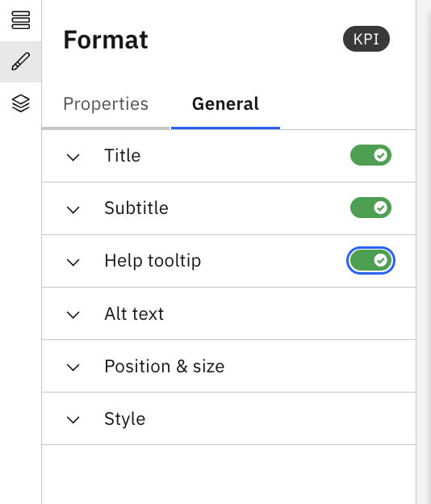

# Descripción general de los componentes

Los componentes son los elementos básicos que se utilizan para estructurar los informes y permitir la interacción con los datos en Report Studio. Permiten a los administradores presentar datos, aplicar filtros y guiar a los usuarios en la exploración de los informes.

Se pueden añadir componentes al lienzo del informe y configurarlos utilizando propiedades como la selección de datos, los filtros y el formato.

## Qué se puede hacer con los componentes

Con los componentes, puedes:

- Mostrar datos en formatos estructurados, como tablas e indicadores clave de rendimiento (KPI)
- Habilita la interacción mediante segmentadores, filtros y selectores
- Organice el contenido del informe utilizando componentes de diseño como pestañas y grupos
- Añadir contenido contextual o explicativo utilizando texto o HTML

## Propiedades comunes de los componentes

Todos los componentes comparten un conjunto común de propiedades, que se documentan una sola vez y se consultan desde las páginas de cada componente.

Propiedades generales en el panel Formato

|  |  |
| --- | --- |
| Título | Deslice el interruptor si desea añadir un título al componente. Si es así, puedes editar lo siguiente:  - Título - Tamaño y estilo de la fuente (negrita, cursiva, subrayado) - Color del texto del título (con opción para restablecer el color) |
| Subtítulo | Deslice el interruptor si desea añadir un subtítulo al componente. Si es así, puedes editar lo siguiente:  - Subtítulo - Tamaño y estilo de la fuente (negrita, cursiva, subrayado) - Color del texto del subtítulo (con opción para restablecer el color) |
| Ayuda con la información sobre herramientas | Proporciona una información sobre herramientas para el componente. Al proporcionar esta información sobre herramientas, aparecerá el icono de ayuda junto al componente. |
| Alt text | Proporcione el texto alternativo, que es el texto descriptivo de las imágenes y gráficos de la interfaz de usuario, ofreciendo una alternativa textual para los usuarios que utilizan lectores de pantalla o en caso de que la imagen no se cargue. |
| Posición y tamaño | Edite las siguientes propiedades, según sea necesario:  - Ancho - Altura - Posición (ejes x e y) |
| Estilo | Edite las siguientes propiedades, según sea necesario:  - Color de texto - Color de fondo - Color de borde - Tamaño del borde |

