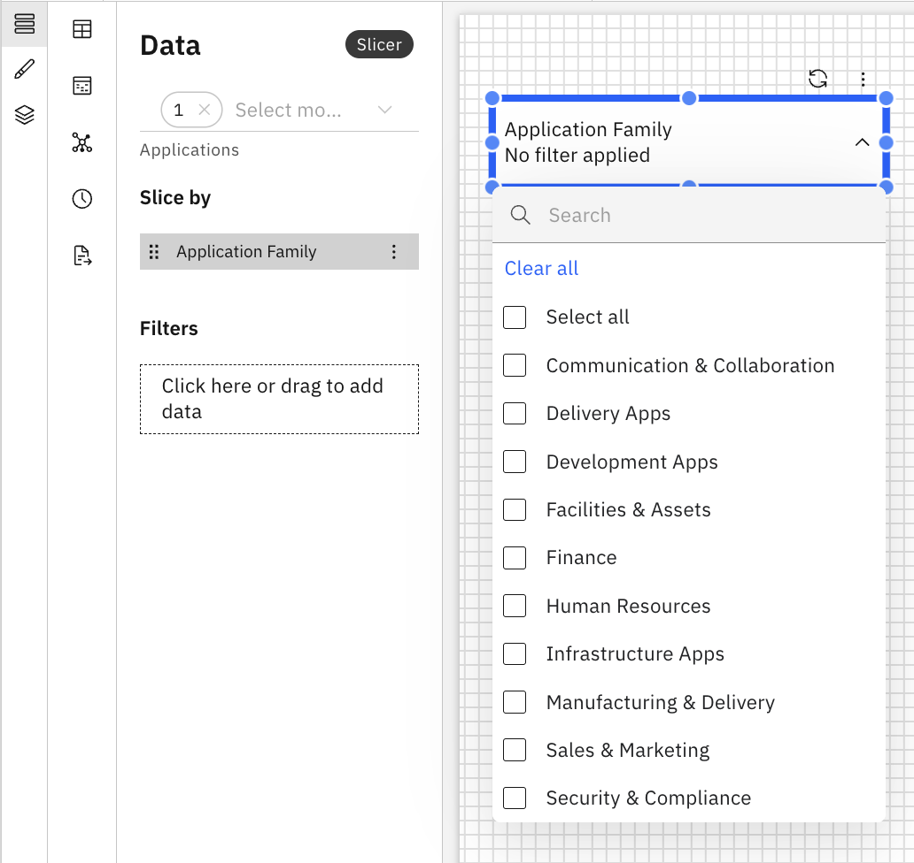

# Creador de secciones

Un Slicer permite a los usuarios filtrar datos de forma interactiva en un informe seleccionando uno o más valores de una dimensión. Los segmentadores aplican sus selecciones a todos los componentes y visualizaciones compatibles del informe, lo que permite realizar análisis específicos sin modificar la estructura del informe. Los cortadores también se pueden utilizar en tablas editables.

## Cuándo utilizar un cortador

Utilice un cortador cuando desee:

- Filtrar un informe por una sola dimensión (por ejemplo, familia de aplicaciones, región, centro de costes o tiempo)
- Cambia rápidamente el contexto de los datos

## Añadir un filtro al informe

1. Añadir un cortador desde el panel Componentes de la barra de herramientas
2. Haga clic en el Slicer para habilitar los paneles Datos y Formato.
3. Panel de datos
   1. Seleccione el objeto modelo de la lista desplegable
   2. Arrastre una dimensión desde el Explorador de dimensiones al campo Cortar por. Esto define la dimensión que controla el segmentador.
   3. Añade uno o más filtros para restringir las opciones del segmentador. Esto resulta útil cuando se desea mostrar a los usuarios un subconjunto controlado de valores.
4. Panel de formato
   1. Propiedades generales: consulte [Propiedades de los componentes.](components.html#abt-comp__comprop)
   2. Propiedades específicas del cortador
      1. Búsqueda
         1. Contiene - Busca todos los valores que incluyen los caracteres introducidos.
         2. Empieza por - Busca todos los valores que empiezan por los caracteres introducidos.
      2. Tipo de cortadora
         - Menú desplegable
           - Muestra los valores del cortador en una lista desplegable compacta.
           - Adecuado cuando hay muchos valores de corte.
           - Expanda la lista para realizar una selección.
         - Lista vertical
           - Muestra los valores del cortador como una lista visible.
           - Muestra todos los valores de un vistazo.
           - Permite una selección más rápida sin necesidad de expandir un menú.
      3. Ordenar
         1. ABC/123
         2. Estado
      4. Opciones rápidas de tamaño
         1. Grande, mediano, pequeño

Ejemplo: Cortador

Slicer admite fórmulas personalizadas y dimensiones de fórmulas. Para obtener más información, consulte [Fórmulas personalizadas.](../create-first/custom-formula.html "Las fórmulas personalizadas (también denominadas dimensiones de fórmula) le permiten definir nuevas dimensiones calculadas utilizando campos existentes en su modelo de datos. Esto permite realizar análisis más profundos y obtener información más detallada sin necesidad de realizar cambios en el conjunto de datos o el esquema subyacentes.")
