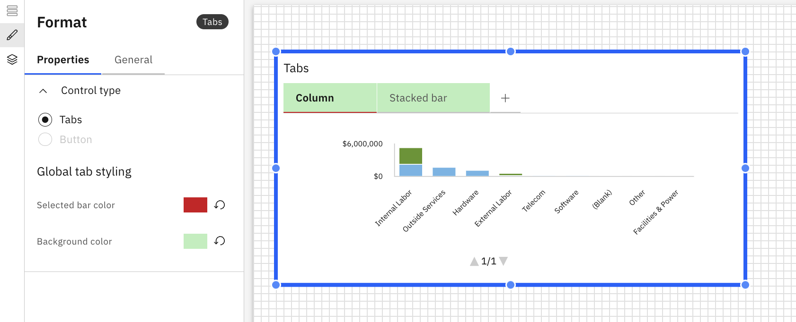

# Tabuladores

El componente Pestañas le permite organizar el contenido de los informes en varias pestañas dentro de un mismo informe. Cada pestaña puede contener su propio diseño de componentes y visualizaciones, lo que ayuda a estructurar informes complejos en secciones claras y navegables.

## Cuándo usar pestañas

Utilice pestañas cuando desee:

- Divida un informe extenso o complejo en secciones lógicas
- Separar diferentes vistas de análisis
- Reducir el desplazamiento y mejorar la legibilidad de los informes
- Presente múltiples perspectivas sin crear múltiples informes

## Añadir pestañas a un informe

1. Añadir pestañas desde el panel Componentes de la barra de herramientas
2. Haga clic en las pestañas para habilitar los paneles de formato.
3. Panel de formato
   1. Propiedades generales: consulte Propiedades de los componentes
   2. Propiedades específicas de la pestaña
      1. Tipo de control: elige entre pestañas y botones (próximamente)
      2. Estilo de la pestaña Global
         1. Selecciona el color de la barra de pestañas
         2. Selecciona el color de fondo de la pestaña

Ejemplo: Pestañas

- **[Reglas de visibilidad de las pestañas](../../../studio/report-studio/components/tab-visible.html)**
