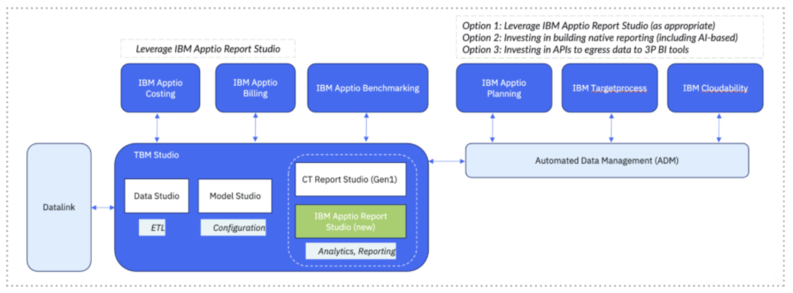

# Solución de problemas y preguntas frecuentes

## Preguntas frecuentes generales

**¿Cuál es el contexto?**

- CT Report Studio (uno de los componentes de TBM Studio) necesita «modernizarse» para ofrecer una experiencia de usuario sencilla y fácil.
- El objetivo de este proyecto de modernización es aliviar las dificultades que experimentan nuestros usuarios a la hora de aprender a utilizar la herramienta, navegar por ella y extraer información útil de los datos que presenta.

**¿A qué retos se refiere esto?**

- Simplifica la incorporación y el TTV
- Mejora los tiempos de incorporación de administradores y usuarios finales al proporcionar una plataforma inteligente e intuitiva que se anticipa a las necesidades de los usuarios, presentando automáticamente las herramientas y opciones de configuración esenciales en función de sus acciones inmediatas
- Reduce el número de clics y guía la generación de informes
- Permite crear informes más rápidamente; genera informes pulidos y coherentes con menos esfuerzo
- Utiliza una biblioteca diversa de componentes visuales para comunicar información y conocimientos de forma rápida y eficaz

**¿Por qué no se ha implementado el modelo o el sistema de gestión de la calidad ( Data Studio ) y cuándo se implementará?**

Dada la necesidad de abordar los aspectos más críticos de los puntos débiles actuales de nuestros usuarios, se ha dado prioridad a las capacidades de Report Studio y End User. Implementaremos una experiencia fluida tanto para Model como para Data Studio en las próximas fases.

**¿Qué no es compatible con el nuevo Report Studio?**

- Perspectivas: la funcionalidad será sustituida por fórmulas publicadas
- Cortadores globales: la funcionalidad será sustituida por la función Vistas guardadas.
- Tablas heredadas en tablas y tablas editables
- Tablas editables: funciones «Establecer todas las filas en» y «Añadir fila al cuadro de diálogo»
- Fecha de inicio del informe
- Actualizar configuración: opción para configurar la actualización manual o automática cada 3 segundos
- Componente Notas: anteriormente permitía a los usuarios crear notas en los informes y controlar la visibilidad (por ejemplo, «Solo yo» o roles específicos).
- Planos: creación de informes basados en plantillas

## Preguntas frecuentes sobre informes

**¿Por qué mi informe tarda más en cargarse en el nuevo Report Studio?**

Durante la vista previa pública, los informes de V2 no se calculan previamente. Esto significa que el sistema recupera y procesa los datos bajo demanda cada vez que se abre o actualiza un informe. Como resultado, es posible que experimente tiempos de carga más lentos en comparación con la experiencia clásica.
