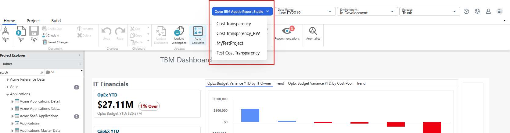
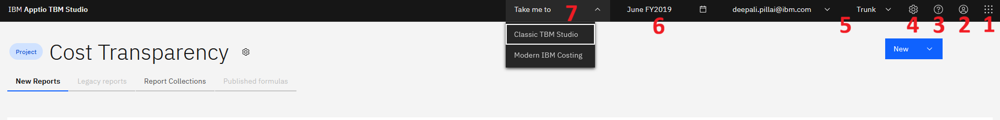

# Guía para la navegación por el nuevo Report Studio

Para acceder al nuevo Report Studio, vaya al Classic TBM Studio en su entorno principal.

**Busca el botón azul «Abrir IBM Apptio Report Studio»:** una vez que tu instancia se haya actualizado a 12.11.21 o una versión superior, verás un botón azul en la parte superior de tu Report Studio actual. Al hacer clic aquí, se abrirá una lista de proyectos disponibles.

Nota: Los clientes que utilicen las versiones 12.11.19 deben estar inscritos en la versión preliminar pública para que les aparezca el botón azul.

**Seleccione un proyecto para abrirlo en el nuevo estudio de informes** : elija un proyecto en el menú desplegable para iniciarlo automáticamente en la nueva experiencia.

El nuevo Report Studio se abre en la página de inicio, como se muestra a continuación.

**Inicio de informes**

1. Nuevo botón: haga clic aquí para crear un nuevo informe o una nueva colección de informes
2. Buscar: buscar un informe existente
3. Nuevos informes: muestra todos los informes creados con el nuevo Report Studio.
4. Colecciones de informes: muestra grupos de informes relacionados organizados en colecciones.
5. Menú desbordamiento de informes (menú de 3 puntos): haga clic aquí para acceder a una serie de operaciones que se pueden realizar en un informe, como eliminarlo o exportar su definición y configuración.
6. Configuración del proyecto: haga clic aquí para registrar uno o varios informes, revertir los cambios realizados en ellos o importar una configuración de informe al proyecto en contexto.

**Panel de navegación**

1. Selector de aplicaciones: utilícelo para cambiar a otro IBMApptio producto
2. Configuración del perfil: utilice esta opción para gestionar su perfil, suplantar a otro usuario (nota: los administradores pueden querer hacer esto para comprobar los permisos de un usuario o para solucionar problemas) y cerrar la sesión
3. Ayuda: utilice esta opción para acceder a la nueva documentación de ayuda de Report Studio
4. Configuración: utilice esta opción para cambiar el acceso de los clientes, actualizar los permisos y acceder a la configuración de múltiples divisas
5. Menú desplegable Entorno: utilícelo para cambiar entre los entornos y los espacios de trabajo de los usuarios.
6. Selector de fecha: utilícelo para cambiar entre períodos de fechas
7. Llevame a: utilice este menú de navegación rápida para cambiar al estudio TBM clásico o al nuevo visor de informes.
