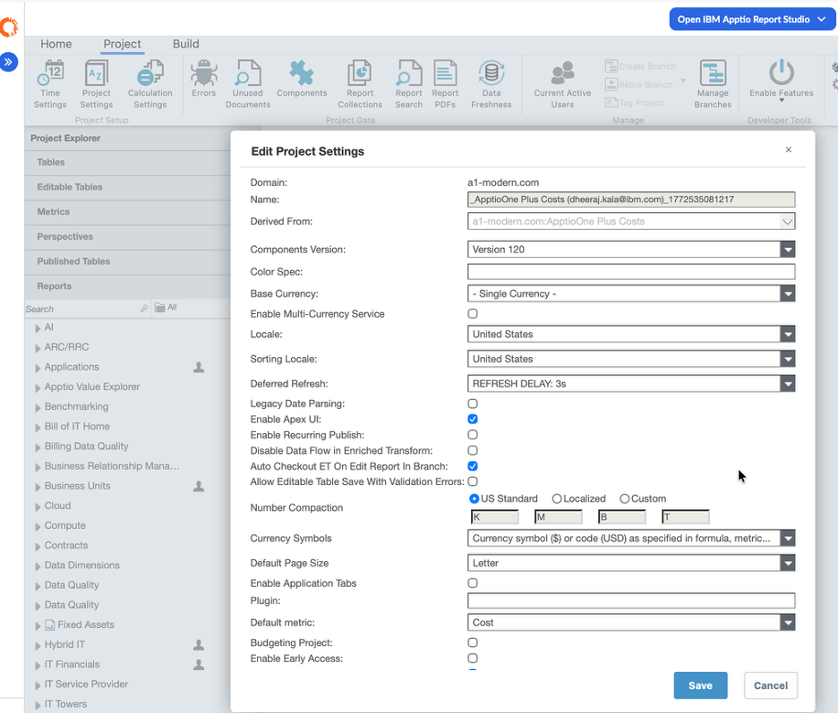
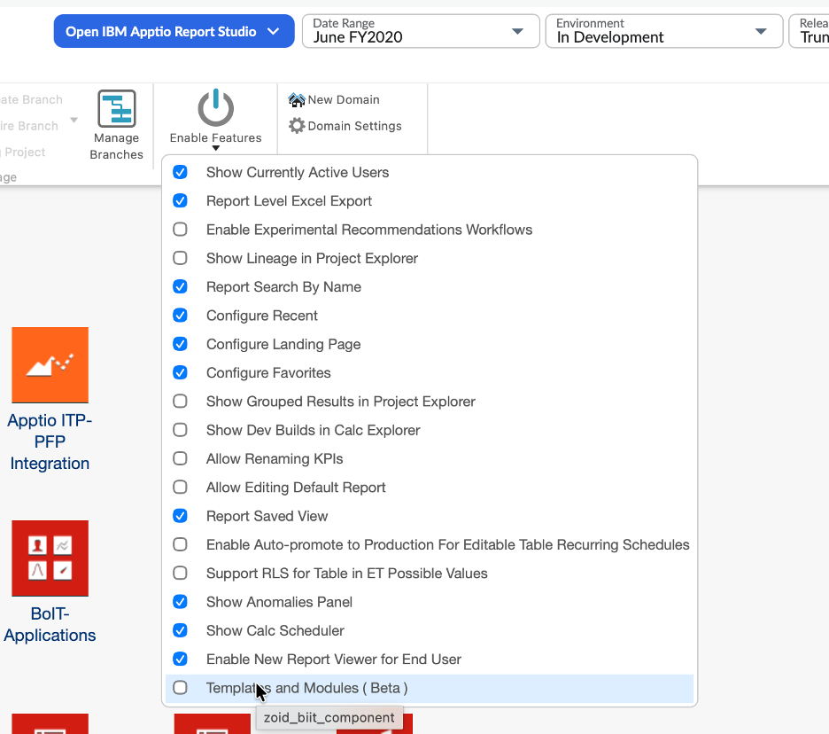
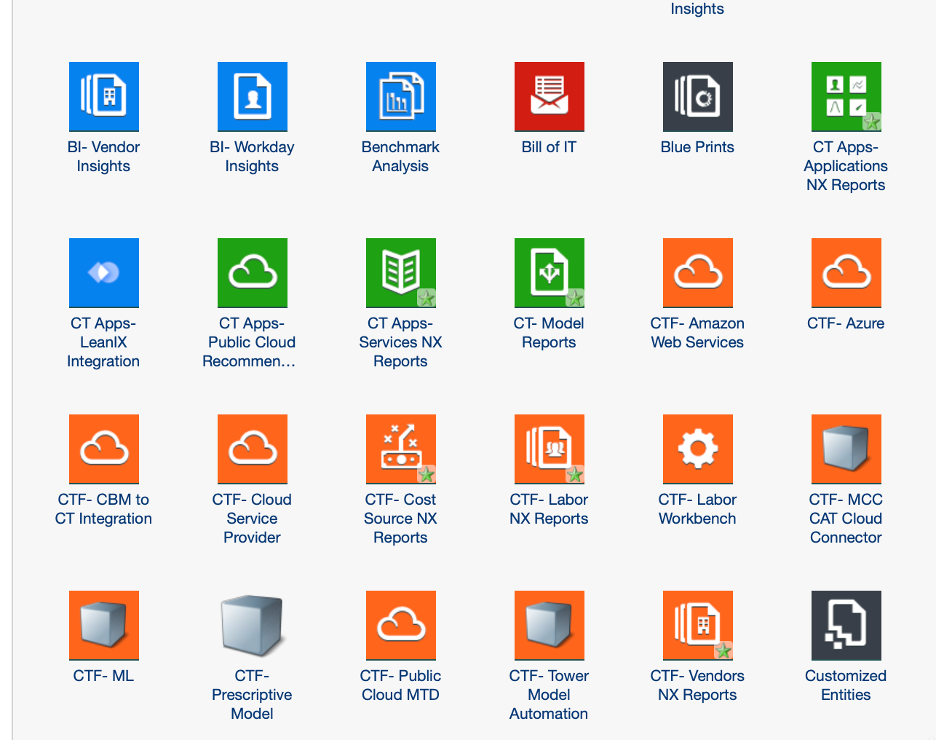
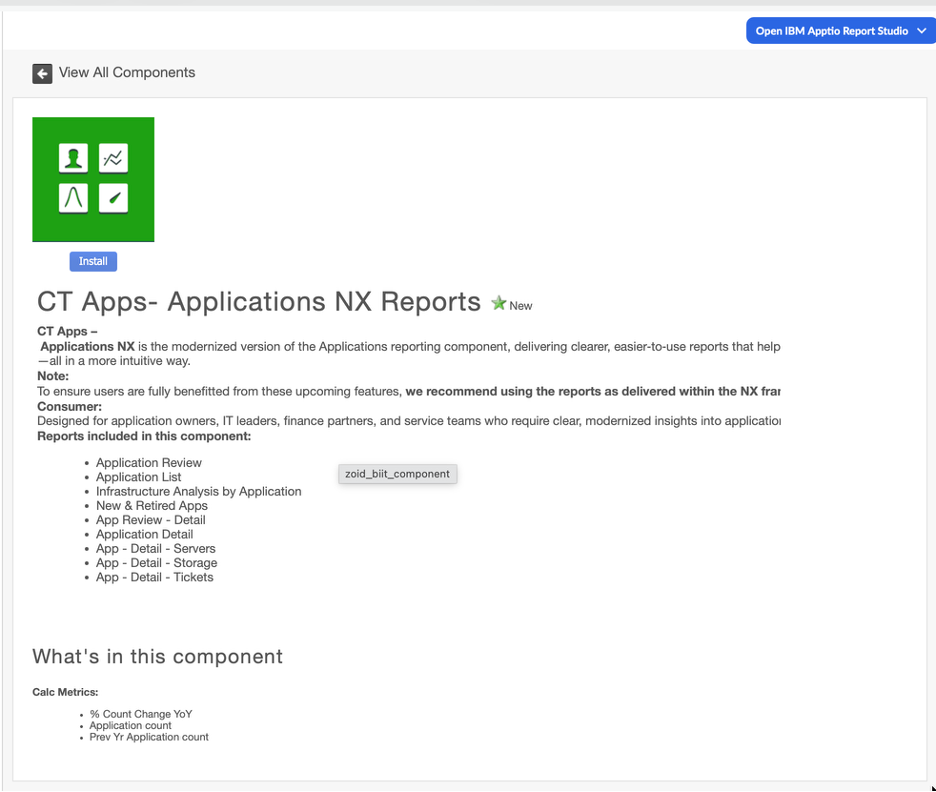
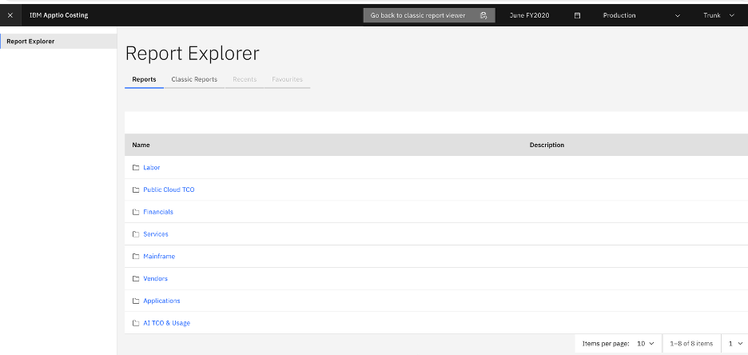

# Pasos para habilitar los informes OOTB (NX) modernizados en la instancia del cliente

Este documento describe los **pasos necesarios para habilitar los informes Modernized OOTB (Nueva experiencia (NX))** en una instancia de cliente. Estos informes ofrecen una mayor claridad, una mejor comprensión y una experiencia más intuitiva, al tiempo que siguen utilizando los **mismos conjuntos de datos que Classic TBM Studio**.

1. **Comprueba los requisitos previos**

   Antes de habilitar cualquier informe, asegúrese de que el entorno del cliente cumple los **requisitos obligatorios relativos a las plantillas y a la versión del servidor**.

   - **Versiones necesarias**
     - **Versión de la plantilla:** V120
     - **Versión del servidor:** 12.11.22 o superior

     Estas versiones son **obligatorias** para habilitar los informes modernizados de serie.
2. **Configure la plantilla del cliente para la versión de contenido V120 (no es necesaria ninguna actualización)**

   Si el cliente **aún no** está utilizando la versión de contenido V120, **no** es necesario que realice una actualización completa de la plantilla. Puedes consultar la versión del contenido en TBM Studio, en la pestaña «Proyecto» > «Configuración del proyecto». En la ventana emergente aparecerá un campo llamado «Versión del componente» que te permitirá saber cuál es la versión actual de la plantilla de contenido.

   

   - **Requisitos**
     - **Dirija** temporalmente la instancia del cliente a la versión de contenido V120 a través de la sección **«Componentes del informe»,** utilizando el menú desplegable de «Versión del componente» (navegue por TBM Studio > pestaña «Proyecto» > «Configuración del proyecto»; en la ventana emergente encontrará un campo denominado «Versión del componente»)
     - Este paso es necesario porque **los nuevos componentes de informes de Modernized OOTB (NX) solo son visibles cuando la versión del contenido está configurada en « V120 »**
   - **Aclaraciones importantes**
     - **No es necesario actualizar la plantilla**
     - Se trata **únicamente** de un cambio en el índice de contenidos, no de una actualización estructural
     - Una vez que hayan accedido a V120, los clientes podrán **instalar las colecciones de informes necesarias**
   - **Revertir la versión del contenido (opcional)**
     - Una vez instalados los componentes necesarios del informe NX, el cliente **puede volver a la versión original del contenido** si lo desea
     - **No hay ningún riesgo en hacerlo**
   - **Aviso importante**
     - Los componentes de informes de NX instalados seguirán **estando disponibles** incluso después de revertir los cambios
     - Todas **las tablas, modelos e informes** instalados permanecen intactos
     - La reversión de la versión del contenido no provoca ninguna pérdida de datos ni afecta al funcionamiento

     Nota: Si no se establece temporalmente una referencia a **la versión de contenido V120**, los nuevos componentes NX **no** aparecerán en la lista de componentes.
   - **Documentación de referencia**

     Si necesitan más información, los clientes pueden consultar la documentación oficial de Apptio :

     - Instalación de nuevas soluciones de cálculo de costes de Apptio en proyectos basados en plantillas antiguas

       https://www.ibm.com/docs/en/apptio-commercial/costing-standard/saas?topic=configuration-installing-new-apptio-costing-solutions-older-template-projects
3. **Instalar los componentes modernizados de NX**

   Una vez que el entorno esté en marcha:

   - Versión de la plantilla **V120**
   - Versión del servidor **12.11.22 o superior**

   Los componentes del informe se pueden activar mediante **cualquiera** de las siguientes opciones:

   **Opción A: Rol de acceso de escritura de Admin/TBM Studio**
   - Un usuario con **el rol de administrador de « Apptio » o de «TBM Studio» con acceso de escritura** puede habilitar directamente los componentes. Para ello, primero hay que seguir el paso 2 y actualizar la versión de la plantilla a la última versión del contenido. A continuación, los usuarios pueden ir a la pestaña «Proyectos» e instalar los componentes NX que acaban de estar disponibles.

     

   **Opción B: Gestor de Éxito del Cliente (CSM)**
   - El cliente puede solicitar a su **gestor de cuentas asignado** que active los componentes en su nombre.
4. **Identificar las colecciones de informes y los componentes disponibles**

   En la siguiente tabla se enumeran las **colecciones de informes** y **los componentes principales de los informes** disponibles en esta versión.

   - **Colecciones y componentes de informes NX modernizados**
   - **Finanzas**
   - **CTF – Informes de origen de costes NX**
     - Análisis financiero
     - Financial Review – CapEx
     - Análisis financiero
   - **Sistema principal**
   - **BI – Informes de Mainframe Insights NX**
     - Coste total de propiedad (TCO) de los mainframes
     - Análisis de mainframe
     - Aplicaciones de mainframe
     - Uso de mainframes
     - Consumo de recursos del mainframe
     - Factura de consumo por uso del mainframe
   - **Coste total de propiedad (TCO) y uso de la IA**
   - **Informes de IA sobre el coste total de propiedad (TCO) y el uso de NX**
     - Coste total de propiedad (TCO) y uso de la IA
   - **Proveedores**
   - **CTF – Informes de proveedores NX**
     - Opinión sobre el proveedor
     - Deducción del coste del proveedor
     - Lista de proveedores
   - **Trabajo**
   - **CTF – Informes Labor NX**
     - Revista Laboral
     - Análisis laboral
     - Coste de mano de obra (sin incluir)
   - **Aplicaciones**
   - **Aplicaciones de TC – Informes de NX**
     - Revisión de la solicitud
     - Lista de aplicaciones
     - Aplicaciones nuevas y retiradas
     - Análisis de la infraestructura por aplicación
   - **Servicios**
   - **Aplicaciones de TC – Servicios – Informes NX**
     - Lista de servicios
     - Revisión del servicio
   - **Coste total de propiedad de la nube pública**
   - **Informes sobre el coste total de propiedad (TCO) de la nube pública de NX**
     - Coste total de propiedad de la nube pública
5. **Instalar los componentes de NX Report en TBM Studio**
   1. Accede a **TBM Studio** tal y como se indica en el paso 3.
   2. Ve a la sección **«Componentes»**
   3. Localice los **componentes** necesarios del informe NX
   4. **Instala** los componentes que desees

   Una vez instalados, los componentes aparecerán en la lista **«Componentes disponibles»** de TBM Studio.

   La siguiente captura de pantalla muestra los componentes marcados con una estrella como nuevos componentes disponibles para su instalación.

   

   Al hacer clic en cualquier componente, se mostrarán la descripción y los detalles del mismo. Tras hacer clic en el botón de instalación, el usuario podrá instalar los componentes, y los informes estarán disponibles en New Report Studio, que es el botón azul que se muestra en la captura de pantalla.

   
6. **Accede al nuevo Report Studio**
   1. Una vez instalados los componentes, haz clic en el **enlace o botón azul** situado en la parte superior de la pantalla
   2. Esta acción lleva al usuario al **nuevo Reporting Studio**
7. **Acceso y uso de los informes NX modernizados**
   - Los componentes de informes instalados aparecerán como **carpetas de colecciones** en el nuevo Reporting Studio
   - Los usuarios pueden:
     - Selecciona la **colección** que desees
     - Acceder a **los informes principales** individuales
     - Utiliza **las rutas de desglose** integradas para obtener información más detallada

     Captura de pantalla que muestra cómo quedará tras instalar el componente:

     

   Importante:
   - Los informes OOTB modernizados utilizan los **mismos conjuntos de datos** que ya están disponibles en **Classic TBM Studio**
   - No es necesario realizar ninguna configuración ni importación adicional de datos
   - Una vez que se hayan instalado y registrado los componentes de Modernized NX Report, los usuarios finales podrán ver esas colecciones de informes y los informes en su instancia.

## Preguntas frecuentes: Informes OOTB (NX) modernizados

**Sección A: Preguntas frecuentes generales – Informes OOTB NX (modernizados)**

1. ¿Qué son los informes OOTB (NX) modernizados?

   Los informes OOTB modernizados (New Experience – NX) son **informes de última generación listos para usar,** diseñados para ofrecer:
   - Mayor visibilidad
   - Una interfaz de usuario más limpia y moderna
   - Mejor comprensión
   - Navegación simplificada con funciones de exploración en profundidad

   Se basan en el **modelo de datos existente** de TBM y utilizan los mismos conjuntos de datos que los informes de Classic TBM Studio.
2. ¿En qué se diferencian los informes de NX de los informes clásicos predeterminados?

   NX informa:
   - Son **fáciles de usar y se basan en datos**
   - Agrupa informes extensos y complejos en vistas específicas
   - Ofrecer una navegación por niveles en lugar de informes estáticos de varias páginas
   - Ajustarse a **los estándares modernos de presentación de informes y experiencia de usuario** de Apptio

   Los informes clásicos siguen siendo compatibles, pero los informes NX representan la **tendencia futura en materia de informes**.
3. ¿Los informes NX sustituyen a los informes clásicos de serie?

   Núm. **Los informes NX coexisten con los informes Classic**. Los clientes pueden:
   - Sigue utilizando los informes clásicos
   - Explora y adopta los informes de NX a tu propio ritmo

   Con el tiempo, los informes de NX se convertirán en la principal herramienta de generación de informes.
4. ¿Están los informes de NX disponibles para el público en general (GA)?

   Sí. Los informes de NX se lanzan como **versión general**. Esto significa:
   - Las características pueden cambiar
   - Se tienen muy en cuenta las opiniones recibidas
   - Es posible que se publiquen actualizaciones con frecuencia
5. ¿Qué áreas funcionales abarcan los informes de NX?

   Los informes NX están disponibles en ocho componentes del lote 1, entre los que se incluyen:
   - Finanzas
   - Sistema principal
   - Coste total de propiedad (TCO) y uso de la IA
   - Proveedores
   - Trabajo
   - Aplicaciones
   - Servicios
   - Coste total de propiedad de la nube pública

**Sección B: Preguntas frecuentes sobre implementación y habilitación**

1. ¿Cuáles son los requisitos previos para habilitar los informes de NX?

   El cliente debe estar en:
   - **Versión de la plantilla:** V120
   - **Versión del servidor:** 12.11.22 o superior

   Estos son obligatorios para habilitar los informes de NX.
2. ¿Es necesario actualizar completamente la plantilla para habilitar los informes NX?

   Núm. **No es necesario actualizar la plantilla por completo**. Los clientes solo tienen que **redirigir temporalmente a la versión de contenido V120** para que los componentes de NX sean visibles.
3. ¿Por qué tenemos que hacer referencia a la versión de contenido V120?

   Los componentes del informe NX se incluyen en **la versión de contenido V120**. Sin hacer referencia a V120:
   - Los componentes NX **no aparecerán** en la lista de componentes
   - No es posible realizar la instalación
4. ¿Se puede revertir la instalación de los componentes de NX?

   Sí. Los clientes pueden volver a la versión original del contenido tras la instalación. **No** hay ningún riesgo:
   - Los componentes de NX instalados siguen estando disponibles
   - Las tablas, los modelos y los informes se mantienen intactos
   - Sin pérdida de datos ni impacto en el sistema
5. ¿Quién puede habilitar los componentes de NX Report?

   Los componentes de NX Report se pueden activar de las siguientes maneras:
   - **Un rol de acceso de escritura de «Admin/TBM Studio»**
   - O **el gestor de éxito** del cliente (CSM) asignado al cliente
6. ¿Dónde pueden consultar los usuarios los informes de NX tras la instalación?

   Después de la instalación:
   - Haz clic en el **enlace o botón azul** situado en la parte superior de la pantalla
   - Esto redirige a los usuarios al **nuevo Reporting Studio**
   - Los informes se muestran como **colecciones** con navegación y rutas de exploración
7. ¿Los informes de NX necesitan nuevas fuentes de datos o una nueva importación?

   Núm. Los informes de NX utilizan los **mismos conjuntos de datos que ya están disponibles en Classic TBM Studio**. Sin más:
   - Configuración de datos
   - Ingesta de datos
   - Correlación

     es obligatorio.

**Sección C: Preguntas frecuentes sobre uso y comportamiento**

1. ¿Se pueden utilizar los informes de NX inmediatamente después de la instalación?

   Sí. Una vez instalados y registrados los componentes:

   - Las colecciones de informes pasan a ser visibles
   - Los usuarios finales pueden empezar a utilizar los informes de inmediato
2. ¿Los informes de NX se basan en roles?

   A continuación se muestra el acceso a los informes de NX:

   - Roles de usuario existentes
   - Permisos del proyecto

     No es necesario gestionar el acceso por separado.
3. ¿Los informes de NX permiten realizar desgloses?

   Sí. Los informes de NX se han diseñado con:

   - Información resumida
   - Desgloses contextuales
   - Rutas de navegación simplificadas

**Sección D: Preguntas frecuentes sobre la personalización (importante para los clientes)**

1. ¿Cuál es la mejor práctica recomendada para los informes de NX listos para usar?

   **No modifiques los informes predeterminados de NX.** Mantener los informes sin modificaciones garantiza:
   - Acceso automático a las mejoras
   - Compatibilidad con futuras versiones
   - Menores gastos generales de mantenimiento
2. ¿Qué ocurre si personalizo un informe predeterminado de NX?

   Si se personaliza un informe de NX listo para usar:
   - Las futuras mejoras **no** se aplicarán
   - El informe pasa a **estar gestionado por el cliente**
   - Las nuevas funciones y correcciones no se aplicarán
3. ¿Se actualizarán los informes personalizados de NX en futuras versiones?

   Núm. Las mejoras **solo** se aplican a los informes NX predeterminados que no han sido modificados.
4. ¿Cómo pueden los clientes acceder a las últimas mejoras del informe NX?

   Los clientes deben:
   1. **Deshacer las personalizaciones** en los informes predeterminados afectados
   2. Póngase en contacto con su **gestor de cuentas (CSM) o con el servicio de asistencia de IBM Apptio**
   3. Actualiza la instancia a la versión deseada
5. ¿Cómo puedo revertir las personalizaciones en los informes predeterminados de NX?
   1. Ve a **TBM Studio → pestaña Proyecto**
   2. Seleccionar **componentes**
   3. Ir a **«Componentes instalados»**
   4. Abre el componente personalizado
   5. Desplázate hasta **«Elementos personalizados»**
   6. Haz clic en el icono **«Revertir»** de cada informe personalizado
   7. ( *Solo hay que revertir los informes* )
   8. Haz clic **en «Check-in»**
6. ¿Tengo que revertir todos los cambios del componente?

   Núm. Solo **los elementos personalizados del informe** deben restablecerse para poder beneficiarse de las mejoras a nivel de informe.
7. ¿Y si la personalización es imprescindible?

   Buenas prácticas:
   - **Copia el informe predeterminado**
   - Personaliza el informe copiado
   - No modifiques el informe original de NX tal y como viene de fábrica

     Esto permite personalizar **el sistema sin perder las futuras mejoras**.

## Puntos de partida clave

- Evita personalizar los informes predeterminados
- Los informes personalizados no se benefician de las mejoras
- Deshacer las personalizaciones antes de las actualizaciones
- Coordinarse con el CSM o con el servicio de asistencia

Accede a [NX Reports](/docs/SSI71A/cost-transparency/get-started/costing-guide-nav.html#base_file_name__nrs)

**Tema principal:** [Configuración y personalización](../../studio/report-studio/config-custom.html)
