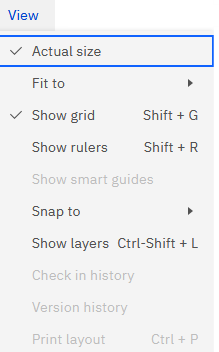
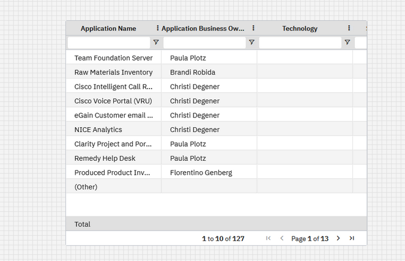
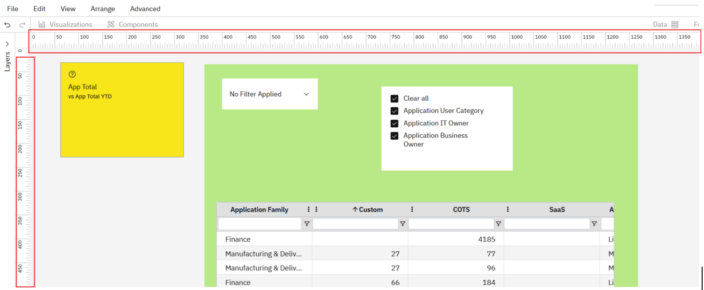
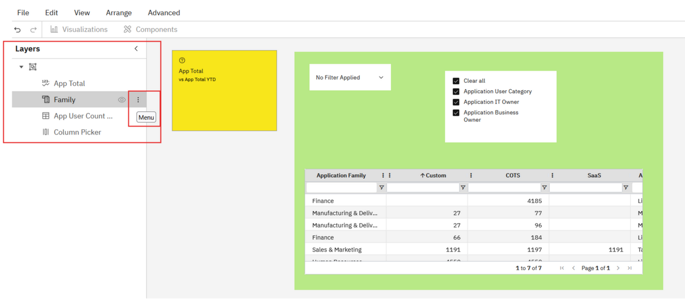

# Ver el menú

Este menú le ayuda a dar formato al aspecto del lienzo del informe. El menú Ver en el lienzo del informe es:

***Tamaño real***

Cambie el tamaño de un componente del informe arrastrando la parte inferior, los lados o las esquinas del borde de un componente.

- Sitúe el puntero del ratón sobre la parte inferior, lateral o esquina del borde de un componente. El puntero del ratón cambiará al icono Redimensionar. Si el borde está oculto, sitúe el puntero del ratón en cualquier lugar sobre el componente para ver su borde.
- Cuando aparezca el icono Redimensionar, haga clic y arrastre el borde para cambiar la altura o anchura del componente.

*Ajustar a - Las opciones son Ajustar a la página y Ajustar a la anchura*

Estas opciones ajustarán automáticamente el componente/visualización según el tamaño de la página o el ancho. También puedes cambiar el tamaño desde la función.

*Mostrar cuadrículas*

Esta opción muestra las cuadrículas en el lienzo del informe.

*Mostrar reglas*

Esta opción muestra las reglas en el lienzo del informe.

*Snap-to-grid*

Cuando se selecciona **Ajustar a cuadrícula**, los componentes se ajustarán al punto más cercano de una cuadrícula invisible.

*Mostrar capas*

Seleccione esta opción para ver la posición de los distintos componentes y visualizaciones en el informe. Seleccione la opción Menú en cada componente para

- Avanzar o retroceder
- Copiar, pegar o borrar el componente

