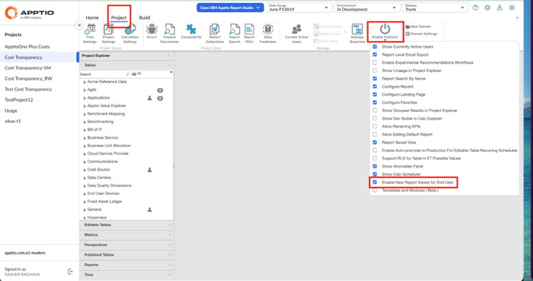

# Control de administración para el acceso al nuevo visor de informes

Los administradores pueden controlar si los usuarios finales tienen acceso al nuevo visor de informes dentro de Report Studio. Esta configuración permite a los equipos gestionar la visibilidad de los informes en función de las necesidades de su organización.

De forma predeterminada, el nuevo visor de informes está activado, lo que permite a los usuarios finales visualizar los informes sin problemas.

## Cuándo se utiliza

Utiliza esta configuración cuando:

- Desea restringir el acceso a los informes para los usuarios finales
- Estás probando o configurando los informes antes de hacerlos visibles
- Quieres tener un mayor control sobre quién puede ver los informes de tu proyecto

## Habilitar o deshabilitar el nuevo visor de informes para los usuarios finales

Para gestionar esta configuración:

1. Ve a la pestaña «Proyecto» en TBM Studio Clásico
2. Abre el menú desplegable **«Habilitar funciones»**
3. Busca la opción:
4. «Habilitar el nuevo visor de informes para el usuario final»
5. Utiliza la casilla de verificación para:
   1. Habilitar (predeterminado): los usuarios finales pueden ver los informes
   2. Desactivar: los usuarios finales no tendrán acceso al Visor de informes

Nota:

- Esta configuración está activada de forma predeterminada en todos los proyectos
- Desactivar esta configuración solo afecta al acceso de los usuarios finales, no a las funciones de los administradores
- Los cambios entran en vigor de inmediato
