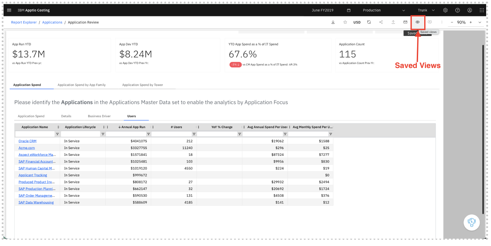
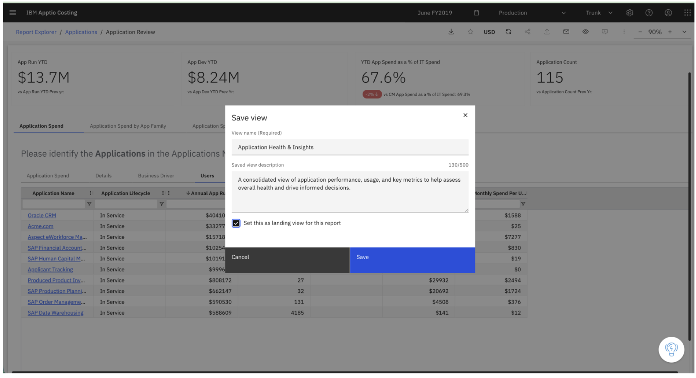

# Vistas guardadas

## Visión general

Las vistas guardadas permiten a los usuarios crear instantáneas personalizadas de un informe en el Visor de informes. Una vista guardada recoge el estado actual del informe, incluidos los filtros y las interacciones aplicadas al mismo.

Las vistas guardadas te permiten volver fácilmente a un informe configurado exactamente como tú prefieres, sin necesidad de volver a aplicar filtros ni repetir las acciones cada vez. Las vistas guardadas son privadas para el usuario que las ha creado y no son visibles para otros usuarios.

Nota: Las vistas guardadas solo están disponibles en entornos de producción.

## Inicio rápido

Utiliza las vistas guardadas para personalizar la forma en que visualizas los informes.

Puede:

- Crea una vista guardada tras aplicar filtros o interacciones.
- Mantenga varias vistas del mismo informe para satisfacer diferentes necesidades de análisis.
- Configura una vista de inicio para que el informe se abra con tu configuración preferida.
- Marca como favorito la vista URL para poder acceder rápidamente a ella más adelante.

Cada usuario puede crear hasta 5 vistas guardadas por informe.

## Crear una vista guardada

Para crear una vista guardada:

1. Abre un informe en el Visor de informes.
2. Aplica los filtros o interacciones que desees.
3. Haz clic en el **icono del ojo** situado en la barra de acciones en la parte superior del informe.
4. Selecciona «**Guardar vista** ». Aparecerá un cuadro de diálogo en el que podrás introducir:
   1. Nombre de vista
   2. Descripción opcional
   3. Opción para establecer como vista de inicio
5. Se crea la vista y se le redirige automáticamente a la vista recién creada.

## Actualizar o crear vistas adicionales

**Guardar Vista**

Cuando te encuentras en una vista guardada:

- Al hacer clic en **«Guardar vista»,** se actualiza la vista actual con las últimas interacciones y filtros del informe.
- Utilice esta opción para crear una vista guardada por primera vez para un informe determinado.

**Guardar como**

Utilice **«Guardar vista como»** para crear una nueva vista basada en el estado actual del informe.

Pasos:

1. Modificar los filtros o las interacciones del informe
2. Haz clic en el icono del ojo
3. Selecciona **«Guardar vista como»**
4. Introduce un nuevo nombre para la vista

Esto crea una vista guardada independiente sin modificar la vista original.

**Cambiar entre vistas**

Para cambiar de vista:

1. Haz clic en el icono del ojo en la barra de herramientas del informe.
2. Selecciona una vista de la lista. La lista incluye:
3. El informe predeterminado
4. Todas las vistas guardadas que hayas creado

Al seleccionar una vista, se carga esa versión del informe.

**Gestión de vistas guardadas**

Cada vista guardada incluye un menú desplegable (tres puntos) que te permite realizar las siguientes acciones:

- Ver detalles: consulta el nombre y la descripción de la vista.
- Editar: modifica el nombre o la descripción de la vista.
- Eliminar: eliminar la vista de forma definitiva.

**Eliminar una vista**

- Si eliminas la vista que estás viendo ahora mismo, se te redirigirá a la vista de inicio.
- Si no hay ninguna vista de destino, se le redirigirá al informe predeterminado.

**Marcar vistas**

Cada vista guardada tiene una URL única ( URL ) que incluye el ID de la vista.

Esto te permite:

- Añade la página URL a los favoritos de tu navegador
- Guarda el enlace para consultarlo más adelante
- Volver directamente a la misma configuración del informe

## Conceptos clave

1. **Informe predeterminado** : el informe predeterminado es la versión original del informe tal y como la creó el autor o el administrador del informe.
   1. Aparece en la lista de vistas guardadas con un icono de una casa.
   2. No incluye ningún filtro ni interacción guardados.
   3. Te permite volver a la versión básica del informe en cualquier momento.
2. **Vista guardada** : una vista guardada es una versión personalizada del informe creada por un usuario.
   1. Recoge el estado actual del informe, incluyendo:
      1. Filtros aplicados
      2. Interacciones con las visualizaciones de los informes
   2. El informe general se genera en el momento en que se guarda la vista
   3. Cuando estás viendo una vista guardada:
      1. El icono del ojo de la barra de herramientas aparece en negrita.
      2. El título de la ruta de navegación del informe incluye el nombre de la vista entre paréntesis.
   4. Ejemplo: **Informe de análisis de costes (vista del Departamento de Finanzas)** - En este caso, el informe predeterminado es el Informe de análisis de costes y la vista es la vista del Departamento de Finanzas
3. **Vista de inicio** : una vista de inicio es una vista guardada que se abre automáticamente al acceder al informe.
   1. Se identifica con un icono de estrella.
   2. Solo se puede establecer una vista por informe como vista de inicio para un usuario.
   3. Configurar una vista de inicio te permite empezar con la configuración de informe que utilizas con más frecuencia.
4. **Vista divergente** : se produce una vista divergente cuando el informe base se ha modificado después de crear la vista. Dado que la estructura del informe ha cambiado, es posible que la vista guardada ya no se corresponda totalmente con la última versión del informe.
   1. Aparece un icono de advertencia junto a la vista.
   2. Aparece un mensaje que indica que la vista se ha desviado del informe base.

**Actualización de una vista divergente**

Para actualizar una vista divergente:

1. Abrir la vista ampliada
2. Haz clic en el menú de opciones (los tres puntos) para ver la vista
3. Selecciona **«Actualizar» en el informe base**

Al actualizar la vista:

- Sincronízalo con la última versión del informe
- Elimina todos los filtros e interacciones existentes
- Restablecer la vista para que coincida con el informe base

A continuación, puedes aplicar nuevos filtros o interacciones y volver a guardar la vista.

Nota: No se pueden crear vistas adicionales a partir de una vista divergente.

**Límites y normas**

- Las vistas guardadas solo están disponibles en entornos de producción.
- Las vistas guardadas son específicas de cada usuario y no son visibles para los demás usuarios.
- Cada usuario puede crear hasta 5 vistas guardadas por informe.
- Los usuarios no pueden crear vistas adicionales a partir de una vista divergente.
- Al actualizar una vista divergente, se eliminan los filtros y las interacciones existentes.

## Guía de iconos

|  |  |
| --- | --- |
| **Icono** | **Significado** |
| Icono de ojo | Accede al menú «Vistas guardadas» |
| Icono de ojo en negrita | Indica que actualmente estás viendo una vista guardada |
| Icono de inicio | Informe predeterminado |
| Icono de estrella | Vista del aterrizaje |
| Icono de aviso | La opinión difiere del informe original |
