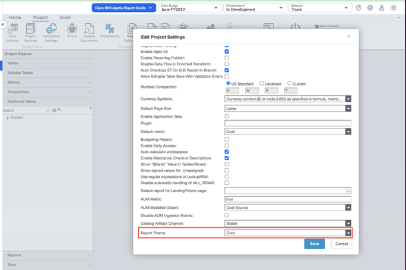
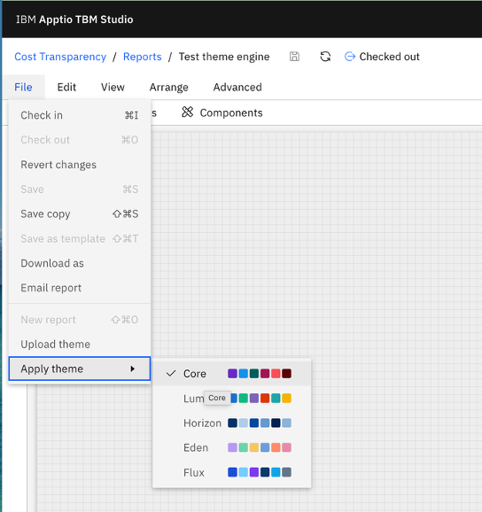

# Motor de temas

## Visión general

El motor de temas del nuevo Report Studio permite aplicar un estilo y un formato uniformes en todos los informes mediante la aplicación de un conjunto predefinido de configuraciones visuales, como colores, tipografía, espaciado y estilos de componentes.

Los temas ayudan a unificar el aspecto de los informes, reducen el trabajo de formato manual y agilizan la migración de Report Studio clásico a Report Studio nuevo.

## ¿Qué es un tema?

Un tema es un conjunto reutilizable de ajustes de formato que controla el aspecto visual de los informes.

Un tema puede incluir:

- Paletas de colores
- Tipografía (tipo de letra, tamaño de letra)
- Estilo de los componentes
- Espaciado
- Fronteras

Los temas garantizan la coherencia visual en todos los informes, al tiempo que permiten a los usuarios realizar personalizaciones específicas para cada informe cuando sea necesario.

## Comportamiento predeterminado del tema

**Tema a nivel de proyecto** : en el Report Studio clásico, en la sección «**Configuración del proyecto** », se puede configurar un **tema de informe**.

- El tema predeterminado es «**Core** »
- Además de Core, hay otros cuatro temas listos para usar disponibles
- Los usuarios pueden seleccionar uno de estos temas como predeterminado a nivel de proyecto

**Aplicación automática de temas** : el tema predeterminado a nivel de proyecto se aplica automáticamente a:

- Informes de nueva creación en el Estudio de informes nuevos
- Informes migrados desde Classic Report Studio

Esto garantiza un punto de partida uniforme para el formato de los informes.

## Aplicar o cambiar un tema en un informe

En el Nuevo Estudio de informes, los usuarios pueden aplicar o cambiar un tema a nivel de informe.

Ve al menú Archivo -> Aplicar tema

**Anulación a nivel de informe** : cuando se cambia de tema desde el menú Archivo:

- El tema seleccionado solo se aplica al informe actual
- Anula el tema predeterminado a nivel de proyecto para ese informe

Esto ofrece flexibilidad para los informes que requieren diferentes estilos visuales.

## Componente: Formato de nivel

Incluso después de aplicar un tema, los usuarios pueden seguir personalizando los componentes individuales de los informes.

Ejemplos:

- Cambiar los colores del gráfico
- Ajustar el tamaño de la fuente en una visualización
- Modificar el espaciado o los bordes de componentes específicos

Estos cambios de formato a nivel de componente anulan la configuración del tema correspondiente únicamente para ese componente concreto.

## Mejores prácticas

- Utiliza temas a nivel de proyecto para mantener la coherencia en todos los informes
- Utiliza las modificaciones a nivel de informe solo cuando un informe requiera una imagen de marca o un estilo específicos
- Reduzca al mínimo las modificaciones excesivas a nivel de componente para mantener la coherencia
- Aplica los temas antes de llevar a cabo migraciones a gran escala para reducir el trabajo manual
