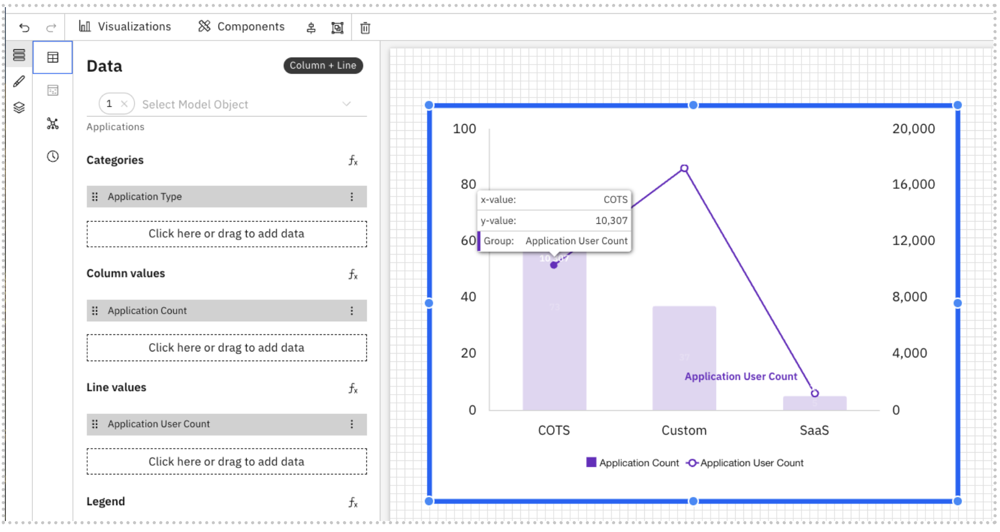
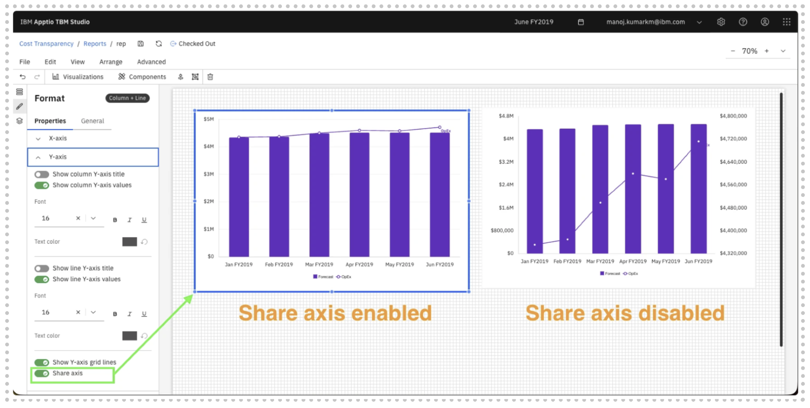

# Gráficos de columnas + líneas (superposición)

El gráfico de columnas + líneas (superposición) combina visualizaciones de columnas y líneas en un solo gráfico. Le permite comparar valores absolutos (columnas) junto con una tendencia o métrica relacionada (línea) en las mismas categorías.

Esta visualización resulta especialmente útil cuando se desea analizar las relaciones entre dos medidas diferentes sin tener que cambiar de gráfico.

**Cuándo utilizar un gráfico de columnas + líneas**

Utilice un gráfico de columnas + líneas (superposición) cuando desee:

- Compare los valores reales con una tendencia u objetivo
- Visualizar el volumen y el rendimiento juntos (por ejemplo, coste frente a utilización)
- Realiza un seguimiento de los cambios a lo largo del tiempo sin perder de vista la distribución por categorías
- Resaltar cómo se comporta una métrica en relación con otra

**Añadir un gráfico de columnas y líneas a un informe**

- Añadir un gráfico de columnas + líneas desde el panel Visualizaciones de la barra de herramientas
- Haga clic en el gráfico para habilitar los paneles Datos y Formato.
- Panel de datos
  - Seleccione el objeto modelo en el menú desplegable
  - Categorías: define el eje X del gráfico. Haga clic aquí o arrastre para añadir dimensiones desde el Explorador de dimensiones
  - Valores de columna: métricas mostradas como columnas
  - Valores de línea: métricas mostradas como una superposición de líneas
  - Leyenda: diferencia múltiples series de columnas o líneas
  - Filtros de columna: aplica filtros que solo afectan a los valores de la columna
  - Filtros de línea: aplica filtros que solo afectan a los valores de línea.
- Panel de formato
  - Propiedades generales: consulte [Propiedades de los componentes.](../components/components.html#abt-comp__comprop)
  - Propiedades específicas del gráfico de columnas + líneas
    - Categorías
      - Mostrar título de la categoría
      - Mostrar etiquetas de categoría
      - Elija el tamaño de la fuente, el estilo (negrita, cursiva, subrayado) y el color
      - Mostrar líneas de cuadrícula
    - Valores
      - Mostrar título de valores
      - Mostrar etiquetas de valores
      - Elija el tamaño de la fuente, el estilo (negrita, cursiva, subrayado) y el color
      - Mostrar líneas de cuadrícula
    - Leyenda
      - Alternar para mostrar la leyenda
      - Título de la leyenda, tamaño y estilo de la fuente para la leyenda (negrita, cursiva, subrayado)
      - Color del texto de la leyenda (con opción para restablecer el color)
      - Etiquetas de leyenda: tamaño, estilo y color de la fuente
      - Ubicación de la leyenda: elige entre centro, izquierda y derecha
    - Líneas
      - Elija el tipo de línea, el color y el estilo
    - Columnas
      - Resultados a mostrar: le permite elegir el número de columnas que se mostrarán
      - Relleno entre columnas: controla el espaciado entre columnas adyacentes en el gráfico, lo que ayuda a mejorar la legibilidad y la claridad visual.
      - Color de la serie: aplica color a diferentes series
    - Etiquetas de datos
      - Alternar para mostrar las etiquetas de datos
      - Posición de la etiqueta: elija entre las diferentes posiciones

Ejemplo: Gráfico de columnas + líneas

El gráfico de columnas + líneas admite fórmulas personalizadas y dimensiones de fórmulas. Para obtener más información, consulte [Fórmulas personalizadas.](../create-first/custom-formula.html "Las fórmulas personalizadas (también denominadas dimensiones de fórmula) le permiten definir nuevas dimensiones calculadas utilizando campos existentes en su modelo de datos. Esto permite realizar análisis más profundos y obtener información más detallada sin necesidad de realizar cambios en el conjunto de datos o el esquema subyacentes.")

**Gráficos de columnas apiladas + líneas** : amplían el gráfico de columnas + líneas al apilar varios valores de columna dentro de cada categoría, lo que permite comparar distribuciones de partes y total junto con una tendencia o métrica superpuesta.

**Eje de proporción en los gráficos superpuestos:** Los gráficos superpuestos admiten ahora un eje de proporción, lo que permite alinear varias series de datos en una escala común para facilitar la comparación y mejorar la legibilidad.

