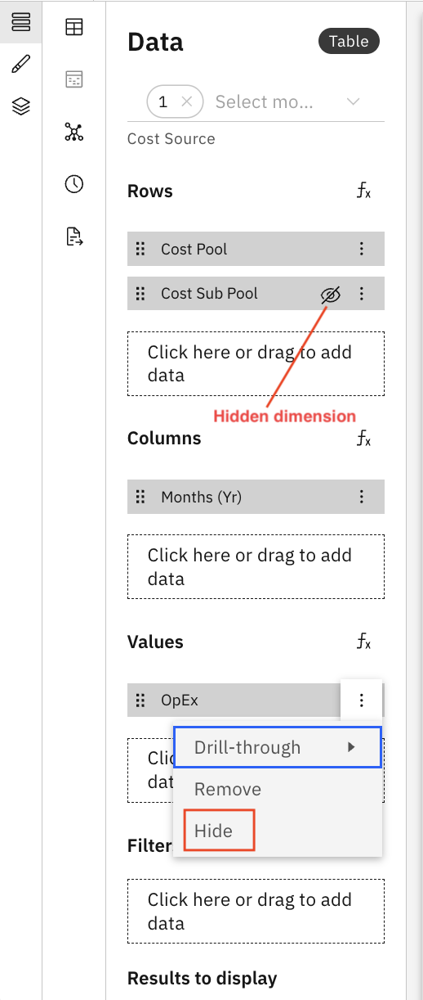

# Ocultar dimensiones intermedias

La función «Ocultar dimensiones intermedias» te permite ocultar las dimensiones que se utilizan como pasos intermedios en fórmulas o cálculos, lo que te ayuda a presentar datos más claros y relevantes a los usuarios finales. De este modo, se garantiza que en los componentes del informe solo se muestren las dimensiones relevantes, mientras que los campos intermedios o de apoyo permanecen ocultos.

1. Ocultar las dimensiones en las tablas
   1. Abre el panel **de configuración de datos** de la tabla.
   2. En la sección **«Filas»** o **«Valores»**, busca la dimensión que quieras ocultar.
   3. Abre el **menú desplegable** situado junto al nombre de la cota y selecciona «**Ocultar** ».
   4. Una vez ocultado, aparece un **icono de ocultación** junto al nombre de la dimensión.
   5. La dimensión ya no se ve en la vista de tabla.

      
2. Mostrar dimensiones ocultas
   1. Para volver a mostrar una dimensión, abre de nuevo el **menú desplegable** y selecciona «**Mostrar** ».
   2. La dimensión vuelve a aparecer en la tabla.
3. Ocultar las dimensiones en los gráficos
   1. Abre el panel **de configuración de datos** de un gráfico.
   2. Al igual que con las tablas, haz clic en el **menú desplegable** situado junto a la dimensión que quieras ocultar y selecciona «**Ocultar** ».
   3. El gráfico se actualiza para mostrar únicamente las dimensiones visibles.

La tabla admite fórmulas personalizadas y dimensiones de fórmula. Para obtener más información, consulta [«Fórmulas personalizadas»](../create-first/custom-formula.html "Las fórmulas personalizadas (también denominadas «dimensiones de fórmula») te permiten definir nuevas dimensiones calculadas utilizando campos existentes en tu modelo de datos. Esto permite realizar análisis más exhaustivos y obtener información más detallada sin necesidad de modificar el conjunto de datos ni el esquema subyacentes.")

**Tema principal:** [Tabla](../../../studio/report-studio/visualizations/rs-table.html "El componente de tabla muestra los datos en un formato tabular estructurado. Es ideal para mostrar información detallada, resumir métricas y facilitar el filtrado interactivo dentro de un informe.")
