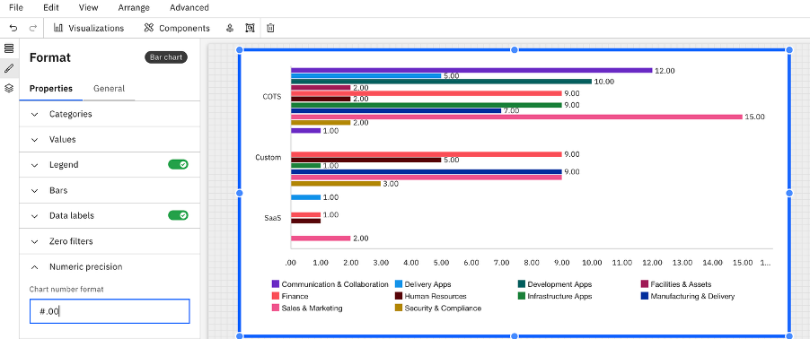

# Precisión numérica en las coordenadas cartesianas

Puedes controlar el número de decimales que se muestran para los valores en los gráficos cartesianos mediante la opción **«Precisión numérica»,** disponible en el **panel** de formato del gráfico.

Esta configuración admite patrones de formato como:

- #.00 → Muestra los valores con 2 decimales
- Ejemplo: 10 → 10.00

Esta mejora contribuye a aumentar la legibilidad y la coherencia de los valores numéricos que se muestran en los gráficos.

Nota: El formato de precisión numérica solo es compatible actualmente con **los gráficos cartesianos**.

