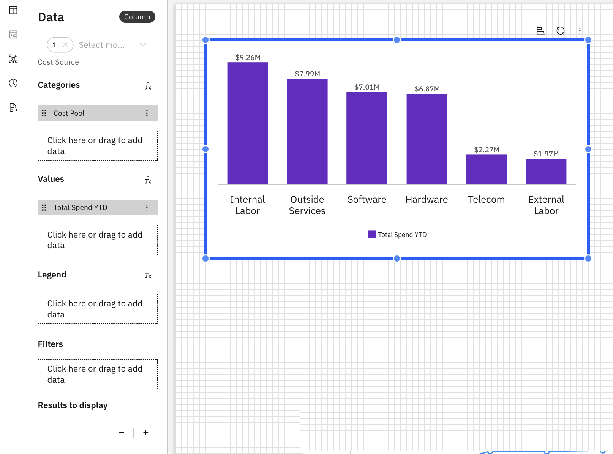

# Gráficos de columnas

Un gráfico de columnas muestra los datos mediante barras verticales, lo que facilita la comparación de valores entre categorías. Los gráficos de columnas son ideales cuando se desea resaltar las diferencias entre elementos o realizar un seguimiento de los cambios a lo largo del tiempo.

## Cuándo utilizar un gráfico de columnas

Utilice un gráfico de columnas cuando desee:

- Comparar valores entre categorías
- Clasificar las categorías de mayor a menor
- Destacar tendencias o diferencias entre categorías

## Añadir un gráfico de columnas a un informe

1. Añadir un gráfico de columnas desde el panel Visualizaciones de la barra de herramientas
2. Haga clic en el gráfico de columnas para habilitar los paneles Datos y Formato.
3. Panel de datos
   1. Seleccione el objeto modelo en el menú desplegable
   2. Categorías: define cómo se agrupan los datos a lo largo del eje utilizando una dimensión. Haga clic aquí o arrastre para añadir dimensiones desde el Explorador de dimensiones
   3. Valores: especifica la métrica o métricas que se muestran como columnas
   4. Leyenda: divide los valores en varias series basadas en una dimensión.
   5. Filtros: limita los datos que se muestran en el gráfico según las condiciones seleccionadas
   6. Resultados a mostrar: indique el número de columnas que desea mostrar
   7. Configurar ordenación: controla el orden de las columnas por valor en orden ascendente o descendente.
4. Panel de formato
   1. Propiedades generales: consulte [Propiedades de los componentes.](../components/components.html#abt-comp__comprop)
   2. Propiedades específicas del gráfico de columnas
      1. Categorías
         1. Mostrar título de la categoría
         2. Mostrar etiquetas de categoría
         3. Elija el tamaño de la fuente, el estilo (negrita, cursiva, subrayado) y el color
         4. Alternar para cambiar la posición de las categorías
         5. Mostrar líneas de cuadrícula
      2. Valores
         1. Mostrar título de valores
         2. Mostrar etiquetas de valores
         3. Elija el tamaño de la fuente, el estilo (negrita, cursiva, subrayado) y el color
         4. Alternar para invertir el rango
         5. Mostrar líneas de cuadrícula
      3. Leyenda
         1. Mostrar la leyenda
         2. Tamaño y estilo de fuente de la leyenda (negrita, cursiva, subrayado)
         3. Color del texto de la leyenda (con opción para restablecer el color)
      4. Barras
         1. Acolchado entre barras (grosor de las barras)
         2. Relleno entre grupos (espacio entre grupos)
      5. Etiquetas de datos
         1. Alternar para mostrar las etiquetas de datos: las opciones son dentro o fuera de la barra.
         2. Elija el tamaño de la fuente, el estilo (negrita, cursiva, subrayado) y el color
         3. Establecer colores automáticamente: asigna automáticamente colores a las barras en función de los datos y el tema seleccionados.
         4. Defina el contorno y el color de la etiqueta

Ejemplo: Gráfico de columnas

Los gráficos de columnas admiten fórmulas personalizadas y dimensiones de fórmulas. Para obtener más información, consulte [Fórmulas personalizadas.](../create-first/custom-formula.html "Las fórmulas personalizadas (también denominadas dimensiones de fórmula) le permiten definir nuevas dimensiones calculadas utilizando campos existentes en su modelo de datos. Esto permite realizar análisis más profundos y obtener información más detallada sin necesidad de realizar cambios en el conjunto de datos o el esquema subyacentes.")

Los gráficos de columnas también admiten visualizaciones compatibles. Para obtener más información, consulte [Visualizaciones compatibles](visualizations.html#abt-visual__compvis).

## Gráficos de columnas apiladas

Los gráficos de columnas se pueden convertir en columnas apiladas para mostrar las contribuciones de las subcategorías dentro de cada categoría, sin dejar de mostrar el valor total.
