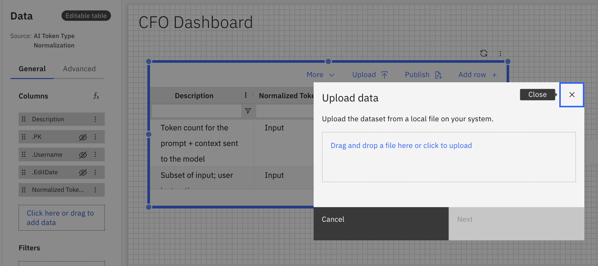
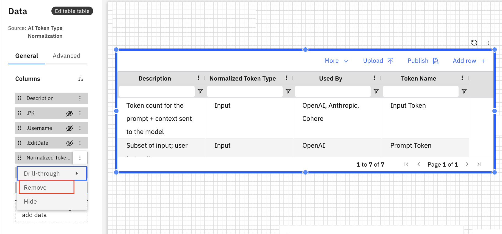
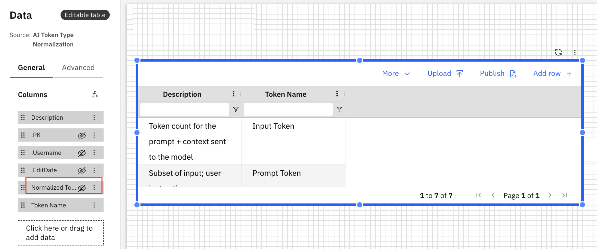
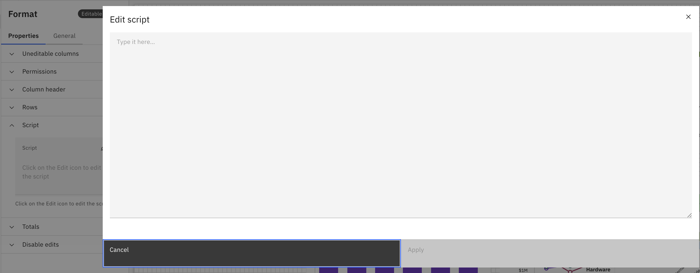
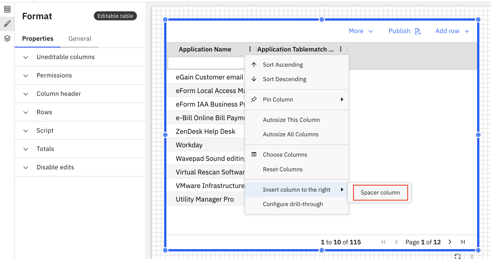
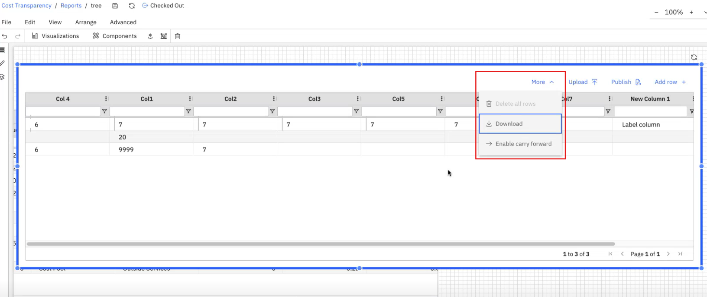
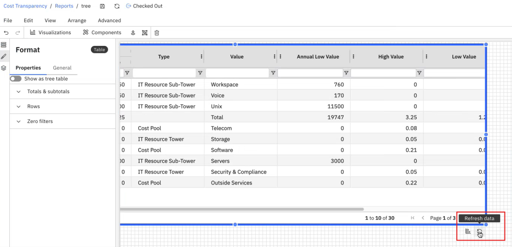
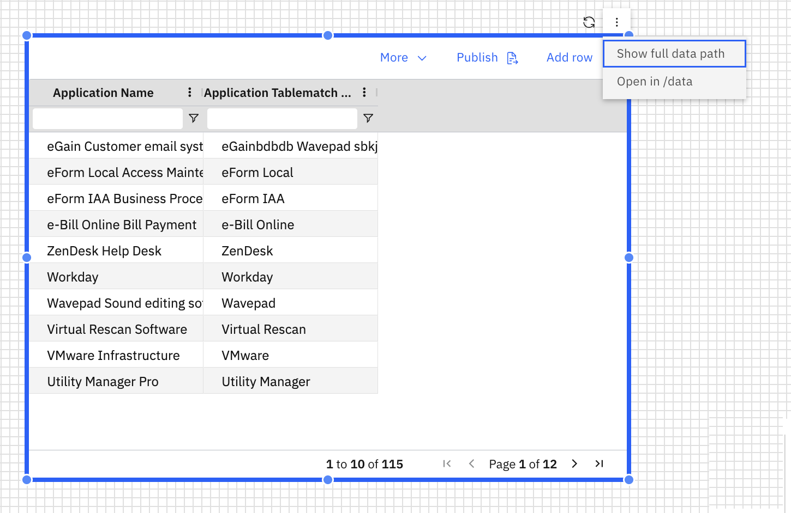
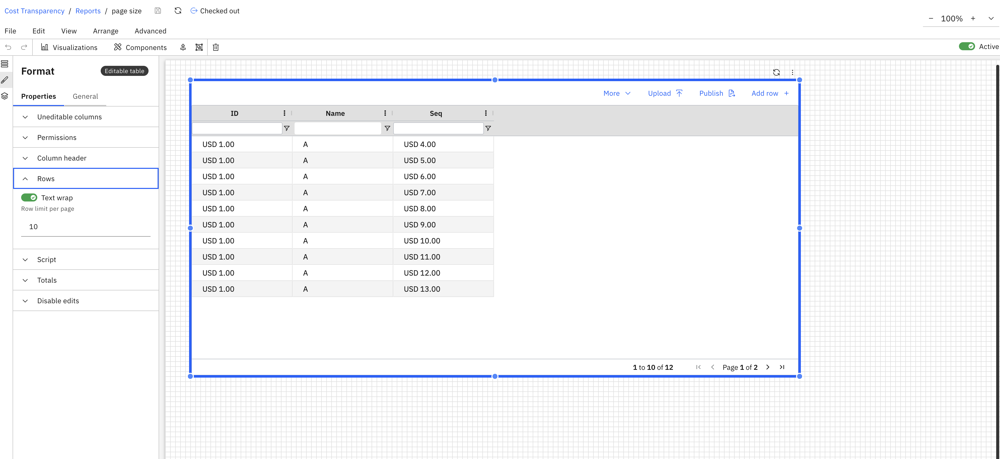
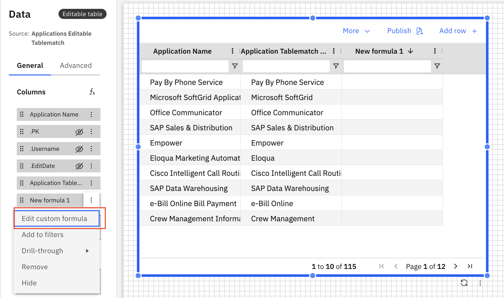

# Tabla editable

Una tabla editable permite editar los datos directamente dentro de la tabla, como actualizar valores, añadir nuevas filas o eliminar filas existentes, sin tener que salir de la tabla o navegar a una interfaz de edición independiente.

## Cuándo utilizar una tabla editable

Utilice tablas editables cuando desee:

- Actualizar valores en línea
- Colaborar en datos estructurados

## Añadir una tabla editable al informe

1. Añadir una tabla editable desde el panel Visualizaciones de la barra de herramientas
2. Haga clic en la tabla editable para activar los paneles Datos y Formato.
3. Panel de datos
   1. Arrastre uno o más campos al área **Columnas** desde el Explorador de dimensiones.
4. Panel de formato
   1. Propiedades generales: consulte [Propiedades de los componentes.](../components/components.html#abt-comp__comprop)
   2. Propiedades específicas de la tabla editable
      1. Columnas no editables: seleccione o deseleccione columnas específicas en las tablas editables como no editables.
      2. Permisos: otorgar o eliminar permisos para las propiedades de las tablas (como añadir filas, eliminar filas, cambiar el historial, etc.) a roles seleccionados o a toda la organización.
      3. Script: edita los scripts para habilitar acciones como ediciones de tablas, correos electrónicos, flujos de trabajo y lógica de botones.
      4. Totales: muestra el total de los valores numéricos de las filas y/o columnas.
      5. Desactivar ediciones: introduzca las condiciones para desactivar las ediciones en la tabla.

La tabla editable admite fórmulas personalizadas y dimensiones de fórmulas. Para obtener más información, consulte [Fórmulas personalizadas.](../create-first/custom-formula.html "Las fórmulas personalizadas (también denominadas dimensiones de fórmula) le permiten definir nuevas dimensiones calculadas utilizando campos existentes en su modelo de datos. Esto permite realizar análisis más profundos y obtener información más detallada sin necesidad de realizar cambios en el conjunto de datos o el esquema subyacentes.")

## Cargar datos en una tabla editable

La función **Cargar datos** permite rellenar rápidamente Tablas editables con datos de archivos. Esto facilita la adición o actualización de información en bloque sin necesidad de introducir manualmente cada valor.

**Pasos a seguir**

1. Navegue hasta la sección **Tabla editable** dentro de la aplicación.
2. Haga clic en el botón **Cargar** situado en la esquina superior derecha de la interfaz de la tabla.
3. En el **cuadro de diálogo de selección de archivos**, elija el archivo que desea cargar
   1. Formatos compatibles:.csv,.xlsx
4. Haga clic en **Abrir** para iniciar la carga.
5. Una vez finalizada la carga, la tabla **se actualizará** y mostrará los **datos recién añadidos.**



## Mostrar/Ocultar columnas en tabla editable

La función **Mostrar/Ocultar columnas** mejora la trazabilidad y facilidad de uso de los datos al permitir a los usuarios personalizar las columnas que se muestran en una tabla editable. También ayuda a agilizar la vista mediante auditorías y análisis al mantener ocultos por defecto los valores sensibles o generados por el sistema (.pk,.Username y .EditDate ).

**Pasos a seguir**

1. Abra la **configuración de columna** (normalmente representada por un engranaje o un icono de columna).
2. Aparecerá una lista de columnas disponibles con casillas de verificación.
3. Marque las casillas de las columnas que desee mostrar; desmarque las que desee ocultar.
4. La vista de tabla se actualizará instantáneamente para reflejar sus selecciones.





## Apptio Guión

La función de secuencias de comandos Apptio permite **interacciones y validaciones dinámicas** en tablas editables mediante secuencias de comandos backend.

**Pasos a seguir**

1. El script se ejecuta automáticamente en segundo plano, sin que el usuario tenga que hacer nada.
2. Garantiza que los comportamientos de la tabla, como el formato condicional, la validación de datos o los cálculos automáticos, se ejecuten correctamente a medida que los usuarios interactúan con la tabla.



## Publicar para transformar tabla

La función Publicar en tabla de transformación permite a los usuarios publicar los cambios realizados en una tabla editable en una tabla de transformación vinculada. De este modo se garantiza que cualquier actualización o edición realizada en el nivel de entrada de datos se refleje posteriormente para su procesamiento y análisis.

**Pasos a seguir**

1. Después de realizar modificaciones en la tabla editable, pulse el botón **Publicar**.
2. Aparecerá una ventana modal mostrando la tabla de transformación asociada.
3. Revise los detalles y haga clic en **Confirmar** para continuar.
4. Aparecerá una notificación confirmando que los cambios se han añadido a la tabla de transformación.
5. Se abrirá el modal **Check-In**, que le permitirá finalizar y enviar los cambios.

   Nota: Actualmente, esta función sólo está disponible para **los usuarios administradores**.

## Desactivar ediciones

Este campo admite una expresión de texto dinámica. Si la expresión se evalúa como verdadera, se desactivará la edición de la tabla. En el ejemplo siguiente, el usuario ddavis no podrá editar la tabla.

```
“ {$CurrentUser:Users.ID}=ddavis@ABCCompany.com ”
```

## Columna espaciadora

La columna espaciadora añade una separación visual entre las columnas para mejorar la legibilidad. Para añadir una columna espaciadora a una tabla editable, haz clic con el botón derecho del ratón en la tabla y selecciona **Insertar columna a la derecha** > **Columna espaciadora**. Aparece una nueva columna en la parte superior de la tabla editable.



## Habilitar/Deshabilitar Traspaso

Esta función le permite trasladar los valores numéricos a un informe de tabla editable (ET). En la tabla editable, seleccione **Más opciones** y, a continuación, seleccione la opción **Habilitar traspaso**.



Nota: El arrastre solo es aplicable a valores numéricos y columnas consecutivas. Si hay una columna no numérica entre medias, el arrastre no se aplicará a partir de entonces.

No se pueden mover las columnas si se selecciona la opción Habilitar traslado. Si el usuario selecciona **Desactivar traspaso**, el traspaso se desactivará y el botón aparecerá como **Activar traspaso**, y viceversa.

El comportamiento de transferencia solo es aplicable a la sesión local y no persiste. Por lo tanto, cada vez que el usuario vuelva, estará en el estado predeterminado de transferencia habilitada.

## Actualizar datos

Actualizar datos actualiza el contenido de la tabla globalmente. Aparece en la parte superior o inferior derecha de la tabla editable.



## Diagnóstico de datos

Esta función le permite abrir (/data) para realizar una depuración más exhaustiva. Para ver y abrir la ruta completa de los datos, seleccione la tabla editable y haga clic en los tres puntos.



## Ajusta automáticamente el ancho de los encabezados y las celdas de las tablas editables

Las tablas editables ahora admiten el ajuste automático del texto tanto en los encabezados de columna como en las celdas, lo que mejora la legibilidad y garantiza que el contenido sea totalmente visible sin necesidad de cambiar manualmente el tamaño.

## Configuración de los límites de filas en tablas editables

Las tablas editables admiten ahora límites de filas configurables, lo que permite a los usuarios controlar el número máximo de filas que se pueden añadir o editar en una tabla. Esto permite gestionar los flujos de trabajo de introducción de datos de forma más eficaz y garantiza un mayor control sobre el tamaño de las tablas y su facilidad de uso.



## Visualización de datos formateados en tablas editables

Las tablas editables ahora admiten la visualización de datos con formato, lo que garantiza que los valores se muestren siguiendo las reglas de formato configuradas en la tabla. Esto mejora la legibilidad y ofrece una experiencia más coherente en la elaboración de informes y la introducción de datos.

## Uso de fórmulas personalizadas con la opción «Añadir al filtro» en tablas editables

Ahora se pueden utilizar fórmulas personalizadas con la función «Añadir al filtro» en las tablas editables. Esta mejora permite a los usuarios crear filtros más flexibles y dinámicos basados en valores calculados dentro de la tabla.


