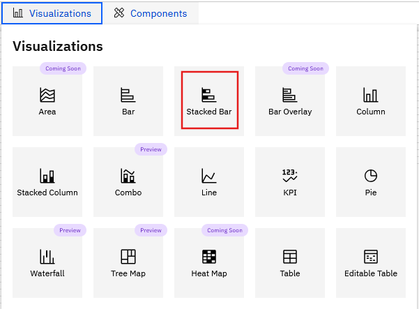
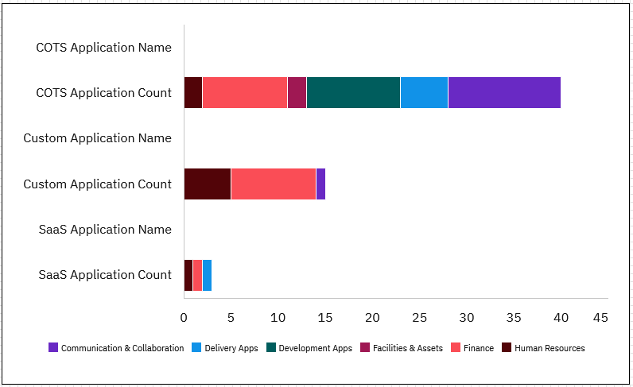

# Barras apiladas

Para crear un gráfico de barras,

1. Abra un informe nuevo o existente.
2. Vaya a **Visualizaciones** y seleccione el mosaico **Barra apilada**.

   
3. Haga clic en la visualización Barra apilada para activar los paneles **Datos** y **Formato**.
4. Despliegue los paneles para configurar los datos y las opciones de formato:

   |  |  |
   | --- | --- |
   | **Datos** | |
   | Seleccionar objeto modelo | Seleccione el objeto modelo en la lista desplegable |
   | Leyenda | Arrastre o añada los datos para la leyenda. |
   | Eje Y | Arrastre o añada los datos para el eje Y |
   | Eje X | Arrastre o añada los datos para el eje X |
   | Filtros | Arrastre o añada los criterios de filtrado |
   | **Formato - Propiedades** | |
   | Eje X | Edite las siguientes propiedades, según sea necesario - Mostrar el título del eje X. Añada un título al gráfico de barras. - Mostrar los valores del eje X - Tamaño y estilo de letra (negrita, cursiva, subrayado) - Color del texto del título y los valores del eje X (con opción para restablecer el color) - Conmutar la posición del eje - Mostrar las líneas de la cuadrícula del eje X |
   | Eje Y | Edite las siguientes propiedades, según sea necesario - Mostrar el título del eje Y - Mostrar los valores del eje Y - Tamaño y estilo de letra (negrita, cursiva, subrayado) - Color del texto del título y los valores del eje Y (con opción para restablecer el color) - Alternar para invertir el rango - Mostrar las líneas de la cuadrícula del eje Y |
   | Leyenda | Edite las siguientes propiedades, según sea necesario - Mostrar la leyenda - Tamaño y estilo de fuente de la leyenda (negrita, cursiva, subrayado) - Color del texto de la leyenda (con opción para restablecer el color) |
   | Barras | Edite las siguientes propiedades, según sea necesario - Número de resultados a mostrar - Acolchado entre barras (grosor de las barras) - Relleno entre grupos (espacio entre grupos) - Color de la barra para todos los parámetros - Leyenda, eje X, eje Y |
   | Etiquetas de datos | Edite las siguientes propiedades, según sea necesario - Alternar para mostrar las etiquetas de datos - las opciones son **dentro** o **fuera de** la barra. |

A continuación se muestra un ejemplo de gráfico de barras apiladas:

