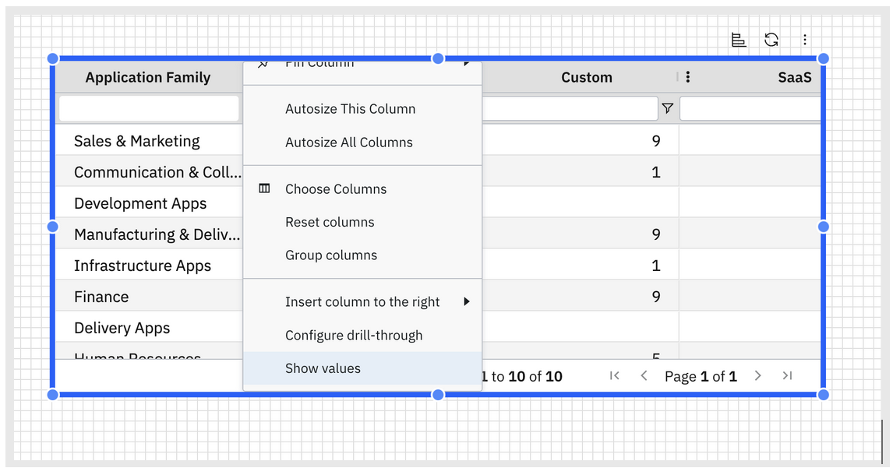
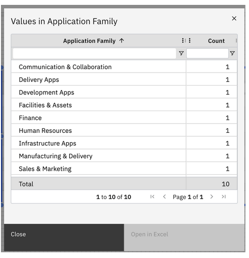

# Mostrar valores

La función **«Mostrar valores»** te ayuda a comprender rápidamente cómo se distribuyen los datos dentro de una columna. Muestra todos **los valores únicos** de la columna seleccionada, junto con el **número de veces que aparece cada valor** en la tabla.

**Utiliza esto para**

- Explora un conjunto de datos antes de crear visualizaciones
- Comprueba la calidad de los datos (duplicados, valores en blanco, valores inesperados)
- Comprender los campos categóricos

**Cómo utilizar «Mostrar valores»**

1. Abrir una mesa
2. Pasa el cursor por encima de la columna que quieras analizar
3. Haz clic en el menú desplegable del encabezado de la columna
4. Seleccionar «Mostrar valores»

Se abre una vista tabular que muestra:

- Valor: cada valor único de la columna
- Recuento: número de filas que contienen ese valor

**Tema principal:** [Tabla](../../../studio/report-studio/visualizations/rs-table.html "El componente de tabla muestra los datos en un formato tabular estructurado. Es ideal para mostrar información detallada, resumir métricas y facilitar el filtrado interactivo dentro de un informe.")
