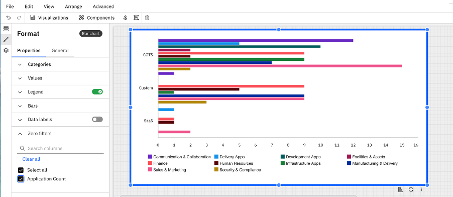

# Sin filtros

Ahora se admiten los filtros de valor cero en las visualizaciones de gráficos, lo que permite a los usuarios incluir o excluir puntos de datos con valores cero durante el análisis. Esto ofrece una mayor flexibilidad a la hora de centrarse en las tendencias relevantes, reducir el ruido visual y mejorar la legibilidad general y la interpretación de los datos de los gráficos.

