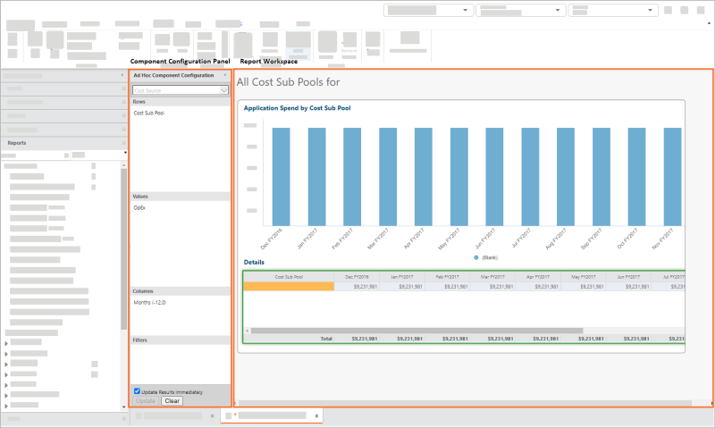
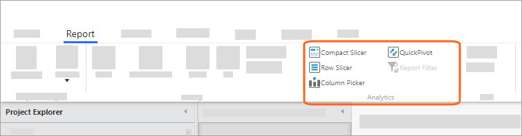

# Acerca de los informes

**Se aplica a** : TBM Studio 12.0 y posteriores

Para mostrar los datos a los usuarios, cree informes utilizando la sección **Informes** del **Explorador de proyectos**. Cuando se edita un informe, el panel de **Configuración de componentes** y el área de trabajo del informe aparecen como se muestra en la imagen siguiente. Los informes pueden incluir diversos componentes, como tablas, gráficos, botones, notas, cuadros de grupo y rebanadores. Con las rebanadoras, los usuarios pueden filtrar rápida y fácilmente los datos que aparecen en tablas y gráficos. Para obtener información sobre la visualización e impresión de informes, consulte [Trabajar con informes](work-with-reports.html "Se aplica a: TBM Studio 12.0 y posteriores").

## Añadir interactividad

Los informes basados en objetos de los modelos pueden incluir enlaces que lleven a informes más detallados. Los enlaces proporcionan un nivel básico de interactividad a los usuarios. Puede proporcionar más interactividad añadiendo rebanadoras, seleccionadores de campos y pivotes rápidos, como se muestra en la siguiente imagen. Las rebanadoras filtran la tabla (o el gráfico) por los valores seleccionados. Seleccionando Column Pickers se añaden columnas y seleccionando Quick Pivot se agrupan los datos por una columna seleccionada.

## Tablas y gráficos personalizados

Además de las rebanadoras, los selectores de campos y los pivotes rápidos, los usuarios finales asignados a una función de Analista pueden añadir tablas y gráficos personalizados a los informes.

## Pasos generales para crear informes

A continuación se indican los pasos generales para crear informes:

- Crear un informe en blanco.
- Añade tablas y gráficos.
- Organice los cuadros y gráficos para presentar mejor los datos y facilitar el acceso.
- Añada rebanadores para que los usuarios puedan filtrar el informe.
- Añada navegación entre informes si es necesario.
