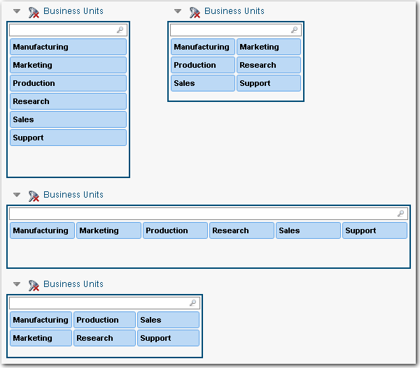

# Ordenar los valores de la cortadora

**Se aplica a** : TBM Studio 12.0 y posteriores

Puede organizar los valores de una rebanadora verticalmente (por defecto) u horizontalmente seleccionando las opciones de **Diseño** en la pestaña **Rebanadora**. Además, puede seleccionar el número de columnas o filas en el menú desplegable situado debajo de cada opción. La misma cortadora dispuesta verticalmente, horizontalmente, con una y dos columnas, y con una y dos filas se muestra en la siguiente imagen:

