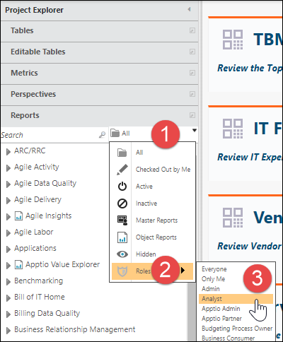

# Controle el acceso a los informes mediante permisos basados en funciones

**Se aplica a** : Apptio TBM Studio 12.7 y posteriores.

Los permisos de informes permiten al administrador controlar el acceso de los usuarios finales a los informes estableciendo permisos para los informes por función. Consulte [Trabajar con funciones y permisos de usuario en Apptio Studio](https://community.ibm.com/community/user/viewdocument/manage-user-permissions-and-roles "(se abre en una pestaña o una ventana nueva)"). Antes de la versión TBM Studio 12.7, la configuración de permisos de informes individuales podía hacer que el sistema creara copias adicionales de informes por rol. Este planteamiento era difícil de mantener. En TBM Studio12.7 y versiones posteriores, la configuración de permisos ya no crea informes secundarios específicos para cada función. Ahora puede configurar los permisos a nivel de las Colecciones de Informes. Véase [Crear y gestionar colecciones de informes](creating-report-collections.htm "(se abre en una pestaña o una ventana nueva)"), además del nivel de informe.

Para sacar el máximo partido a los permisos de informe, ten en cuenta lo siguiente:

- Los permisos de **informes existentes seguirán funcionando** : si los usuarios han establecido permisos basados en funciones en informes anteriores a 12.7, estos permisos heredados seguirán funcionando en 12.7, pero puede resultar difícil modificarlos.
- **página "Acceso denegado** " - Anteriormente, cuando los usuarios no tenían permiso para ver un informe, veían una página de informe con sólo un componente de informe en blanco. Los usuarios encontraban esto confuso. En TBM Studio 12.7 y posteriores, el sistema evalúa el rol del usuario cuando intenta acceder al informe. Los usuarios sin permiso suficiente verán la pantalla Acceso denegado.
- **Los permisos de los informes no se aplican mientras se está en TBM Studio** - Esto puede ayudar a los administradores a probar los permisos antes de comprobarlos. Las pruebas ayudan a garantizar la exactitud de los permisos y que los usuarios no configuren los permisos de forma que bloqueen a todos los usuarios de una vista de informe determinada.
- **Los permisos de informe son ajustes a nivel de proyecto** - Esto significa que los usuarios no tendrán que comprobar los permisos para establecerlos, pero los permisos deben ser comprobados y la instancia calculada antes sin permiso suficiente vería la pantalla Acceso denegado.
- **Filtro de informes por** función - En TBM Studio, los usuarios tienen la opción de filtrar la lista de informes del proyecto por función. Al hacerlo, se muestra qué informes tienen permisos específicos establecidos para ese rol. Para ello:
- Seleccione el filtro del informe. A continuación, seleccione **Roles**. Muestra una lista de todos los roles de la instancia.
- Seleccione un rol de la lista para que la lista de informes muestre sólo los informes con permisos específicamente configurados para ese rol**.NOTICE**

  Los informes con permisos establecidos en "Todos" (todos los informes OOTB hasta que se personalicen) no aparecerán en estas listas filtradas.

  

## Establecer permisos

Puede establecer permisos de informe por función a nivel de informe o de colección de informes.

## Establecer permisos de recopilación de informes

1. En TBM Studio, en la pestaña **Proyecto**, en el grupo Datos del proyecto, seleccione **Colecciones de informes**.
2. En el cuadro de diálogo **Gestionar colecciones** de informes, seleccione la colección de informes cuyos permisos se modificarán.
3. En **Visible por**, seleccione **Funciones seleccionadas** y, en la lista desplegable que aparece, seleccione las funciones que tendrán acceso a esta colección de informes.
4. Una vez establecidos los permisos, cierre el cuadro de diálogo y compruebe las actualizaciones. Los cambios en los permisos aparecerán en el cuadro de diálogo Check In como el nombre de la colección de informes en la que se modificaron los permisos.

Una vez calculado cada entorno, por ejemplo, Desarrollo y luego Puesta en escena, los demás usuarios podrán ver los permisos aplicados en el entorno calculado. Al igual que otros ajustes del proyecto, estos ajustes tendrán que ser promovidos a Producción.

## Establecer permisos para informes individuales

1. Para establecer permisos para un informe, primero compruebe ese informe. A continuación, en la pestaña **Informe**, en el grupo **Avanzado**, seleccione **Permisos**.
2. En el cuadro de diálogo **Cambiar permisos**, en **Visible por**, seleccione **Funciones seleccionadas** y, en la lista desplegable que aparece, seleccione las funciones que tendrán acceso a este informe.
3. Una vez establecidos los roles, guarda los permisos y comprueba las actualizaciones. Los cambios en los permisos aparecerán en el cuadro de diálogo Check In como el nombre del informe en el que se modificaron los permisos.

Una vez calculado cada entorno, por ejemplo Desarrollo y luego Puesta en Escena, los demás usuarios podrán ver los permisos aplicados en el entorno calculado. Al igual que otros ajustes del proyecto, estos ajustes tendrán que ser promovidos a Producción.

## Buenas prácticas en materia de permisos

Con las capacidades de permisos introducidas en TBM Studio 12.7, es más fácil para los usuarios modificar los permisos a nivel de informe sin todos los problemas que se creaban cuando los usuarios utilizaban los permisos antes de 12.7. Utiliza los siguientes consejos para sacar el máximo partido a estas habilidades:

- Al **establecer nuevos permisos, comience por las colecciones de informes siempre que sea posible** - Al actualizar los permisos, haga todo lo posible a nivel de colección de informes antes de realizar cambios en los informes individuales. Esto ayudará a garantizar que los cambios realizados en los permisos a nivel de informe no entren en conflicto con los permisos de toda la colección.
- **Realice anotaciones al registrar el trabajo** : la descripción estándar que aparecerá en el Historial de registros para las actualizaciones de los permisos de los informes sólo contendrá el nombre de la colección o del informe cuyos permisos se hayan actualizado. Tomar notas más descriptivas al registrar el trabajo puede ayudar a solucionar problemas más adelante.
- **Rellenar la dirección de correo electrónico de Soporte** - Esta dirección de correo electrónico puede ser especialmente útil cuando un usuario intenta acceder a un informe para el que no tiene permisos. Aunque esto no es tan necesario en organizaciones más pequeñas, el número de usuarios puede crecer rápidamente, por lo que es útil tener este valor establecido para que los nuevos usuarios puedan canalizar sus preguntas a través de una única dirección de correo electrónico. Para ello:
  1. En la pestaña **Proyecto**, en el grupo **Dominio**, haga clic en **Configuración del dominio**.
  2. En el cuadro de diálogo **Configuración del inquilino**, **campo Correo electrónico de soporte**, añada la dirección de correo electrónico de su TBMO. **CONSEJO** - Si desea revertir la pantalla Acceso denegado a su contenido original sin dirección de correo electrónico, sustituya la dirección de correo electrónico personalizada anterior por [support@apptio.com](mailto:support@apptio.com "(se abre en una pestaña o una ventana nueva)").
- **Atención a las advertencias** de conflicto: si establece permisos que podrían entrar en conflicto con permisos establecidos en un nivel superior (colecciones) o inferior (informes), asegúrese de estar atento a las advertencias de conflicto de permisos que se han añadido a los cuadros de diálogo de nivel de informe y de colección de informes**.AVISO**

  Debido a la forma en que se detecta este conflicto, esta advertencia aparecerá sólo después de que los permisos basados en roles para un informe hayan sido configurados, registrados y la instancia haya terminado de calcularse.
- **Vista a nivel de informe con conflictos a nivel de colección** : muestra los permisos que ya se han reducido para la colección que contiene el informe.
- **Vista a nivel de colección con conflictos en los informes subyacentes** : muestra que los permisos establecidos para la colección de informes entran en conflicto con los permisos establecidos en el informe Cartera de aplicaciones.
- **Sugerencias de prueba y validación** - Muchos clientes utilizan el inicio de sesión seguro (SSO), lo que puede dificultar la prueba de esta nueva funcionalidad. A continuación se ofrecen algunas sugerencias para ayudar a los usuarios:
  - Dado que los permisos de los informes no se aplican en TBM Studio, cualquier administrador puede modificar los permisos de un informe en TBM Studio y luego salir de TBM Studio y volver a la aplicación (por ejemplo, a Costing Standard) donde se aplican los permisos. Si el administrador no tiene los permisos adecuados para ver un informe, verá la pantalla Acceso denegado cuando no esté en TBM Studio.
  - Cuando se prueban muchos roles, puede ser útil coordinar un pequeño grupo de usuarios finales que estén dispuestos a probar haciendo clic en los informes después de que un administrador haya modificado los permisos de los informes (y posiblemente los roles de usuario si se prueban muchos roles).

## Trabajar con permisos previos

Como se mencionó anteriormente, si tiene informes que han sido configurados para utilizar permisos de informe antes de 12.7, entonces esos permisos seguirán funcionando. Sin embargo, en algún momento surgirá un nuevo requisito o función que deberá añadirse a uno de los informes personalizados por función. En este caso, consulte la [Guía de migración del control de acceso a informes](migratereportaccesscontrol.htm "(se abre en una pestaña o una ventana nueva)").

## Preguntas frecuentes

**P: Si he personalizado informes utilizando permisos anteriores a 12.7, ¿podré seguir utilizándolos?**

R: Sí. La actualización a 12.7 no cambia la forma de navegar y acceder a los informes personalizados por roles. Proporciona una experiencia más limpia para cualquier nuevo permiso que deba aplicarse en el futuro.

**P: ¿Tengo que hacer algún cambio en mi instancia para empezar a utilizar la nueva funcionalidad de permisos cuando actualice a 12.7?**

R: No. Los antiguos permisos de informe seguirán funcionando en paralelo con la nueva funcionalidad, por lo que podrá decidir cuándo desea empezar a utilizar la nueva funcionalidad.

**P: ¿Cómo puedo ver qué informes tienen permisos establecidos para mi función?**

R: En el Explorador de Proyectos, puede aplicar un filtro por rol a la lista de Informes para ver todos los informes que tienen permisos establecidos para un rol determinado.

**P: ¿Por qué faltan funciones personalizadas en mi lista de funciones?**

R: Esto suele deberse a que Enhanced Access Administration no está configurado correctamente, lo que provoca que la instancia no se conecte correctamente a Enhanced
Access Administration , donde se mantiene la lista completa de roles personalizados.

**P: ¿Qué registro del Historial de comprobaciones captura los permisos que apliqué a una determinada colección de informes en caso de que necesite revertirlos?**

R: Si no añadió notas para calificar cuándo se modificó una colección de informes, puede ser difícil saber qué se registró como parte de un registro determinado. El historial de registros sólo contiene el nombre del informe o de la colección de informes una vez que se han ampliado los registros.
