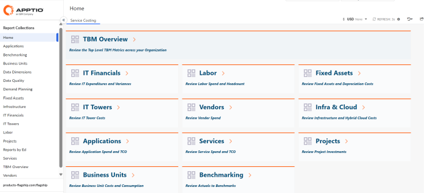
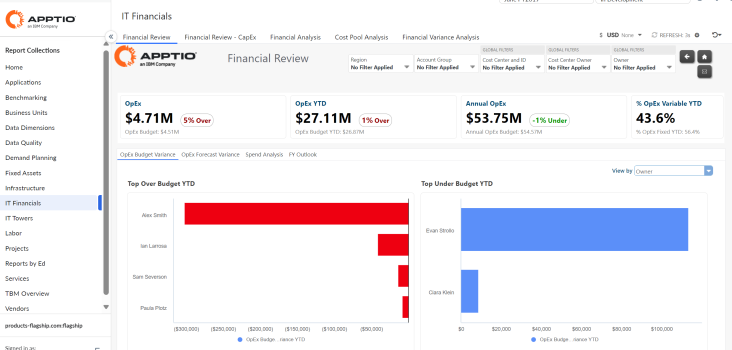

# Crear colecciones de informes

**Se aplica a** : TBM Studio 12.0 y posteriores

En el sistema Apptio, las colecciones de informes agrupan informes relacionados para que los usuarios puedan navegar fácilmente entre informes de un tema o perspectiva similar. Los administradores configuran las colecciones de informes para limitar los roles de usuario que pueden acceder a los informes dentro de una colección. Los administradores pueden establecer permisos de función para las colecciones de informes y crear o eliminar colecciones de informes personalizadas.

Para más información sobre:

- Roles, ver [Permisos y roles de Frontdoor](https://community.ibm.com/community/user/viewdocument/manage-user-permissions-and-roles?CommunityKey=44bcb0d2-5ce6-4504-89eb-019253d3b5d8&tab=librarydocuments "(se abre en una pestaña o una ventana nueva)").
- Permisos de informes, consulte [Trabajar con permisos de informes](control-access-reports-11755.html "Se aplica a: Apptio TBM Studio 12.7 y posteriores.").

## Crear una colección de informes personalizada

Sólo los administradores pueden crear colecciones de informes, y únicamente en el proyecto Costing Standard . Una vez creadas, las colecciones de informes están disponibles en todo un proyecto, y otros usuarios pueden añadir y eliminar informes de una colección.

1. En la pestaña **Proyecto**, en el grupo **Datos del proyecto**, haga clic en **Recopilaciones de informes**.
2. En el cuadro de diálogo **Gestionar colecciones de informes**, haga clic en **Añadir colección**.Se añade una nueva entrada a la lista de colecciones. La entrada se llama **Nueva colección de informes**. La nueva colección aparece en el campo **Colección seleccionada**.

   
3. Para cambiar el nombre de la colección, haga clic en la entrada **Nueva colección de informes** de la lista de colecciones y, a continuación, haga clic en el nombre de la colección en el campo **Colección seleccionada**.

   

## Eliminar una colección de informes personalizada

Seleccione el informe en el cuadro de diálogo **Gestionar colecciones de informes**.

Haga clic en el botón **Eliminar colección**.

**Notas:**

- Los usuarios sólo pueden eliminar colecciones de informes personalizados.
- Alternativamente, en TBM Studio 12.7 y posteriores, puede explorar otras opciones descritas en [Desactivar informes](disablereports.html "◆ Se aplica a: TBM Studio 12.7 y posteriores") y [Trabajar con permisos de informes](control-access-reports-11755.html "Se aplica a: Apptio TBM Studio 12.7 y posteriores.").

## Añadir un informe a una colección

1. Haga clic en el informe en el **Explorador de proyectos**.
2. En la pestaña **Informe**, en el grupo **Agrupación**, haga clic en **Asignar a colección**.

   
3. Abra la lista desplegable y seleccione la colección a la que debe añadirse el informe. Un informe sólo puede asignarse a una colección de informes.

## Eliminar un informe de una colección

1. Navegue hasta el informe y compruébelo.
2. En la pestaña **Informe**, en el grupo **Agrupación**, haga clic en **Asignar a colección**.
3. En el menú que aparece, haga clic en la X roja junto al nombre de la colección.

Consejo: Si tiene acceso a la creación de contenidos, puede eliminar un informe de una colección utilizando el cuadro de diálogo **Gestionar colecciones de informes**. Para eliminar un informe de esta forma, haga clic en la X roja situada a la derecha del registro de ese informe dentro de la colección:

## Ocultar o mostrar un informe en una colección

En lugar de eliminar un informe de una colección de informes, puede ocultar un informe de una colección de informes. Por ejemplo, puede hacer esto para los informes listos para usar a los que no desea que accedan los usuarios porque los datos del informe aún no están disponibles. A continuación, una vez cargados los datos para iluminar el informe, podrá mostrarlo.

Nunca elimine un informe de una colección de informes. En su lugar, oculta el informe.

## Ocultar un informe en una colección de informes

1. En la pestaña **Proyecto**, en el grupo **Datos del proyecto**, haga clic en **Recopilaciones de informes**. Aparece el cuadro de diálogo Gestionar colecciones de informes.
2. En la lista **Colecciones disponibles** de la izquierda, seleccione la colección de informes que contiene el informe que desea ocultar. A la derecha aparece la lista de informes existentes en la colección de informes seleccionada.
3. Para los informes que desee ocultar, desactive la casilla **Mostrar en el navegador** situada junto al nombre del informe:
4. Pulse el botón **Cerrar**.

## Mostrar un informe oculto en una colección de informes

1. En la pestaña **Proyecto**, en el grupo **Datos del proyecto**, haga clic en **Recopilaciones de informes**. Aparece el cuadro de diálogo Gestionar colecciones de informes.
2. En la lista **Colecciones disponibles** de la izquierda, seleccione la colección de informes que contiene el informe que desea mostrar.
3. Para los informes que desee mostrar, seleccione la casilla **Mostrar en el navegador** situada junto al nombre del informe y, a continuación, haga clic en **Aceptar**.

## Añadir un navegador de colección de informes a un informe

El navegador de la colección de informes es un componente que permite a los usuarios desplazarse fácilmente entre los informes de una colección. Cuando se añade un informe a una colección, el componente navegador se añade automáticamente al informe.

## Paletas de colores personalizadas

Se aplica a R12.10.10 y posteriores.

El administrador (administrador del cliente, Apptio Admin, Partner Admin) puede crear colores corporativos y tener una paleta de colores definida para elegir los colores de los gráficos, para una mejor experiencia de usuario con información visualmente atractiva.

Para saber más sobre la aplicación de la paleta de colores, consulte [Paletas de colores personalizadas](../admin/color-enhancement.html).

Nota: Si se selecciona una paleta de colores para una colección de informes y se selecciona una paleta de colores diferente para un informe dentro de ella, cambiará la paleta de colores sólo para ese informe.
