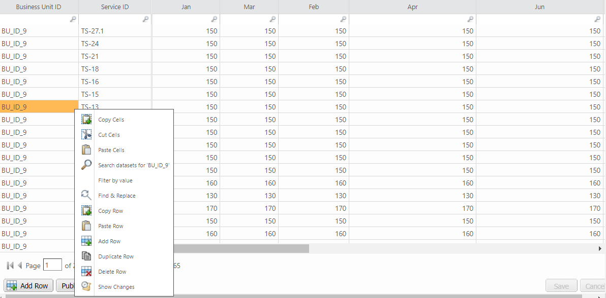
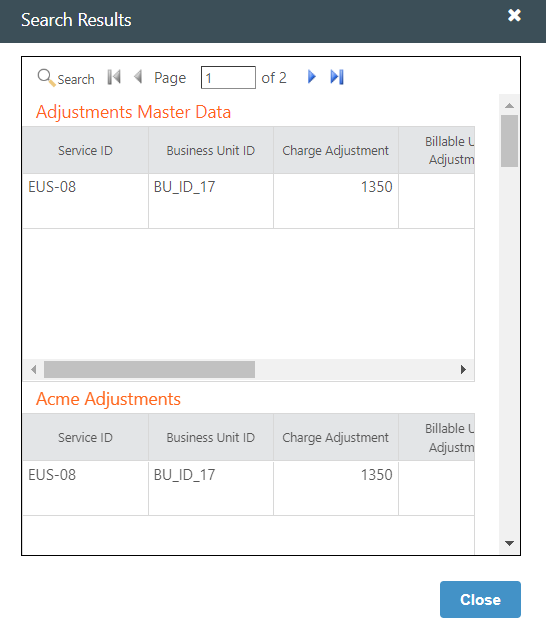
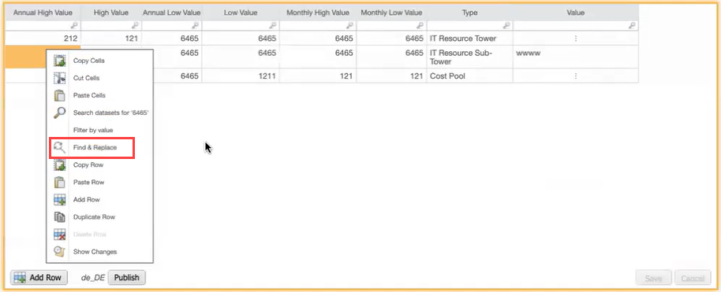
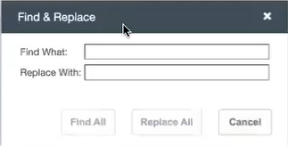
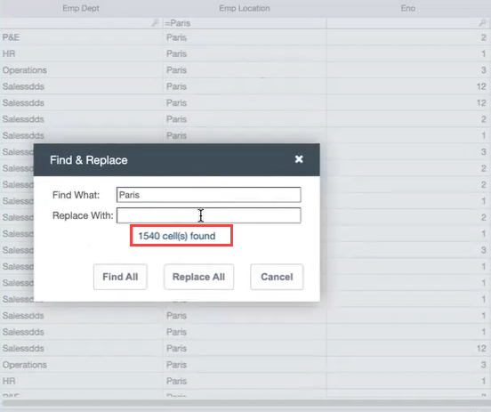
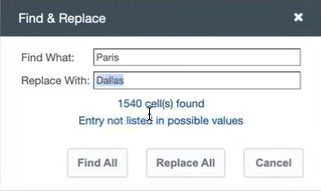
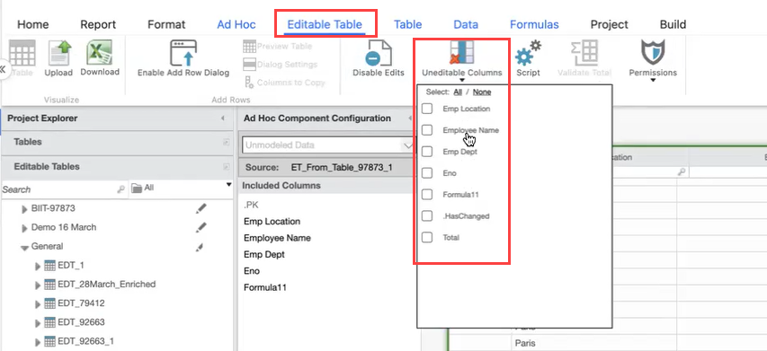
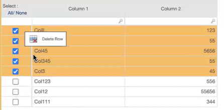
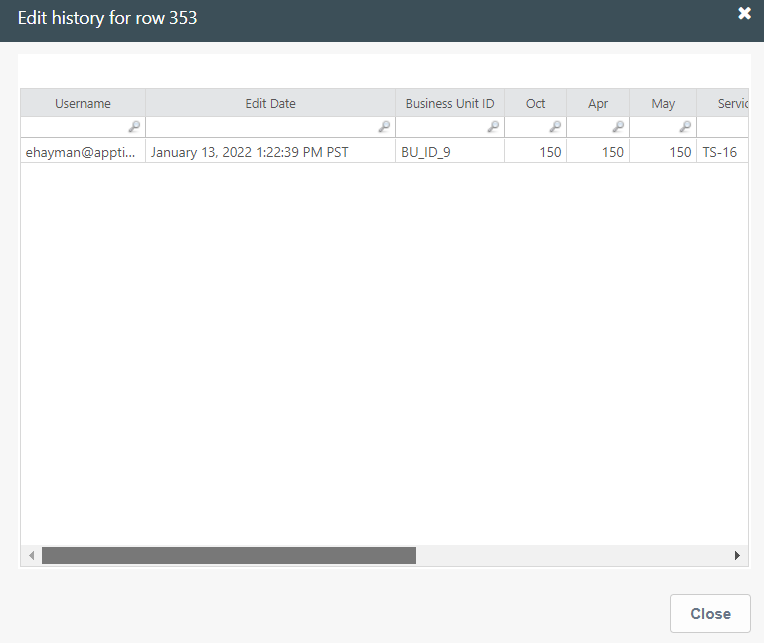
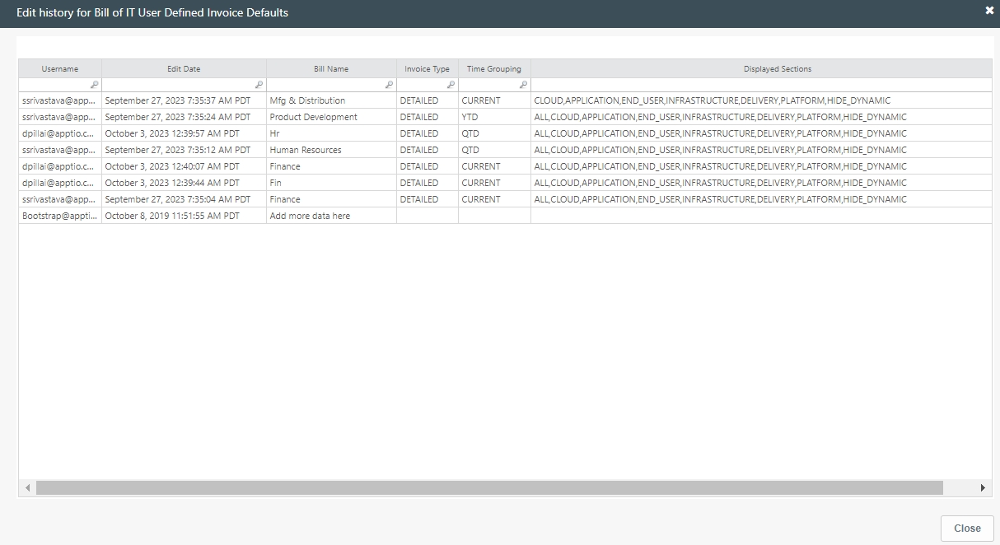

# Editar propiedades de fila

## Buscar conjuntos de datos

Mantenga el cursor sobre el valor/celda que desea buscar en los conjuntos de datos. Haga clic con el botón derecho y seleccione Buscar conjuntos de datos para <valor> para ver los resultados de la búsqueda en una ventana emergente.

## Filtrar por valor

Mantenga el cursor sobre la celda/para la que desea filtrar la tabla. Haga clic con el botón derecho y seleccione Filtrar por valor para ver los resultados filtrados por el valor de esa celda.

## Buscar y reemplazar

**Se aplica a** 12.10.10 y posteriores

Esta función sólo es aplicable a algunas columnas del componente Tabla editable e [Informes con tabla editable](tables/et-report-find-replace.htm "(se abre en una pestaña o una ventana nueva)"). Puede buscar o sustituir en columnas que procedan de otra tabla de origen si la casilla **Permitir edición en columnas incluidas** está seleccionada en la configuración del ET.

Para buscar y sustituir un valor en la tabla, haga lo siguiente:

1. Haga clic con el botón derecho en la columna editable de la tabla

   
2. Elija la opción **Buscar y reemplazar**. Aparece la siguiente ventana emergente

   
3. Introduzca el valor (distingue mayúsculas de minúsculas) que desea buscar y seleccione el botón **Buscar todo**. Se mostrará el recuento de resultados coincidentes exactos.

   
4. Introduzca el valor que desea sustituir y seleccione el botón **Sustituir todo**. Si hay algún error en el valor de sustitución, aparecerá un mensaje de error apropiado. Véase el ejemplo siguiente

   
5. La opción Buscar y reemplazar se desactivará para las [columnas no editables](tables/edit-properties-tables.htm "(se abre en una pestaña o una ventana nueva)").

   

**Excepciones**

- La función de búsqueda no admite la búsqueda booleana
- La búsqueda sólo es aplicable a una columna cada vez, y no en toda la tabla o en varias columnas juntas.
- La búsqueda no es aplicable a columnas deshabilitadas como fórmula, total, otros y columnas pk.

## Añadir fila

Haga clic en el botón **Añadir fila** de la parte inferior de la tabla. Se añade una nueva fila en la parte inferior de la tabla, en color naranja.

## Fila duplicada

Para saber más, consulte [Añadir fila duplicada.](tables/add-duplicate-row.htm "(se abre en una pestaña o una ventana nueva)")

## Suprimir fila

Haga clic con el botón derecho del ratón en la tabla editable y, a continuación, haga clic en **Eliminar fila**.

Si la **columna Añadir casilla de verificación** está activada en las [propiedades avanzadas](tables/set-table-properties.htm "(se abre en una pestaña o una ventana nueva)"), seleccione la casilla de verificación de una o varias filas, haga clic con el botón derecho y seleccione **Eliminar fila**.

## Mostrar cambios para esta fila

**12.11.1 y posteriores** : Esta opción mostrará los cambios para la fila seleccionada.

## Mostrar cambios

**12.11.0 y antes** : Esta opción mostraba los cambios para la fila seleccionada.

**12.11.1 y posteriores** : Seleccione esta opción para mostrar todos los cambios en toda la tabla

