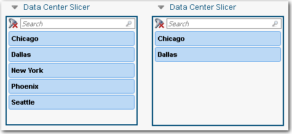
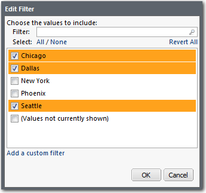

# Filtrar cortadoras

**Se aplica a** : TBM Studio 12.0 y posteriores

Para limitar los valores mostrados en la tabla, añada uno o varios filtros a la tabla. Cuando un usuario visualice el slicer, verá los resultados filtrados. En la siguiente imagen se muestra un slicer antes y después del filtrado:

## Añadir un filtro a una cortadora

1. Arrastre un campo del **Explorador de proyectos** al área **Filtros** del panel **Configuración de la cortadora**.
2. Haga clic con el botón derecho en el campo y seleccione **Editar filtro** en el menú emergente. Aparecerá el cuadro de diálogo **Editar filtro** como se muestra en la siguiente imagen:
3. Seleccione los valores que desea que se muestren en el corte y haga clic en **Aceptar**.
   - Para añadir un valor personalizado a la lista, haga clic en el enlace **Añadir un filtro personalizado**.
   - La **opción Valores no mostrados actualmente**, cuando está marcada, incluirá todos los valores que no se pueden mostrar en el filtro porque superan el límite de 1.000 valores.
   - Si hay más de 1.000 valores disponibles en el filtro, aparecerá un mensaje alertándole de ello y sugiriéndole que utilice el cuadro Filtro de la parte superior de la lista para encontrar valores adicionales.

## Publicar el filtro en una perspectiva

Al igual que con otros componentes de informes basados en objetos, puede publicar un filtro en una perspectiva personalizada. El filtro publicado puede utilizarse al crear otros componentes.

Para publicar un filtro:

1. Haga clic con el botón derecho del ratón sobre el filtro en el área **Filtros**.
2. Señale **Publicar** y seleccione una perspectiva existente o cree una nueva.

## Retirar un filtro de una cortadora

Para eliminar un filtro de una cortadora, realice una de las siguientes acciones:

- Arrastre el filtro fuera del área **Filtros**.
- Haga clic con el botón derecho en el filtro del área **Filtros** y seleccione **Eliminar** en el menú emergente.
