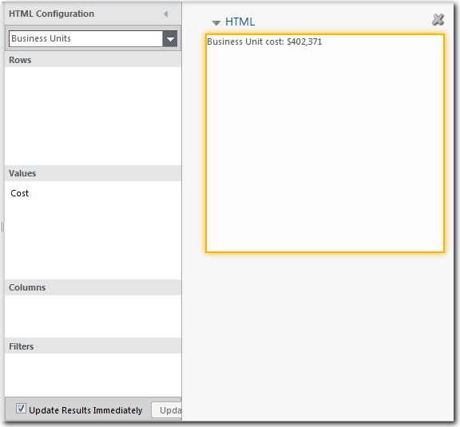
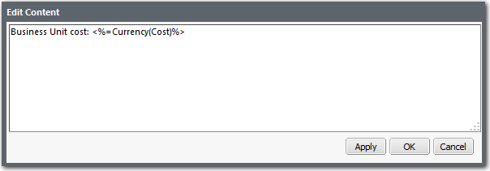

# Cuadro de texto HTML

**Se aplica a** : TBM Studio 12.0 y posteriores

Puede añadir un cuadro que contenga texto formateado en HTML. El texto puede presentar información que explique el informe o proporcione otros datos importantes. En la siguiente imagen se muestra un ejemplo de cuadro HTML. La sintaxis HTML admitida depende del navegador que utilice (no del cuadro de texto HTML).



El HTML puede incluir enlaces a otros informes y texto dependiente del contexto (texto dinámico), como la fecha o el nombre de usuario. Para más información, véase [Codificación de enlaces a otros informes](coding-links-to-other-reports.html "Se aplica a: TBM Studio 12.0 y posteriores"). El componente HTML se utiliza más a menudo para añadir texto, pero puede introducir cualquier código HTML correctamente formateado. Por ejemplo, puede añadir bordes y gráficos alrededor del cuadro de texto.

Nota: El cuadro de texto HTML no admite JavaScript.

Puede añadir un contexto de objeto para el texto dependiente del contexto utilizando el panel **Configuración HTML**.

Los cuadros de texto son visibles para todos los usuarios, independientemente de su función.

## Añadir un cuadro de texto HTML

1. En la pestaña **Informe**, haga clic en el icono **HTML**. El cuadro de texto se añade al informe y se abre el cuadro de diálogo **Editar contenido**, como se muestra en la imagen siguiente:
2. Introduzca el texto y la codificación HTML en el cuadro de diálogo.
   - Para añadir el texto al cuadro de texto y dejar abierto el cuadro de diálogo **Editar contenido**, haga clic en **Aplicar**.
   - Para añadir el texto al objeto de texto y cerrar el cuadro de diálogo, haga clic en **Aceptar**.

## Añadir un contexto de tabla al cuadro HTML

Si utiliza texto dependiente del contexto en el cuadro HTML, puede añadir un contexto de tabla mediante el panel **Configuración HTML**.

1. Seleccione la casilla HTML.
2. En el panel **Configuración HTML**, seleccione una tabla del campo situado en la parte superior del panel.
3. Si ha añadido una métrica en el texto como, por ejemplo, Coste, arrastre el campo de cálculo correspondiente al área **Valores** del cuadro de diálogo, como se muestra en la primera imagen.

## Editar texto en un cuadro de texto

Para editar texto en un cuadro de texto:

1. Selecciona el cuadro de texto.
2. En la pestaña HTML, haga clic en **Editar contenido**.

## Insertar texto dependiente del contexto en el HTML

La aplicación proporciona una sintaxis de secuencias de comandos que puede utilizar para insertar texto dependiente del contexto (dinámico) en cuadros de texto HTML y rutas de datos. Puede utilizar esta sintaxis para crear títulos de informes personalizados, leyendas y encabezados para columnas agrupadas en tablas. También puede utilizarla en el cuadro de diálogo **Editar ruta** disponible en el panel **Avanzado** del cuadro de diálogo **Propiedades** de una tabla.

El texto dinámico utiliza la siguiente sintaxis:

`<%=code%>`

En la declaración anterior, *el código* puede ser una referencia de columna a cualquier tabla, métrica, fórmula o función.

## Ejemplos

El siguiente ejemplo muestra el valor actual de la métrica Coste:

> `<%=Cost%>`

Los siguientes ejemplos muestran dos formas de formatear el valor actual de la métrica Coste como moneda:

> `<%=Currency(Cost)%>`
>
> `<%=NumberFormat(Table.Column,”$#,###.00”)%>`

El siguiente ejemplo hace referencia al contenido de la columna Nombre del servidor para mostrar el nombre del servidor actual:

> ```
> <%=Server.Server
>           Name%>
> ```

El siguiente ejemplo llama a la función IZQUIERDA para mostrar los tres caracteres situados más a la izquierda del nombre del servidor:

> `<%=LEFT(Servers.Server OS,3)%>`

El siguiente ejemplo utiliza sintaxis dinámica en un URL para mostrar la entrada CMDB de un servidor:

> ```
> <a
>           href="http://cmdb.company.com/report?server=<%=Server.ServerId%>">
> ```

El siguiente ejemplo muestra la fecha actual en el texto:

> `<%=CurrentDate()%>`

El siguiente ejemplo muestra el nombre de la cuenta de correo electrónico del usuario:

> `<%=$CurrentUser:Users.Id%>`

El siguiente ejemplo muestra el nombre completo del usuario:

> `<%=$CurrentUser:Users.Full Name%>`

El siguiente ejemplo muestra $0 si el valor devuelto está en blanco:

> ```
> <%=IF(IsNumeric(SRM
>           Debits and Credits),Currency({SRM Debits and
> Credits},"#,###"),"$0")%>
> ```

## Propiedades

Para editar las propiedades de un componente HTML, muestre el cuadro de diálogo **Propiedades** realizando una de las siguientes acciones:

- En la esquina superior izquierda del componente, haga clic en el pequeño triángulo  situado junto al nombre del componente para mostrar el menú **Acciones**. En el menú **Acciones**, seleccione **Propiedades**.
- Haga clic con el botón derecho del ratón en cualquier lugar dentro de los bordes del componente y seleccione **Propiedades** en el menú emergente.

## Propiedades generales

- **Nombre** - Introduzca un nombre que se mostrará en la cabecera de la tabla encima del componente. El nombre se muestra cuando se selecciona la opción **Mostrar encabezado**.
- **Mostrar cabecera** - La cabecera del componente muestra el contenido del campo **Nombre**. Seleccione esta opción para hacer visible la cabecera del componente (por defecto). Cuando la cabecera está oculta, puede detener el puntero del ratón sobre el componente para mostrarlo cuando esté en modo Edición.
- **Mostrar** borde - Seleccione esta opción para mostrar un borde alrededor de la tabla. Cuando el borde está oculto, puede mostrarlo deteniendo el puntero del ratón sobre el componente.
- **Ajustar título** - Ajusta el texto introducido en el campo **Nombre** a la anchura del componente.
- **Contexto de texto dinámico** - Especifica la ruta a la fuente que se utilizará para el texto dinámico introducido en el cuadro HTML. Para más información sobre el texto dinámico, véase más arriba Insertar texto dependiente del contexto.

## Propiedades avanzadas

- **Actualizar automáticamente al finalizar los cálculos** - Cuando la aplicación muestra un componente HTML, lo muestra con los datos calculados disponibles en ese momento. En muchos casos, la aplicación puede estar calculando nuevos valores en segundo plano. Si desea que se muestren los resultados una vez finalizados los cálculos, marque esta opción. Esta opción sólo está disponible cuando la **Política de cálculo** (en el cuadro de diálogo **Cálculo del proyecto** ) de un proyecto está establecida en **Publicación dinámica**.

## Añadir una barra de desplazamiento

Si desea introducir una gran cantidad de texto en el cuadro HTML, pero quiere limitar el tamaño del cuadro, puede añadir una barra de desplazamiento utilizando el siguiente código HTML:

> ```
> <div
>           style="overflow-y:scroll; height:100%">
> This is
>             a</br>
> test for scroll</br>
> bars</br>
> </div>
> ```
