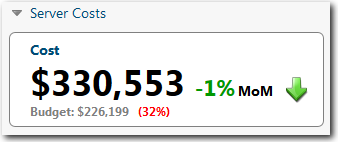
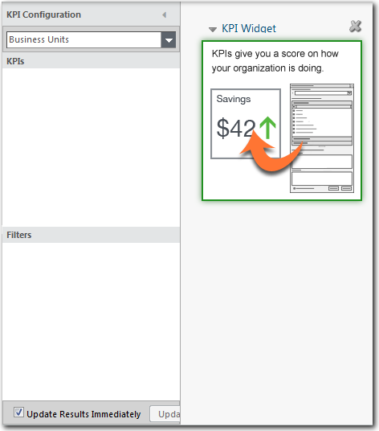
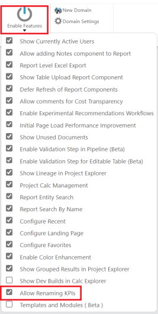
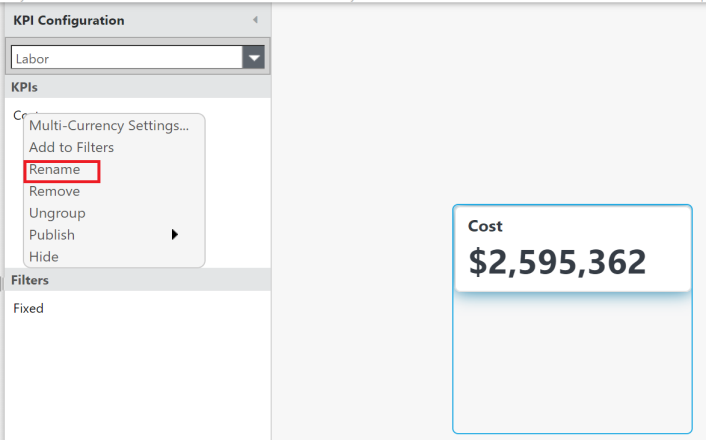
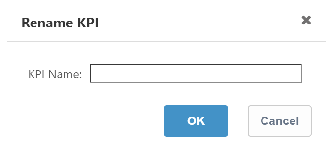
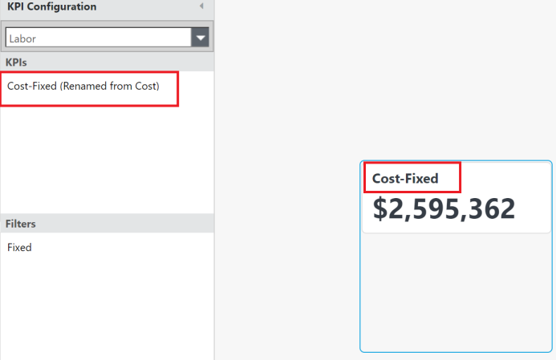

# Indicadores clave de rendimiento (KPI)

**Se aplica a** : TBM Studio 12.0 y posteriores

Puede mostrar indicadores clave de rendimiento (KPI) en cuadros de mando y otros informes añadiendo un componente KPI.

Un componente KPI muestra cualquier número de métricas que desee, e incluye las siguientes características:

- Flechas para mostrar la desviación con respecto al periodo anterior.
- Rebanadoras para aplicar a los componentes del KPI.

## Añadir un componente KPI

1. Visualiza un informe y compruébalo.
2. En la pestaña **Informe**, en el grupo **Consulta**, haga clic en **KPI**. El componente KPI se añade al informe y aparece el cuadro de diálogo Configuración KPI:
3. Seleccione un objeto modelado en el menú situado debajo de **Configuración de KPI**.
4. Arrastre los campos que desee ver como KPIs desde **Tablas**, **Cálculos** y otras perspectivas al área de **KPIs**.
5. Si los KPI añadidos no aparecen inicialmente en el componente KPI, es posible que no haya espacio suficiente. Arrastre los bordes del componente KPI para cambiar su tamaño y dejar espacio para que todos los valores sean visibles.

## Mostrar y ocultar KPI

1. Seleccione el componente KPI.
2. En la pestaña KPI, haga clic en **Mostrar/Ocultar paneles** y, a continuación, seleccione los KPI que desea que sean visibles en el KPI component.The lista de KPI en **Mostrar/Ocultar paneles** depende totalmente de la **configuración de KPI** del componente.

## Mostrar el borde del componente KPI

Para activar o desactivar el borde de un componente KPI, haga clic con el botón derecho del ratón en el componente KPI, haga clic en **Propiedades**, seleccione o deseleccione **Mostrar borde** y, a continuación, **Aplicar**. Por defecto, los componentes KPI no tienen el borde visible.

## Cambiar el nombre de la etiqueta KPI en los informes (BETA)

**Se aplica a** : 12.11.6 y posteriores

El administrador puede activar esta función a través de **TBM Studio** > **Proyecto** > **Habilitar características** > **Permitir renombrar KPIs**.

Para renombrar el KPI, haga lo siguiente:

1. Añadir un componente de informe KPI a un informe
2. Arrastre las métricas al panel de configuración de KPI

   Haga clic con el botón derecho en el KPI y seleccione **Renombrar**.

   
3. Aparece la ventana emergente Renombrar KPI.

   
4. Introduzca el nombre apropiado para el KPI y seleccione **OK**. El KPI se renombra con éxito.

   

## Filtrar los valores

Después de añadir valores a un KPI, puede filtrar los valores arrastrando los campos de la perspectiva **Tablas** al área **Filtros**. Los filtros se aplican a todos los valores mostrados en el KPI. Por ejemplo, suponga que tiene un componente KPI que muestra información de costes para todas las unidades de negocio. Puede filtrar el KPI para visualizar los costes de un conjunto específico de unidades de negocio.

Para filtrar los valores de KPI para un conjunto específico de unidades de negocio:

1. Haga clic en el KPI.
2. Arrastre el campo **Unidad de negocio** de la sección **Dimensiones** del **Explorador de proyectos** al área **Filtros**.
3. Haga clic con el botón derecho del ratón en el campo **Unidad de Negocio** y haga clic en **Editar Filtro**.
4. Seleccione las unidades de negocio que desea incluir en los valores del KPI.

## Añadir indicadores de desviación

Para indicar la variación de un valor con respecto al periodo anterior, puede añadir un valor porcentual y flechas indicadoras al KPI.

Para añadir un indicador de desviación a un valor de un componente KPI:

1. Haga clic en el componente KPI.
2. Haga clic en la pestaña KPI.
3. Haga clic en el valor del componente KPI al que desea añadir el indicador.
4. Haga clic en el icono Comparaciones de la barra de herramientas KPI.
5. En Tipo de tendencia, seleccione una opción.
6. Seleccione una opción de visualización.
7. En Dirección de la tendencia, seleccione una de las opciones para el indicador.
   - Arriba es Verde: Si el valor del periodo actual es mayor que el valor del periodo anterior, muestra la flecha en verde. Por ejemplo, puede elegir esta opción si el porcentaje de tiempo de actividad del servidor ha aumentado.
   - Arriba es Rojo: Si el valor del periodo actual es mayor que el valor del periodo anterior, muestra la flecha en rojo. Por ejemplo, puede elegir esta opción si ha aumentado el número de incidencias del Help Desk.
8. Para cerrar el desplegable de opciones, haga clic fuera del cuadro desplegable.
9. Para guardar los cambios, haga clic en Guardar en la pestaña Inicio.

## Añadir valores secundarios

Un valor secundario es un valor que aparece debajo del valor principal. En el ejemplo de la imagen, el valor secundario es Presupuesto, y el valor (40%) en rojo indica que el presupuesto es un 40% inferior al valor del coste.

Para visualizar un valor secundario:

1. Haga clic en el componente KPI.
2. Haga clic en la pestaña KPI.
3. Haga clic en el valor del componente KPI al que desea añadir el valor secundario.
4. Haga clic en el icono Secundario de la pestaña KPI.
5. Selecciona un valor.
   - Los valores secundarios se limitan a los valores mostrados actualmente en el KPI. Normalmente, cuando se añade un valor secundario, se oculta el mismo valor en la parte principal del KPI.
   - Para ocultar un valor, haga clic en el icono Mostrar/Ocultar de la pestaña KPI y seleccione el valor que desea ocultar.

## Añadir valores terciarios

Un valor terciario es un valor porcentual que aparece a la derecha del valor principal. Un valor terciario puede comparar la variación intermensual ( MoM ) del valor principal, o la varianza entre los valores principal y secundario (Por encima/por debajo). En el ejemplo de la imagen, el valor terciario indica que el coste supera en un 66% el importe presupuestado:

Nota: Sólo los KPIs con campos numéricos en la sección Tablas o perspectivas personalizadas pueden tener valores terciarios.

## Notación abreviada

Puede mostrar los números de un KPI utilizando la notación K/M/B (miles/millones/millones). Para utilizar la notación:

1. Haga clic en un valor del componente KPI y en la opción Taquigrafía de la pestaña KPI.
2. Seleccione a qué valores (primarios/secundarios) debe aplicarse la abreviatura.
3. Seleccione los tipos de notación de destino para la notación abreviada.

## Cambiar los colores de los KPI

Puede cambiar los colores de cada elemento de un KPI haciendo clic en **Colores** en la pestaña **KPI**. Los colores pueden aplicarse por separado a cada valor de una barra de KPI, o al componente en su conjunto si no se selecciona ningún valor.

## Texto del nombre

Cuando se selecciona, el nombre del valor primario se envolverá si es demasiado largo para caber dentro del ancho del KPI.

## KPI Propiedades

Al igual que con otros componentes de informes, puede editar las propiedades de un componente KPI. Para editar las propiedades de un componente KPI, busque el menú **Propiedades** realizando una de las siguientes acciones:

- En la esquina superior izquierda del componente, haga clic en el pequeño triángulo situado junto al nombre del componente para mostrar el menú **Acciones**. En el menú **Acciones**, seleccione **Propiedades**.
- Haga clic con el botón derecho del ratón en cualquier lugar dentro de los bordes del componente y seleccione **Propiedades**.

**Propiedades generales**

- **Nombre** : Introduzca un nombre que se mostrará en la cabecera de la nota encima del componente. El nombre se muestra cuando se selecciona la opción **Mostrar encabezado**.
- **Leyenda** : Introduzca información adicional sobre la nota. La información se muestra en función de la configuración del campo **Posición del título**. Puede utilizar código HTML en el campo, pero el código HTML no puede incluir enlaces. La restricción del código HTML es por motivos de seguridad.
- **Posición del pie de foto** : En la lista, seleccione una posición de pie de foto relativa a la nota: Arriba, Abajo, Izquierda o Derecha, o seleccione Ocultar para no mostrar el pie de foto.
- **Mostrar cabecera** : La cabecera del componente muestra el contenido del campo Nombre. Seleccione esta opción para hacer visible la cabecera del componente (por defecto). Cuando la cabecera está oculta, puede detener el puntero del ratón sobre el componente para mostrarla.
- **Mostrar borde** : Seleccione esta opción para mostrar un borde alrededor de la tabla. En el modo Edición, puede mostrar un borde oculto deteniendo el cursor sobre la tabla.
- **Ajustar título** : Envuelve el texto introducido en el campo Nombre para acomodarlo al ancho del KPI.

## Propiedad avanzada

- **Actualizar automáticamente al finalizar los cálculos** : Cuando la aplicación muestra una nota, la muestra con los datos calculados que están disponibles en ese momento. En muchos casos, la aplicación puede estar calculando nuevos valores en segundo plano. Si desea que se muestren los resultados una vez finalizados los cálculos, marque esta opción. Esta opción sólo se aplica a la tabla seleccionada en ese momento. Esta opción sólo está disponible cuando la **Política de cálculo** (en el cuadro de diálogo **Editar proyecto** ) de un proyecto está establecida en **Publicación dinámica**.

Para obtener más información sobre cómo cambiar el tipo y el formato de los KPI, consulte [Consejo: El tipo y el formato influyen en cómo aparecen los KPI](https://community.apptio.com/docs/DOC-5400 "(se abre en una pestaña o una ventana nueva)").
