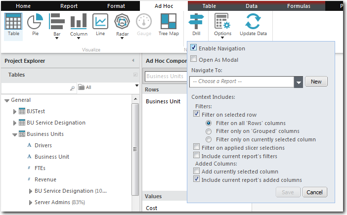
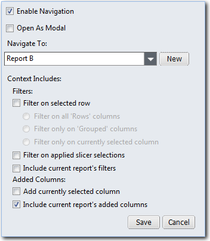
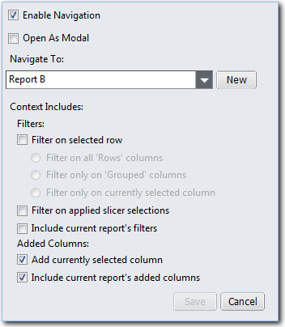
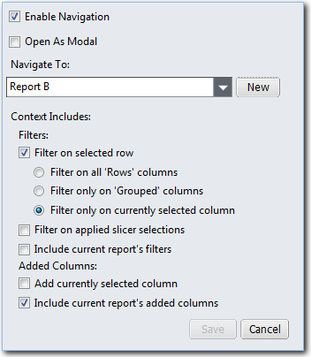

# Enlace a los informes

**Se aplica a** : TBM Studio 12.1 y posteriores

Puede dar a los usuarios que visualizan un informe la opción de seleccionar un valor en una tabla o seleccionar un gráfico completo y mostrar un informe relacionado. Cada columna de una tabla puede enlazar con un informe diferente. Un gráfico sólo puede enlazar con un único informe. Las propiedades de navegación se muestran en la siguiente imagen. En las tablas, los enlaces aparecen como texto azul.

Los informes pueden enlazarse a cualquier parte de un proyecto, incluidos los informes secundarios. Sin embargo, la mejor práctica es crear todos los informes como informes de nivel superior.

Nota: Los enlaces de informes sólo se aplican a las tablas basadas en objetos. No se puede enlazar a informes desde tablas de transformación.

## Acceder a las propiedades de navegación

Para editar las propiedades de navegación:

1. Seleccione una columna de una tabla o seleccione un gráfico completo.
2. Seleccione la pestaña **Ad Hoc** y haga clic en **Perforar** en la sección Navegación.

## Descripciones de los campos

Los campos de navegación se describen en la tabla siguiente. Puede seleccionar más de una de las opciones de Context Includes.

| Campo | Descripción |
| --- | --- |
| Activar la navegación | Hace que los nombres de las unidades de una tabla o las barras o cortes de un gráfico se activen como enlaces para la navegación. Si la opción no está seleccionada, los enlaces no estarán activos en column.NOTE:. En los gráficos, la navegación debe estar vinculada a la columna de valores, no a la columna de etiquetas. |
| Abrir como Modal | Si se selecciona, el informe de búsqueda se mostrará en una ventana emergente. El usuario puede ver el informe y, a continuación, hacer clic en el botón Cerrar para volver al informe original. El informe de objetivos debe ser sencillo. No incluya filtros complejos ni selectores de columnas. |
| Ir a: | Seleccione el nombre de un informe que será el destino de los enlaces. El informe puede ser cualquiera de los informes del proyecto. También puede crear un nuevo informe haciendo clic en **Nuevo informe**. Aparecerá el cuadro de diálogo **Nuevo informe**, en el que podrá definir el nuevo informe. |
| Filtro en la fila seleccionada | Filtra el informe de destino por el valor seleccionado por el usuario. Las opciones determinan qué combinación de filas se utiliza para el filtro. Filas hace referencia a las entradas de la sección **Filas** (o sección **Leyenda** para los gráficos) del cuadro de diálogo **Configuración de Ad Hoc Query**. Para que esta opción funcione, los datos de los dos informes deben estar vinculados a través del motor de inferencia. Si esta opción y las demás no están seleccionadas, el informe de destino mostrará todas las filas**.Filtrar en todas las columnas Filas.** Filtra utilizando los valores de todas las columnas incluidas en la sección **Filas** del cuadro de diálogo **Configuración de consultas ad hoc****.Filtra sólo en columnas agrupadas.** Filtra utilizando los valores de todas las columnas agrupadas incluidas en la sección **Filas** del cuadro de diálogo **Configuración de Ad Hoc Query****.Filtra sólo en la columna seleccionada actualmente.** Filtra utilizando sólo la columna que contiene el valor seleccionado por el usuario. |
| Filtro de selecciones de corte aplicadas | Filtre el informe de destino por los valores seleccionados en las rebanadoras. Si esta opción y las demás no están seleccionadas, el informe de destino mostrará todas las líneas. |
| Incluir los filtros del informe actual | Incluye los filtros definidos en la sección **Filtros** del cuadro de diálogo **Configuración de consultas ad hoc**. Si esta opción y las demás no están seleccionadas, el informe de destino mostrará todas las líneas. |
| Añadir columna seleccionada actualmente | Si la columna seleccionada no existe en el informe de destino, la columna se añadirá al informe de destino. |
| Incluir las columnas añadidas del informe actual | Conserva el contexto del informe actual y lo aplica al informe de destino. Si el informe actual incluye columnas añadidas, éstas se añadirán al informe de destino. |

## Ejemplos de navegación

Suponga que tiene las tres tablas siguientes en tres informes distintos:

|  |  |  |
| --- | --- | --- |
| Informe A | Informe B  Unidad de negocio ETC | Informe C |

**Ejemplo 1: Seleccione un valor en la tabla Costes de unidad de negocio en el Informe A y vincúlelo al Informe B. Visualice todos los valores en el Informe B.**

A continuación se muestra el resultado previsto:

|  |  |  |
| --- | --- | --- |
| Informe A  Costes de las unidades de negocio | ---> | Informe B Unidad de negocio Informe ETC B |

Para obtener este resultado, seleccione la columna **Unidad de Negocio** en la tabla **Costes de Unidad de Negocio** del Informe A y configure las opciones de navegación como se muestra a continuación:

**Ejemplo 2: Seleccionar un valor en la tabla de Costes de la Unidad de Negocio en el Informe A y mostrar la tabla de ETCs de la Unidad de Negocio en el Informe B. Mostrar sólo la fila seleccionada.**

A continuación se muestra el resultado previsto:

|  |  |  |
| --- | --- | --- |
| Informe A  Ejemplo de coste de unidad de negocio | ---> | Informe B  Unidad de negocio ETC Ejemplo |

Para obtener este resultado, seleccione la columna **Unidad de Negocio** en la tabla **Costes de Unidad de Negocio** del Informe A y configure las opciones de navegación como se muestra a continuación:

**Ejemplo 3: Seleccione un valor en la columna Coste de la tabla Costes de la Unidad de Negocio en el Informe A y visualice el Informe B con la columna Coste añadida a la tabla ETCs de la Unidad de Negocio.**

A continuación se muestra el resultado previsto:

| Columna de Costes de la Unidad de Negocio | Columna de costes añadida a los ETC de las unidades de negocio |  |
| --- | --- | --- |
| Informe A  Valores de coste por unidad de negocio | ---> | Informe B  Unidad de negocio Valores ETC |

Para obtener este resultado, seleccione la **columna Coste** en la tabla **Costes de la Unidad de Negocio** en el Informe A y configure las opciones de navegación como se muestra en la siguiente imagen:

**Ejemplo 4: Seleccione un valor en la columna Unidad de Negocio de la tabla Costes de Unidad de Negocio en el Informe A y visualice el Informe B con sólo los datos de la unidad de negocio seleccionada. Seleccione la unidad de negocio visualizada en el Informe B y visualice la tabla Centros de coste de la unidad de negocio en el Informe C con todas las unidades de negocio visualizadas.**

El resultado previsto se muestra en las siguientes imágenes:

| Informe A | ---> | Informe B | ---> | Informe C |
| --- | --- | --- | --- | --- |
| Informe A  Ejemplo de BUC | ---> | Informe B  Ejemplo de ETC | ---> | Informe C |

Para obtener este resultado:

1. Seleccione la columna **Coste** en la tabla Costes de **la Unidad de Negocio** en el Informe A y configure las opciones de navegación como se muestra a continuación:

   
2. Seleccione la columna **Unidad de Negocio** en la tabla **ETCs de Unidad de Negocio** en el Informe B y configure las opciones de navegación como se muestra en la siguiente imagen:

   
