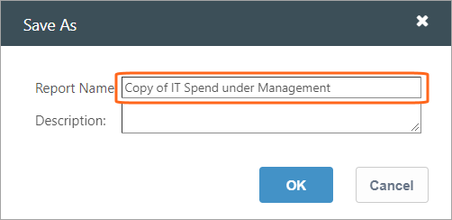
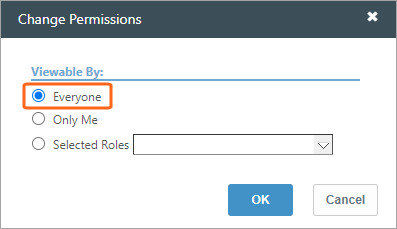

# Migrar el control de acceso a los informes

◆ Se aplica a: TBM Studio 12.7 y posteriores.

Antes de la versión Apptio TBM Studio 12.7, cuando los usuarios habilitaban permisos basados en funciones para los informes, el sistema creaba una copia adicional del informe para cada función a la que se concedían permisos. Este artículo explica cómo eliminar estos informes adicionales cuando desee empezar a utilizar la funcionalidad de permisos mejorada disponible en TBM Studio 12.7 y posteriores.

**NOTAS** :

- La funcionalidad heredada sigue funcionando en TBM Studio 12.7. No es necesario eliminar los informes antes de utilizar la nueva funcionalidad de permisos. Sin embargo, cuando se realizan actualizaciones de configuración en un informe que tiene permisos heredados, asegúrese de evaluar si necesita migrar el informe a una versión libre de informes hijos.
- Aunque no es necesario, puede realizar los pasos descritos en este artículo en una rama siempre que siga las mejores prácticas descritas en [Proyectos de rama](../admin/bp-branching-projects.htm "(se abre en una pestaña o una ventana nueva)").

## Migrar informes

Para todos los informes que identifique para migrar, capture la siguiente información:

- Nombre del informe.
- Colección de informes (para ayudar a localizarlos en el Explorador de proyectos).
- Qué roles deben tener permiso.
- La copia del informe de qué rol debe utilizarse para crear el nuevo informe. Si la respuesta es más de un informe, anote todas las vistas y componentes que deben conservarse o volver a crearse al final del proceso.

Nota: A continuación se dan instrucciones sobre cómo registrar los informes y cómo esperar a que finalice el cálculo antes de pasar al siguiente paso. Asegúrese de completar cada paso antes de pasar al siguiente. De lo contrario, puede obtener resultados inesperados que podrían requerir una reversión u otro tipo de asistencia de Soporte.

1. En el Explorador de proyectos, vaya a **Informes** y, a continuación, seleccione el informe hijo que desea utilizar para crear el nuevo informe (tal y como se ha indicado anteriormente en Antes de migrar informes). Esto hará que el informe principal y todos los informes secundarios aparezcan como retirados:

   
2. Para crear una copia del informe, haga clic primero en el informe secundario y, a continuación, en **Guardar como**. Guárdalo con la Copia del prefijo que se añade automáticamente. Por ejemplo, Copia de <nombre original del informe> y, a continuación, haga clic en **Aceptar**.

   
3. Registre el nuevo informe y espere a que finalice el cálculo antes de continuar.

   Nota: Una vez finalizado el cálculo, la copia del informe puede aparecer en una colección de informes completamente diferente.
4. Compruebe y elimine los permisos de la Copia de <informe original>. En la pestaña **Informe**, haga clic en **Permisos**, seleccione **Todos** y, a continuación, haga clic en **Aceptar**.

   
5. Registre el informe y espere a que finalice el cálculo.
6. Compruebe *cualquiera* de los informes secundarios adjuntos a <Informe original> y, a continuación, haga clic en **Eliminar**.
7. Registre el informe y espere a que finalice el cálculo.

   Nota: Cuando se trabaja con informes OOTB, la eliminación de uno de los informes hijos provoca la desaparición del informe padre y de los demás informes hijos.
8. Comprueba la copia que has creado en el paso anterior. Cree otra copia de la Copia de <informe original> y, a continuación, cambie el nombre del informe por el de <informe original>. Por último, marque el informe y espere a que finalice el cálculo.
9. Una vez finalizado el cálculo, aparece el informe original:
   - En la recopilación del informe original
   - Y con todos los informes de menores adicionales que no se hayan eliminado explícitamente
10. Para eliminar el resto de informes secundarios, realice los siguientes pasos, en este orden, para cada informe secundario:
    - Consulta el informe del niño.
    - Borrar.
    - Registro.
    - Espere a que finalice el cálculo después de cada registro antes de pasar al siguiente informe.
    - Repita este proceso hasta eliminar todos los informes secundarios.

Ahora tiene el informe original que no tiene ningún informe hijo:

## Volver al estado Out-of-the-Box (OOTB)

En el caso de los informes OOTB que se han personalizado intencionadamente, no es necesario revertir o restablecer el informe a la versión original, por lo que el proceso de migración ha finalizado. En este caso, pase a la siguiente sección Personalizar los informes migrados.

Si el estado final que desea para el informe que planea migrar debe establecerse en la versión original del informe sin personalizaciones, entonces complete los siguientes pasos adicionales de migración. Puede que necesite hacerlo porque el estado final que desea para el informe es la versión OOTB, o porque desea ver la última versión del informe antes de decidir qué personalizaciones recrear. En este caso, sigue estos pasos:

1. Realice una personalización en el informe (por ejemplo, añada un componente de tabla en blanco en la parte superior del informe) y, a continuación, compruebe los cambios.
2. Vaya a la página de instalación de componentes para ese informe y revierta el informe OOTB.
3. Cuando finaliza el cálculo de la reversión, el informe se restaura al estado original sin la personalización realizada anteriormente.

## Personalizar los informes migrados

Cuando sólo hay una copia del informe sin copias secundarias, puede volver a aplicar los permisos y personalizaciones que necesite en la copia final del informe migrado.

**Sólo para permisos** : Para añadir permisos al informe recién migrado, consulte [Trabajar con permisos de informes](control-access-reports-11755.htm "(se abre en una pestaña o una ventana nueva)").

**Para otras personalizaciones** :

- Si identifica que se necesita más de un informe para cumplir con todos los requisitos, entonces determine el menor número de informes que necesita construir para cumplir con todos los requisitos.
- Si los permisos de rol se utilizan para crear informes para diferentes roles donde el informe de cada rol es luego personalizado, una opción es utilizar la visibilidad de los componentes para ayudar a recrear un informe donde diferentes roles tienen visibilidad para ver diferentes conjuntos de componentes cuando se navega al mismo informe. En este caso, añada un grupo de informes por rol que contenga los componentes que deben ser visibles para ese rol. A continuación, cada grupo se configura para que sea visible sólo para una función, de modo que estos grupos puedan superponerse en la superficie de informes. De este modo, la función del usuario determinará el grupo de informes y los componentes que verá.

Nota: Si un usuario tiene dos de los roles para los que los grupos son visibles, verá los componentes para el rol que está en la parte superior de la pila de grupos.
