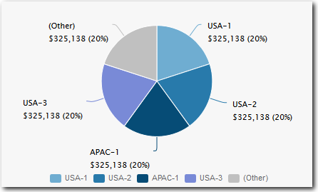
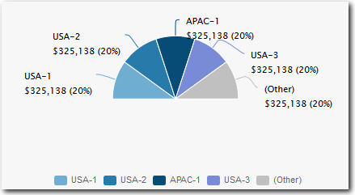
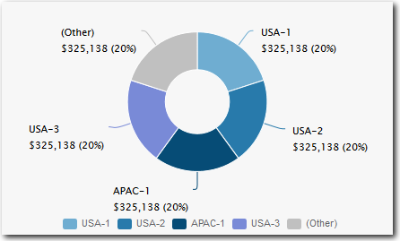
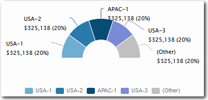
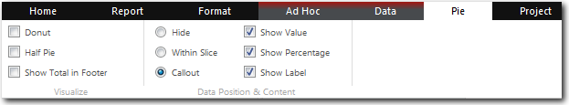
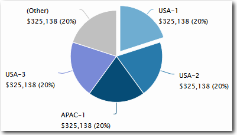

# Gráficos circulares

**Se aplica a** : TBM Studio 12.0 y posteriores

Report TBM Studio ofrece los siguientes tipos de gráficos circulares.

## Estándar

## Media estándar

## Anillo

## Donut Mitad

Los gráficos circulares sólo funcionan con números positivos. Si hay números negativos, en lugar del gráfico circular aparece un mensaje indicando que hay datos inadecuados.

Un gráfico circular siempre mostrará porciones que representen el total (100%) del valor que se está representando. Por ejemplo, supongamos que está creando un gráfico circular que muestra los cinco principales centros de datos en función del coste total. Representan el 70% del coste total. Para representar el 30% restante, se añade al gráfico circular una sección denominada "Otros". No se puede ocultar la sección Otros.

## Propiedades del gráfico circular

Las propiedades del gráfico de tarta están disponibles en la pestaña **Tarta**. Experimenta con las opciones para ver lo que hacen.

## Despiece

Puede desglosar una porción haciendo clic con el botón derecho en una porción de un gráfico circular y haciendo clic en **Desglosar**. En el ejemplo siguiente, la rebanada USA-1 está explosionada:

