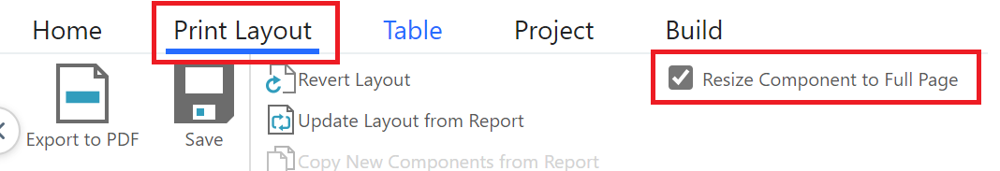
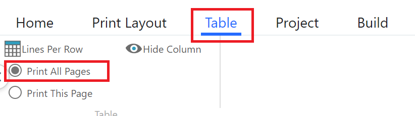
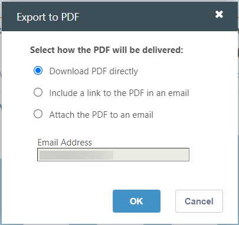
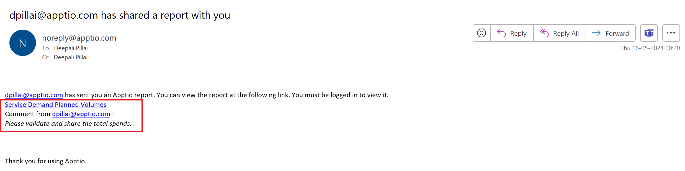
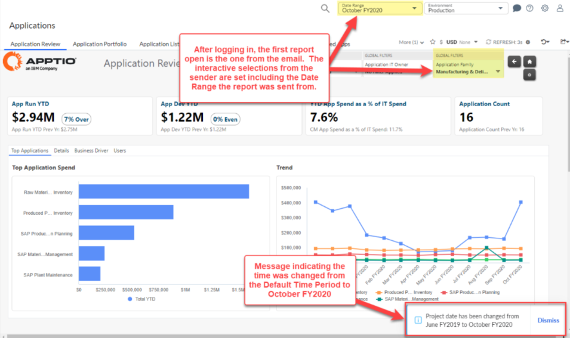

# Imprimir y exportar informes

**Se aplica a** : Apptio TBM Studio R12.5 y posteriores. TBM Studio se basa en la exportación de informes a formato PDF para imprimirlos y compartirlos fuera de la suite TBM. El administrador de TBMA o TBM Studio puede personalizar las opciones de diseño PDF por informe para todos los usuarios de Apptio al imprimir o enviar informes por correo electrónico.

Todos los usuarios de las aplicaciones de cálculo de costes Apptio (como Costing Standard) pueden exportar un informe a formato PDF o enviarlo por correo electrónico en formato PDF. Al hacerlo, el PDF exportado utilizará las opciones de diseño establecidas mediante las instrucciones siguientes.

**VEA TAMBIÉN** : [Buenas prácticas: Imprimir en PDF](https://community.apptio.com/docs/DOC-9644 "(se abre en una pestaña o una ventana nueva)")

## Cree diseños de informes personalizados para la exportación a PDF

Los TBMA pueden establecer opciones de diseño por informe en TBM Studio.

1. Consulta el informe que desees ([¿Cómo?](../admin/bp-check-out.html "(se abre en una pestaña o una ventana nueva)") ).
2. En la pestaña **Inicio**, haga clic en **Ver** y, a continuación, seleccione **Diseño de impresión**.TBM Studio cambia al modo Diseño de impresión.
3. Haga clic en la pestaña **Diseño de impresión**.

   

   Consejo: Para salir de este modo en cualquier momento, en la pestaña **Diseño de impresión**, haga clic en **Salir del modo Diseño de impresión**
4. Seleccione un componente específico del informe y, a continuación, realice los cambios de componentes que desee. Las opciones de componentes incluyen:

   | Opción | Descripción |
   | --- | --- |
   | **Fijar/Desfijar** | Puede fijar un único componente al final de un informe. Un uso típico de esta función es mover las rebanadoras al final de un informe para capturar el filtrado aplicado al informe. Además, puede fijar todos los componentes de un tipo seleccionado al final de un informe. Por ejemplo, puede fijar todas las rebanadoras al final de un informe. |
   | **Mostrar/ocultar** | Puede ocultar un único componente de un informe. Para ocultar varios componentes, haga clic en **Mostrar/Ocultar componentes del informe** y, a continuación, desactive las casillas de los componentes que desee ocultar**.SUGERENCIA** : Para filtrar una lista larga de componentes a un conjunto específico de componentes, introduzca texto en el campo **Filtro**. |
5. Realiza los cambios de diseño de impresión que desees. Las opciones de configuración de página incluyen:

   | Opción | Descripción |
   | --- | --- |
   | **Tamaño de página** | Seleccione un tamaño de papel en el menú desplegable. |
   | **Flujo** | El flujo controla la colocación de los componentes en la página Informe.  **Manual** - Usted coloca los componentes. Una vez colocados, los objetos no se moverán.  **Vertical** - Los componentes se disponen automáticamente en una sola columna vertical.  **Horizontal** - Los componentes se disponen automáticamente en filas, con el número máximo de componentes colocados en cada fila. |
   | **Márgenes** | Seleccione la configuración de márgenes que desee. |
   | **Cabecera** | Puede añadir una cabecera a un informe. La cabecera puede mostrarse en todas las páginas o sólo en la primera. Puede cambiar el tamaño de la cabecera arrastrando los bordes del cuadro de cabecera. Puede dar formato al texto de la cabecera utilizando etiquetas de formato HTML. Además, puede utilizar texto dinámico en la cabecera. Por ejemplo, el siguiente texto dinámico añadirá el período actual: <%=CurrentDate( )%> |
   | **Pie de página** | Puede personalizar completamente el pie de página. Si desea un pie de página en blanco, borre el texto del campo Pie de página izquierdo, seleccione Especificar texto de pie de página y deje el campo en blanco. A diferencia de las cabeceras, no puede utilizar texto dinámico en el pie de página. |
   | **Vertical** | Haga clic en esta opción para la orientación vertical de la página. |
   | **Horizontal** | Haga clic en esta opción para la orientación horizontal de la página. |
   | **Escala** | Seleccione el nivel de zoom que desea aplicar. |
6. Haga clic en **Guardar** en la ficha **Diseño de impresión** para guardar la configuración del diseño de impresión y, a continuación, haga clic en **Salir del modo de diseño de impresión**.
7. Comprueba el informe.

Sugerencia:

- Si ha guardado cambios en la sesión actual de Diseño de impresión pero decide que desea cancelar los cambios guardados, haga clic en **Actualizar diseño desde informe**. También puede volver al último estado guardado en la sesión actual de Diseño de impresión: haga clic en **Revertir diseño**.
- No todos los cambios que realice en el diseño de página serán visibles en el modo de diseño de impresión (los encabezados y pies de página no son visibles, por ejemplo). Puede previsualizar los cambios haciendo clic en **Exportar a PDF** en la pestaña **Diseño de impresión**. El PDF se abrirá en una nueva pestaña.
- Para obtener una vista previa de alta fidelidad del diseño personalizado de un informe en formato PDF, complete la tarea "Exportar un informe a un archivo PDF" descrita a continuación y seleccione la opción **Descargar PDF directamente**.

Nota: Durante la exportación de Excel, el orden de las columnas se mantiene tal y como se ha configurado en el componente del informe. Se añaden las columnas restantes que no forman parte del informe.

## Configurar una tabla para imprimir todas las filas en varias páginas

1. Consultar un informe
2. En la pestaña **Inicio**, seleccione **Ver** y, a continuación, **Diseño de impresión**.
3. Mueve la tabla a su propia página.
4. Seleccione la tabla y, en la pestaña **Diseño de impresión**, seleccione **Redimensionar componente a página completa**.

   
5. Seleccione la tabla y, en la subpestaña **Tabla**, seleccione **Imprimir todas las páginas**.

   
6. Una vez impreso el informe en PDF, la tabla se imprimirá en varias páginas.

## Exportar un informe a un archivo PDF

Las TBMA pueden generar y compartir un informe en formato PDF.

Para exportar un informe en TBM Studio:

1. En el Explorador de proyectos, visualice el informe que desee.
2. En la pestaña **Inicio**, haga clic en **Exportar** y, a continuación, en **PDF**.Aparecerá el cuadro de diálogo Exportar a PDF.

   
3. Haga clic en **Descargar a PDF directamente** y, a continuación, en OK.The. Se creará una representación en PDF del informe. Dependiendo de la configuración de su navegador, podría abrirse en una nueva ventana o pestaña, o aparecer en la barra de descargas de su navegador listo para abrir o guardar.

## Enviar por correo electrónico un informe en formato PDF a otro usuario de Apptio

Puede generar el PDF de un informe y enviarlo por correo electrónico a un destinatario. Puede enviar por correo electrónico un enlace al PDF o enviarlo como archivo adjunto.

Para enviar un informe por correo electrónico en TBM Studio:

1. En el Explorador de proyectos, visualice el informe que desee.
2. En la pestaña **Inicio**, haga clic en **Exportar** y, a continuación, en **PDF**.Aparecerá el cuadro de diálogo Exportar a PDF.
3. Realiza una de las siguientes acciones:
   - Haga clic en **Incluir un enlace al PDF en un correo electrónico**.
   - Haga clic en **Adjuntar el PDF a un correo electrónico**.
4. La dirección de correo electrónico del usuario registrado se rellena por defecto. Si desea cambiar, introduzca la dirección de correo electrónico correspondiente.
5. Pulse **Aceptar**.

   El ejemplo de correo electrónico que recibe el destinatario es -

   

   Nota: Si abre el enlace del informe en el correo electrónico, verá el informe en el mismo contexto, es decir, persistirán todos los filtros, rebanadores, selectores y rangos de fechas aplicados y el informe aparecerá exactamente como lo compartió el remitente.

   

## Exportar un informe a un archivo PDF en una aplicación de cálculo de costes de TBM

Al completar esta tarea, el PDF exportado utilizará las opciones de diseño establecidas con la tarea "Crear y gestionar diseños de informe personalizados para la exportación a PDF", más arriba.

1. Inicie la aplicación (por ejemplo, Costing Standard) y visualice el informe.
2. En el extremo derecho de la barra de título de la colección de informes, haga clic en el botón **Exportar** y, a continuación, en **PDF**.Aparecerá el cuadro de diálogo Exportar a PDF.
3. Realiza una de las siguientes acciones:
   - Haga clic en **Descargar PDF directamente** y, a continuación, en **Aceptar**. Se crea la representación en PDF del informe. Dependiendo de la configuración de su navegador, podría abrirse en una nueva ventana o pestaña, o aparecer en la barra de descargas de su navegador listo para abrir o guardar.
   - Haga clic en **Incluir un enlace al PDF en un correo electrónico**, introduzca la dirección de correo electrónico del destinatario y, a continuación, haga clic en **Aceptar**.
   - Haga clic en **Adjuntar el PDF a un correo electrónico**, introduzca la dirección de correo electrónico del destinatario y, a continuación, haga clic en **Aceptar**.Al enviar por correo electrónico un enlace o un archivo adjunto, el remitente se identifica como noreply@apptio.com.

Nota: Para determinadas funciones de Apptio, como Exportar a PDF, los usuarios deben permitir las ventanas emergentes en su navegador desde su sitio Apptio URL ([¿Cómo?](https://community.apptio.com/docs/DOC-9655 "(se abre en una pestaña o una ventana nueva)") ).
