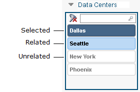

# Estados y valores de la cortadora

**Se aplica a** : TBM Studio 12.0 y posteriores

## Estados de la cortadora

El color de los valores de un slicer indica su estado:

Los valores relacionados están relacionados con los datos mostrados en el informe. Al seleccionar un valor relacionado, éste influye en la visualización de los datos. Los valores no relacionados no están relacionados con los datos que se muestran actualmente en el informe. Cuando se selecciona un valor no relacionado, no afecta a la visualización de los datos si están seleccionados.

Al hacer clic en un valor de un slicer, se cambia el estado seleccionado/deseleccionado. Para seleccionar más de un valor, mantenga pulsada la tecla **Ctrl** y haga clic en los valores.

Las selecciones en una cortadora pueden cambiar el estado de los valores en otras cortadoras a No relacionado.

Puede borrar todas las selecciones de un slicer haciendo clic en el icono de reinicio  en la cabecera del slicer.

## Crear un conjunto de valores por defecto

Puede crear un conjunto de valores por defecto para un slicer seleccionando valores en un slicer y guardando el informe. Cuando un usuario abre el informe, las rebanadoras se muestran con el conjunto de valores seleccionados por defecto.

## Ordenar los valores de la cortadora

Hay dos opciones para ordenar los valores en un slicer:

- **Por** estado - Los valores se agrupan por estado (Seleccionado, Relacionado, No relacionado) y luego se ordenan alfanuméricamente.
- **abc/123** - Los valores se ordenan alfanuméricamente. Se ignora el estado.

Establezca los valores utilizando las opciones de **Ordenar** de la pestaña **Rebanadora**.

Los usuarios que visualizan el informe no pueden cambiar la opción de ordenación.

Por defecto, los valores de las tres secciones (Seleccionado, Relacionado, No relacionado) se ordenan del siguiente modo:

- **Texto** - alfabético
- **Números** - ascendente
- **Fechas** - cronológico
