# Componente de carga de tablas

**Se aplica a** : TBM Studio 12.9.3 y posteriores

El componente Carga de tablas permite a los usuarios finales con los permisos adecuados cargar directamente datos de hojas de cálculo en tablas sin necesidad de acceder a TBM Studio .

Consejo: Para que el componente Carga de tablas esté disponible a través de la cinta de informes, es posible que deba activarse mediante Activar funciones.

[Más información sobre la opción Activar funciones.](../admin/enable_features.html "TBM Studio a veces contiene funciones que aún no están disponibles para todos los clientes. Se trata de funciones de la versión beta y es posible que no funcionen exactamente como se diseñaron.")

## Configuración sencilla

Para utilizar la opción de configuración simple, haga lo siguiente:

1. Añada un componente de carga de tablas a su informe.
2. Haga clic en el botón Config del componente de carga de tablas.
3. Arrastre las tablas cargadas a la lista como se muestra en el siguiente ejemplo.
4. 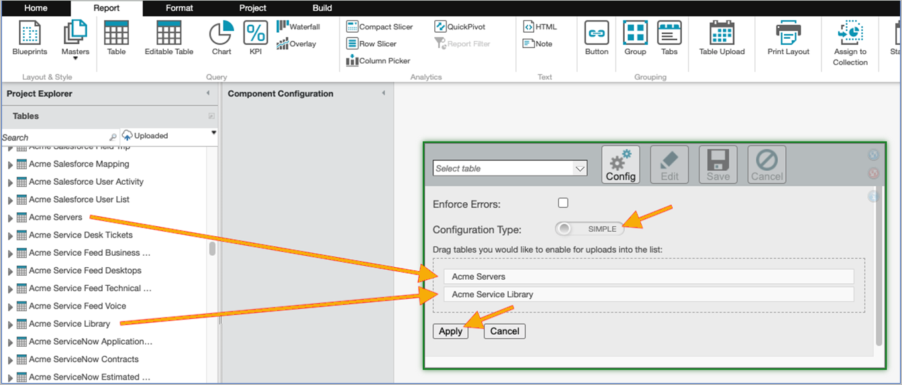

   Nota: Si elige la opción Aplicar errores, se ejecutará la validación en la tabla. Si se encuentran errores de validación, se mostrarán cuando intente cargar. Errores de validación, como columnas que faltan, columnas con encabezados incorrectos, etc.).
5. Haga clic en Aplicar para guardar la configuración del componente.
6. En la cinta, haga clic en el botón Guardar para guardar el informe.

De este modo, los usuarios finales con acceso al informe podrán seleccionar las tablas y actualizarlas.

Consulte la sección [Interacción con el usuario](#TableUploadcomponent__Userinteraction) más adelante en este tema para obtener más detalles sobre cómo es la experiencia del usuario.

## Configuración avanzada

El propósito de la opción de configuración avanzada es permitir un control más granular sobre qué tablas pueden actualizar usuarios individuales o grupos sin tener que realizar múltiples informes.

Para utilizar la opción de configuración avanzada, haga lo siguiente:

1. Cree una tabla editable con las siguientes columnas:
   1. Tabla
   2. Rol
   3. Usuario
2. A efectos de este ejemplo, llamaremos a la tabla editable "Tabla Access".
3. Rellene las columnas con datos para especificar el usuario o rol que debe tener acceso para actualizar una tabla determinada. He aquí un ejemplo:

   | Tabla | Rol | Usuario |
   | --- | --- | --- |
   | Contratos Acme | Usuario avanzado |  |
   | Acme Libro Mayor |  | bob@acme.com |
   | Acme Libro Mayor |  | sally@acme.com |
   | Organigrama de Acme IT |  | bob@acme.com |
   | Organigrama de Acme IT |  | roxanne@acme.com |

   Dada la tabla de ejemplo anterior, y sabiendo que Sally también es un Power User las tablas que cada usuario verá en el desplegable del componente Carga de Tabla son las siguientes:

   - bob@acme.com verá Acme General Ledger y Acme IT Org Mapping.
   - sally@acme.com verá Acme Contracts (en virtud de su pertenencia al grupo Power User) y Acme General Ledger.
   - roxanne@acme.com sólo verá el Libro Mayor de Acme.
4. Añada el componente Carga de tablas a su informe.
5. En el componente de carga de tablas, haga clic en el botón Config.
6. Cambie el Tipo de configuración a Avanzado.
7. En el campo Tabla: añada el nombre de su tabla editable ("Acceso a tabla" en nuestro ejemplo, y opcionalmente especifique la correspondencia para Roles y Usuarios:
8. 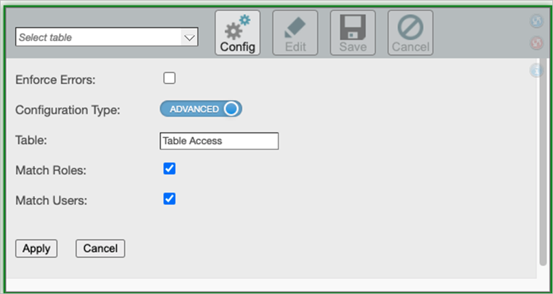

   Nota: Si elige la opción Aplicar errores, se ejecutará la validación en la tabla. Si se encuentran errores de validación, se mostrarán cuando intente cargar. Errores de validación, como columnas que faltan, columnas con encabezados incorrectos, etc.).
9. Haga clic en Aplicar para guardar la configuración del componente.
10. En la cinta, haga clic en el botón Guardar para guardar el informe.

De este modo, los usuarios finales con acceso al informe y acceso a la tabla, tal como se especifica en la tabla editable descrita anteriormente, podrán seleccionar las tablas y actualizarlas.

Consulte la sección [Interacción con el usuario](#TableUploadcomponent__Userinteraction) más adelante en este tema para obtener más detalles sobre cómo es la experiencia del usuario.

## Interacción del usuario

Cuando un usuario con acceso al informe navegue hasta él, verá el componente Cargar tabla.

Para utilizarlo, tendrían que hacer lo siguiente:

1. Seleccione una de las tablas del menú desplegable.
2. Haz clic en el botón Editar.

   De este modo, la mesa se retirará. Cuando la tabla esté lista, la página se actualizará.
3. Al cargar en una ranura con datos existentes, se le presentarán estas opciones:

   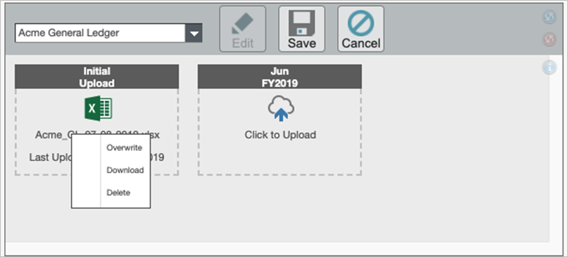
4. Una vez realizados los cambios deseados, haga clic en Guardar.
5. Aparecerá un cuadro de diálogo de registro. Incluya un mensaje que describa la naturaleza del cambio y haga clic en Registrar.

   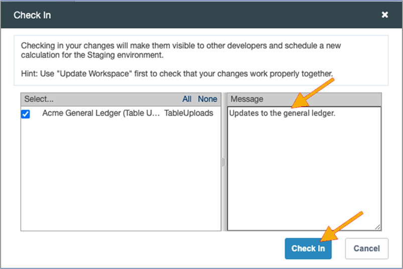

Si ha seleccionado la opción Aplicar errores durante la configuración y se detectan errores, aparecerá una insignia de error con un desplegable.

En el siguiente ejemplo no estaba presente una columna que se esperaba, se añadió una nueva columna y una columna que el sistema esperaba que fuera numérica tenía valores de etiqueta:

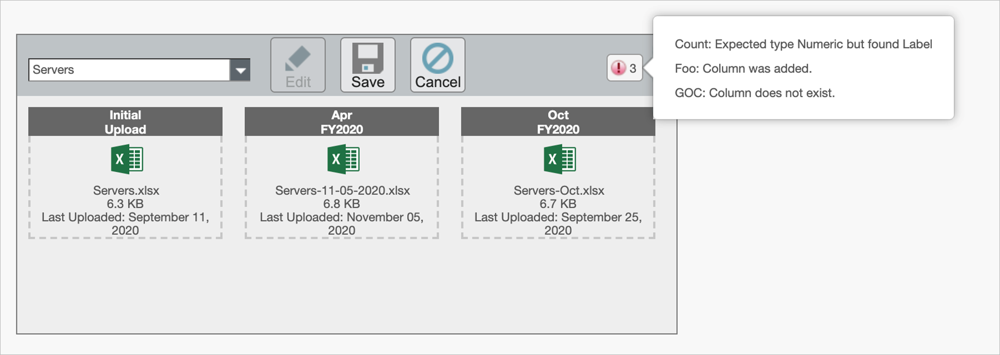

## Carga de datos en tablas editables

**12.11.3 y posteriores** : El botón **Cargar** sólo aparece para la tabla en blanco y no para la tabla generada. Para ver este botón, active la opción **Activar/Desactivar carga** en la ventana emergente [Propiedades avanzadas](tables/set-table-properties.html "Se aplica a: TBM Studio 12.0 y posteriores").

Si carga datos en un informe retirado, la ventana emergente de carga no se puede cerrar. Debido a esto, los botones **Cargar** y **Guardar** permanecerán desactivados y el archivo/datos cargados no se guardarán. Sólo puede cerrar la ventana emergente actualizando la tabla: haga clic con el botón derecho del ratón en el área de la tabla y, a continuación, seleccione la opción **Actualizar datos**.

Sin embargo, cuando se cargan datos en un informe registrado, la ventana emergente de carga tiene el icono de cierre y, por lo tanto, la carga puede cancelarse o guardarse correctamente.

## Carga de datos mediante informes

Navegue hasta un informe de tabla editable y filtre por el ámbito deseado. <clic-derecho> en el menú justo fuera de la tabla y seleccione **Abrir en Excel**.

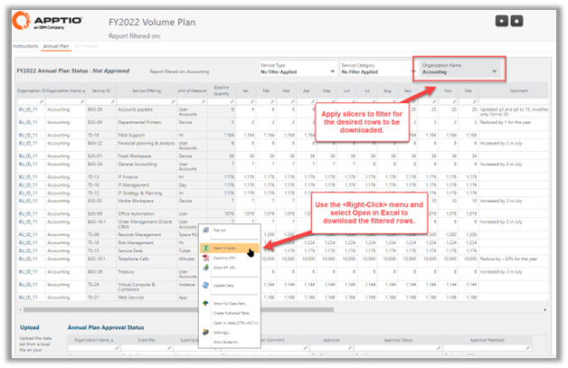

Realice los cambios deseados sin conexión en Excel [Evite la función Descargar ET o la exportación a Excel desde la barra de navegación (exportación sin filtro)]

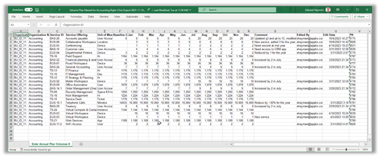

Cargue los cambios seleccionando **Cargar ET** y arrastrando y soltando o introduciendo el nombre del archivo.

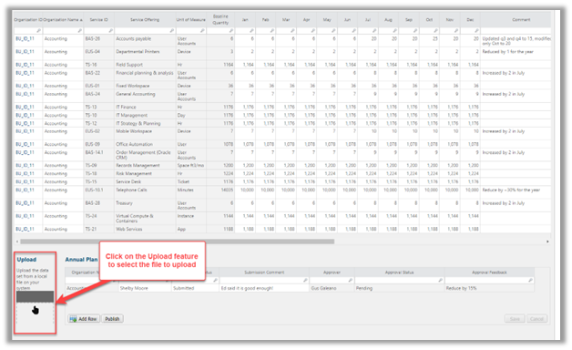

Puede elegir entre sobrescribir los datos existentes o añadirlos. El botón **Cargar ahora** estará desactivado hasta que se seleccione una opción.

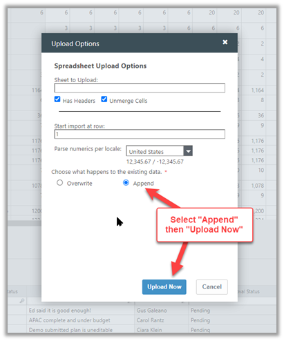

Seleccione la opción **Añadir** y las nuevas entradas se fusionarán con las anteriores. La opción **Anexar** también funciona con la funcionalidad de integración Validación de datos - Carga de tablas.

Nota: La opción **Sobrescribir** está seleccionada por defecto para la primera carga. Para todas las subidas futuras, el usuario debe seleccionar una de las opciones, Sobrescribir o Añadir.

El archivo cargado debe tener la misma configuración que el archivo cargado existente. Si la configuración no coincide, aparecerá una ventana emergente que les impedirá cambiar los datos del ET.

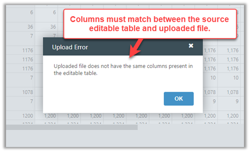

## Añadir datos al cargar

En un informe de tabla editable, haga clic con el botón derecho para seleccionar **Propiedades** > **Avanzadas** y, a continuación, elija la opción "Añadir datos al cargar".

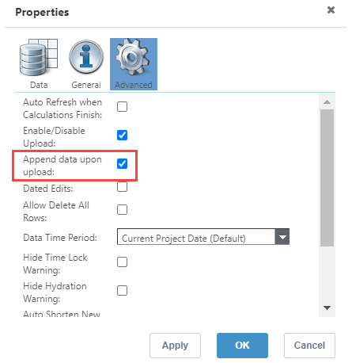

Ahora, cargue cualquier archivo, para ver la ventana emergente **Opciones de carga**.

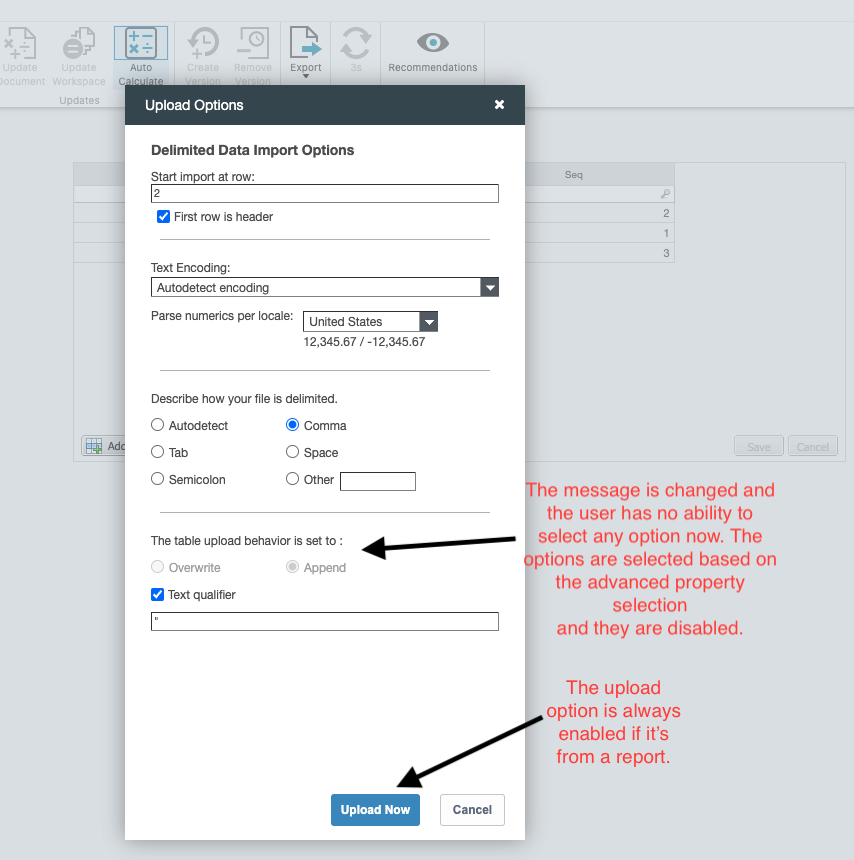

Vea cómo funciona [el análisis sintáctico mejorado de Excel](tables/enhanced-excel-parsing.html) en Apptio

- **[Cómo funciona el análisis sintáctico mejorado de Excel en Apptio](../../studio/reports/tables/enhanced-excel-parsing.html)**
