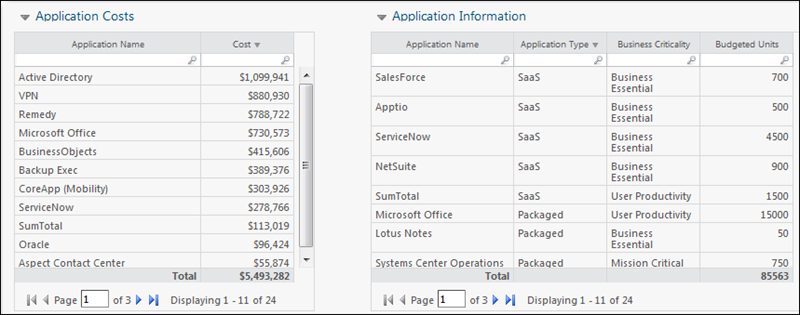
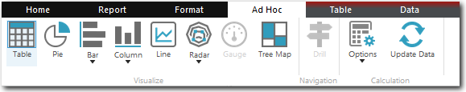

# Tablas en los informes

**Se aplica a** : TBM Studio 12.0 y posteriores

Las tablas son una forma útil de presentar los datos y son un elemento habitual en los informes de las aplicaciones. A continuación se describen los tipos básicos de tablas.

## Tablas de muestra

En la siguiente imagen se muestra un informe con varias tablas de ejemplo. Todas las tablas presentan datos sobre las aplicaciones. El cuadro de la izquierda está basado en objetos. La tabla de la derecha es una tabla de transformación.

## Modificar tablas

Después de añadir una tabla a un informe, puede modificarla seleccionando la tabla y haciendo clic en la pestaña **Ad Hoc**. La pestaña **Ad Hoc** sólo aparece cuando se selecciona una tabla basada en objetos o una tabla de transformación. La pestaña **Ad Hoc** se muestra en la siguiente imagen.

## Analizar tablas

Puede analizar el contenido de las columnas de una tabla haciendo clic con el botón derecho del ratón en la cabecera de una columna y, a continuación, haciendo clic en **Mostrar valores**. Aparece una tabla que muestra cada valor y el número de veces que el valor aparece en la columna.

## Tablas heredadas

Antes de la incorporación de la cinta de opciones a Report Studio, las tablas se creaban y editaban utilizando una amplia variedad de herramientas. A menudo, las tablas se modificaban y formateaban editando la ruta de datos de un gráfico. Las tablas heredadas pueden modificarse utilizando muchas de las herramientas de la cinta de opciones. Sin embargo, no todas las herramientas disponibles para las tablas ad hoc están disponibles para las tablas heredadas.

Puede convertir una tabla ad hoc en una tabla heredada. Sin embargo, una vez que convierta la tabla, no podrá volver a convertirla en una tabla ad hoc. Para convertir una tabla, abra el menú **Tabla** en la esquina superior izquierda del marco de la tabla y seleccione **Convertir en tabla heredada**.
