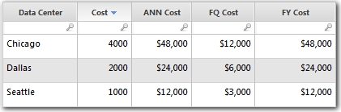

# Añadir una columna basada en el calendario a una tabla

**Se aplica a** : TBM Studio 12.0 y posteriores

Las tablas suelen incluir datos numéricos como unidades y coste. Se muestran para el mes/período actualmente seleccionado. Si desea ver los valores de un periodo de tiempo superior a un mes o un periodo, puede añadir varias columnas basadas en el calendario. Añada elementos de calendario utilizando los elementos de menú situados bajo el icono **Fechas** de la pestaña **Fórmulas**. En la siguiente imagen se muestran varios ejemplos de columnas basadas en calendarios. Al añadir una columna basada en calendario, el nombre de columna por defecto es la abreviatura más el nombre de la columna seleccionada.

## Añadir una columna basada en el calendario

1. Seleccione una columna de valores en la tabla que servirá de base para la columna de calendario.
2. Haga clic en la pestaña **Fórmulas**.
3. Abra el menú **Fechas** y seleccione la columna **Calendario**.

## Tipos de columnas

A continuación se describen los tipos de columnas.

- **Valor anualizado (RNA)** : calcula el valor mensual medio hasta la fecha de una métrica y, a continuación, multiplica ese valor por 12 para proyectar el valor anual total del ejercicio. Esta función es útil para proyectar valores reales como el coste y las unidades.
- **Año fiscal (FY)** - Suma el valor de una métrica especificada en la misma tabla para todo el año fiscal. Si no se especifica ningún año, la función se evalúa para el año en curso. Esta función devuelve el total de todo el año, independientemente del periodo seleccionado.
- **Trimestre fiscal (FQ)** - Suma el valor de una métrica especificada en la misma tabla para todo el trimestre fiscal. Si no se especifica ningún trimestre, la función se evalúa para el trimestre actual. Esta función devuelve el total de todo el trimestre, independientemente del periodo seleccionado en ese momento.
- **Año hasta la fecha (YTD)** - Suma los valores hasta el mes seleccionado, incluido, del año en curso.
- **Trimestre hasta la fecha (QTD)** - Suma los valores hasta el mes seleccionado del trimestre actual, incluido.
- **Último año fiscal (LFY)** - Muestra el valor del año anterior. Resulta útil para comparar las variaciones interanuales de los valores.
- **Último trimestre fiscal (LFQ)** - Suma los valores del trimestre fiscal anterior.
- **Últimos 12 meses (LTM)** - Muestra el valor de los últimos 12 meses (sin incluir el mes actualmente seleccionado) sin tener en cuenta los calendarios fiscales.
- **Último mes (LM)** - Muestra el valor del mes anterior.
- **Este periodo del año pasado (LY)** - Muestra el valor del mismo periodo del año pasado. Útil para comparar las variaciones de valor de un año a otro.
- **Tendencia Sparkline** - Muestra los valores de los últimos seis meses en una pequeña línea de tendencia.
