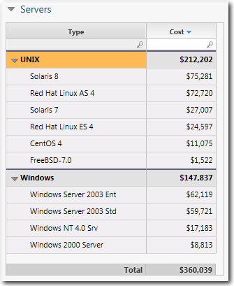
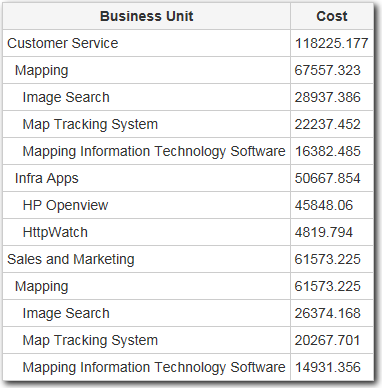
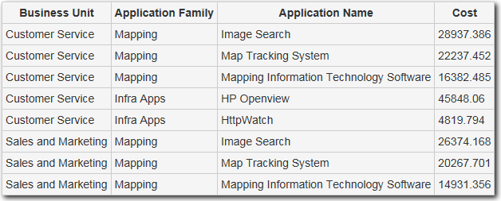

# Añadir una estructura de árbol de subtotales a una tabla

**Se aplica a** : TBM Studio 12.0 y posteriores

Si está creando una tabla jerárquica, puede crear una tabla con filas desplegables. Cuando se expande una fila, las filas del nivel inmediatamente inferior en la jerarquía se muestran debajo de la fila expandida. Por ejemplo, puede que desee desglosar por unidad de negocio, aplicación y servicio. En la siguiente imagen se muestra un ejemplo.

Figura A. Ejemplo de tabla con estructura de árbol de subtotales.

## Directrices generales

Las siguientes directrices se aplican a las estructuras de árbol subtotal:

- Puede anidar filas en varios niveles.
- Puede mostrar todas las sub-líneas o especificar el número de sub-líneas a mostrar con un enlace **Otros** para mostrar las sub-líneas restantes.
- Puede utilizar campos de varios objetos si los campos están bloqueados en los objetos.
- Las cortadoras siguen aplicándose a la mesa.
- Funciona con tablas basadas en objetos.

## Crear una estructura de árbol de subtotales

1. Crear una nueva tabla ad hoc.
2. Arrastre dos o más campos al área **Filas** del panel **Configuración de componentes**.

   Si está añadiendo campos de uno o más objetos, los campos deben estar bloqueados en el objeto.
3. Añada uno o más campos al área **Valores** del panel **Configuración de Ad Hoc Query**.
4. Haz clic en la pestaña **Datos**.
5. En el grupo **Estructura**, haga clic en la opción **Como árbol**.
6. Si procede, especifique el número máximo de hijos que se mostrarán haciendo clic en la opción **Max Hijos**.

   Se añade una fila de enlace **Otros** a la tabla para mostrar las filas restantes.

## Exportar una tabla de vista de árbol a Excel

Puede exportar una tabla de vista en árbol a Excel. Cuando se exporta la tabla, se exportan todas las filas superiores e inferiores. La primera columna de cada fila secundaria tiene una sangría de dos espacios para indicar el nivel jerárquico en el que se encuentra la fila. La exportación a Excel no creará la tabla de árbol correspondiente. En su lugar, creará una tabla plana. Por ejemplo, la siguiente tabla, cuando se exporta.

Se vería así:

