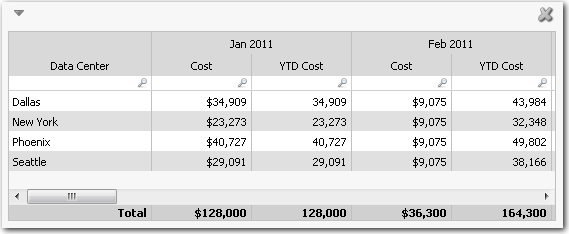
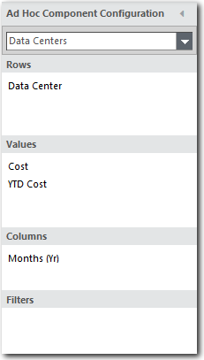
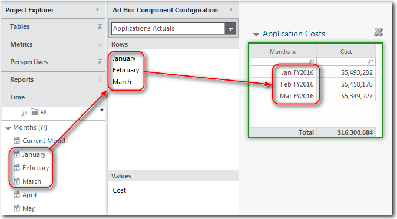
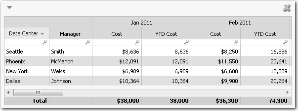
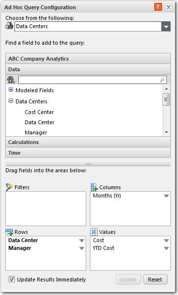
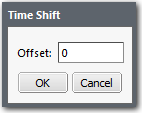
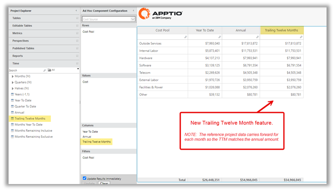

# Añadir un período de tiempo a las columnas de una tabla

**Se aplica a** : TBM Studioo 12.0 y posteriores

Si desea añadir periodos de tiempo como meses o trimestres a una tabla, seleccione la perspectiva **Tiempo** y arrastre un periodo de tiempo al área **Columnas** o al área **Filas**. En la siguiente imagen, se han añadido meses a la tabla. La aplicación admite periodos, meses, trimestres y años. Puede utilizar más de un periodo de tiempo por tabla. La tabla de la siguiente imagen se creó utilizando la configuración de la siguiente imagen. Puede añadir un periodo de tiempo a las tablas basadas en objetos y en transformaciones.

Puede arrastrar más de un periodo de tiempo al área **Eje** de un gráfico o al área **Columnas** de una tabla. Por ejemplo, puede arrastrar enero, febrero y marzo, y luego arrastrar el primer trimestre.

Puede convertir la tabla de la Figura A en un gráfico de líneas de tendencia seleccionando el icono **Línea** de la pestaña **Ad Hoc**.

## Añadir tiempo a una columna

Puede añadir periodos, meses, trimestres y años a una columna añadiendo los campos de tiempo al área **Filas** del cuadro de diálogo, como se muestra en la siguiente imagen:

Nota: La carga de archivos no es posible para periodos de tiempo cerrados. No mostrará el inicio del periodo del proyecto, sino el periodo real en el que se cargó. Si se trata de un periodo cerrado, aparecerá como "<MMM AAAA (cerrado)".

## Controlar los periodos mostrados

En una tabla de tendencias, puede controlar los periodos mostrados haciendo clic con el botón derecho del ratón en el campo **Tiempo** del área **Columnas** del panel **Configuración de componentes** y seleccionando una de las siguientes opciones:

| Periodo de tiempo | Funcionalidad |
| --- | --- |
| **Este trimestre** | Muestra los periodos del trimestre seleccionado en el selector de fechas. |
| **Esta mitad** | Muestra los periodos en la mitad seleccionada en el selector de fechas. |
| **Este año** | Muestra los periodos del año seleccionado en el selector de fechas. |
| **Rango** | Introduzca el número de periodos que desea visualizar desde el pasado hacia el futuro. |

**Añadir columnas a una tabla de tendencias**

Para añadir una columna a una tabla de tendencias como la columna Gestor que se muestra en la siguiente imagen, arrastre el campo al área **Filas** y desactive los subtotales. Para desactivar los subtotales, seleccione la pestaña **Datos**, haga clic en el icono **Subtotal** y, a continuación, en el botón **Borrar**. La columna Gestor se ha añadido con la configuración que se muestra en la siguiente imagen:

**Configuración para crear la tabla** :

## Compensar meses, trimestres y períodos

Si añade Mes actual, Trimestre actual o Período actual al área **Columnas**, puede desplazar la fecha haciendo clic con el botón derecho del ratón en el campo y seleccionando **Desplazar**. Aparecerá el cuadro de diálogo **Cambio de hora**, como se muestra en la siguiente imagen. Puede introducir un número positivo o negativo en el campo **Desplazamiento** para visualizar un periodo futuro o anterior. Por ejemplo, si el campo es **CurrentMonth**, e introduce *3* en el campo **Offset**, la tabla mostrará datos de tres meses en el futuro. Si el selector de fecha para el informe se fijó en marzo, la tabla mostraría datos de junio.

## Agregación temporal de los últimos doce meses

**Se aplica a** : 12.11.8 y posteriores

Se ha añadido una nueva función de agregación de **los últimos doce meses** en la selección de tiempo para apoyar la automatización de los activos gestionados.

La agregación de fechas de los últimos doce meses está disponible en la sección Tiempo del Proyecto Explorar y puede utilizarse en la sección Columnas de la Configuración de componentes ad hoc de un componente de informe.

Resulta útil considerar un total de 12 meses consecutivos en lugar de la perspectiva del "calendario fiscal", como se explica a continuación:

- Suma los 12 meses anteriores (por ejemplo, si el periodo actual es agosto de 2024, sumará los valores de agosto de 2023 a julio de 2024)
- Si es un calendario fiscal de 13 periodos, sumará los 13 meses anteriores
- Si se dispone de menos de 12 (o 13) periodos, anualizará el importe

