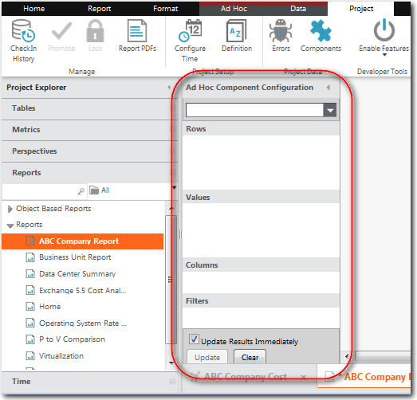
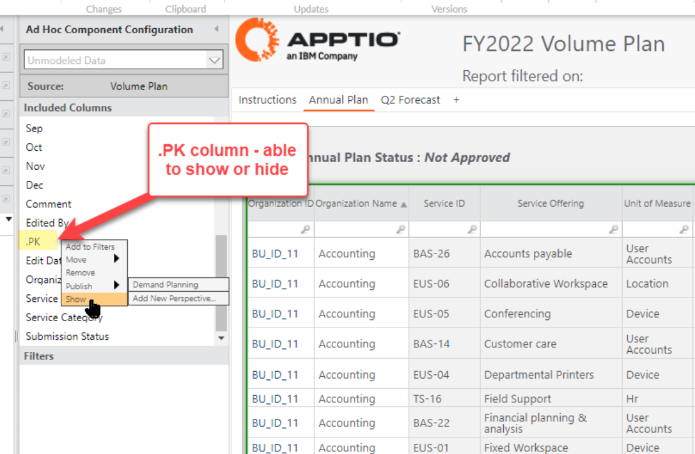
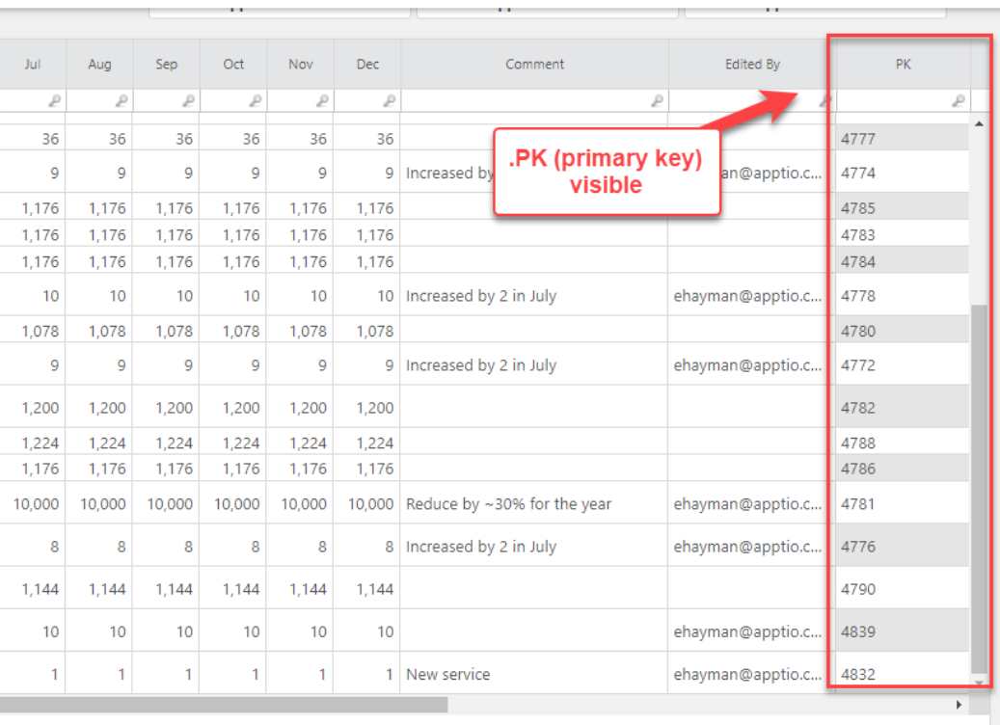
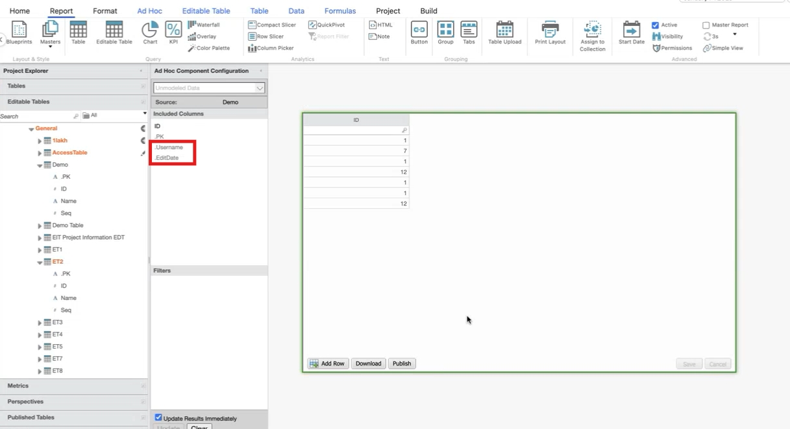
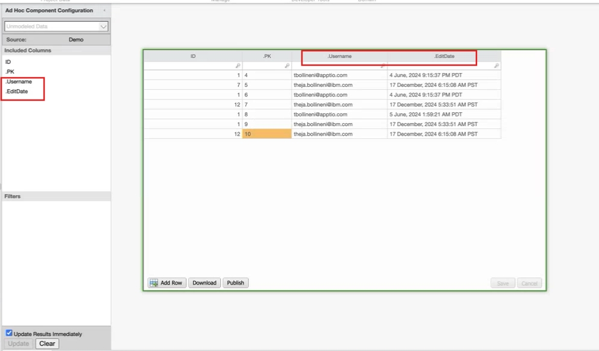
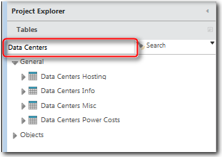

# Panel de configuración de componentes

**Se aplica a** : TBM Studio 12.0 y posteriores

El panel **Configuración de componentes** aparece cuando se inserta una tabla o un gráfico en un informe. Incluye un selector de tablas y áreas donde arrastrar campos para construir tablas y gráficos:

Existen dos versiones del panel **Configuración de componentes** : Usuario avanzado y Analista. La versión que ve un usuario está controlada por el rol asignado al usuario. A continuación se describen las dos versiones:

- **Usuario avanzado** : ve todas las funciones del panel de configuración y puede crear perspectivas personalizadas disponibles para el analista. Esta vista está disponible para los usuarios que tengan asignada la función Admin o equivalente. El rol debe tener el permiso **Editar Modelos**.
- **Analista** - Sólo ve las perspectivas personalizadas, la perspectiva **Tiempo** y el panel **Configuración de componentes**. Esta vista está disponible para los usuarios que tengan asignada la función Usuario empresarial o equivalente.

Al insertar un componente de informe y seleccionar una tabla modelo de la lista desplegable, la tabla seleccionada determina los campos disponibles en las perspectivas del **Explorador de proyectos**. Todos los conjuntos de datos y métricas vinculados a la tabla seleccionada a través del motor de inferencia estarán disponibles.

Las secciones del **Explorador de proyectos** organizan los campos que pueden arrastrarse a las áreas de configuración para construir una tabla. A continuación se describen las dimensiones estándar:

- **Tablas** - Muestra los nombres de las tablas vinculadas por el **motor de inferencia Apptio** al objeto seleccionado.
- **Métricas** - Muestra las métricas modeladas y calculadas.
- **Hora** - Muestra los periodos de tiempo disponibles.
- **Perspectivas** - Para aumentar las secciones estándar, puede crear perspectivas personalizadas en la sección **Perspectivas**. Las perspectivas personalizadas contienen campos seleccionados de las otras secciones que desea poner a disposición de los analistas. Para obtener más información sobre las perspectivas, consulte [Creación de perspectivas personalizadas](../creating-custom-perspectives.html "Se aplica a: TBM Studio 12.0 y posteriores").

Para construir una tabla, arrastre los campos desde el **Explorador de proyectos** a las áreas de la parte inferior del panel **Configuración de componentes**. Se pueden añadir múltiples campos en todas las áreas excepto en el área **Columnas**. Si un campo no puede aplicarse a un área, aparece un mensaje de advertencia.

Para eliminar un campo de un área, arrástrelo fuera del área o haga clic con el botón derecho en el campo y seleccione **Eliminar**.

A continuación se describen las cuatro áreas.

- **Filas** - Proporciona entradas para la primera columna de la tabla. Si hay entradas duplicadas en la fuente, las entradas se agrupan y se muestra una única entrada para cada valor único. Si añade más de un campo al área, se crean subgrupos en la primera columna de la tabla.
- **Columnas** - Proporciona encabezados de columna para la tabla. Arrastre un campo aquí desde una perspectiva. Sólo se puede poner un campo en el área **Columnas**.
- **Valores** - Proporciona los datos que aparecen en el cuerpo de la tabla. Puede ocultar un valor haciendo clic con el botón derecho en el valor y seleccionando **Ocultar**.
- **Filtros** - Filtra las entradas de una columna de la tabla. Arrastre aquí los campos desde las perspectivas y otras áreas. Si utiliza una métrica, puede hacer clic con el botón derecho en la métrica y establecer el intervalo de números.

## Mostrar/ocultar columna.pk

**Se aplica a** : R12.11.2 y posteriores

El administrador de Apptio ahora puede mostrar (y ocultar) la columna.pk para tablas editables sin procesar en un componente de informe de tabla editable y también ordenar los valores por ella. La columna.pk se incluirá por defecto en columnas incluidas en cuanto el usuario arrastre cualquier columna a columnas incluidas, pero estará oculta por defecto. El usuario puede mostrar/ocultar la columna pk en un informe situando el cursor sobre la columna.PK y haciendo <clic-derecho> para que aparezca el menú Añadir a filtros. Compruebe que la columna.PK está oculta por defecto y que el botón Mostrar está activado. Al seleccionar "**Mostrar** " aparecerá la columna.PK, que puede desplazarse al orden de columnas que se desee.

Si la columna.pk está visible en el informe y se añade una nueva fila, su valor no será visible hasta que se guarde la fila. Esto se ha hecho para mantener el patrón de índice pk oculto al usuario. El usuario final puede utilizar esta función para soportar multiceldas consistentes, copiar/pegar, ordenar la columna PK en línea/hoja Excel, y para copiar/pegar empezando por el rango correcto.

## Mostrar/ocultar las columnas.Username y .EditDate

**Se aplica a** : 12.11.11 y posteriores

El administrador de Apptio ahora puede mostrar (y ocultar) las columnas.Username y .EditDate en un componente de informe de tabla editable y también ordenar los valores por ella. La columna.Username mostrará quién hizo el último cambio y .EditDate mostrará cuándo se hizo el último cambio. Ambas columnas se incluirán por defecto en columnas incluidas tan pronto como el usuario arrastre cualquier columna a columnas incluidas.

El usuario puede mostrar/ocultar estas columnas en un informe situando el cursor sobre ella, <clic-derecho> para desplegar el menú **Añadir a filtros**. Al seleccionar "**Mostrar** " aparecerán las columnas, que pueden desplazarse en el orden que se desee. Ambas columnas son de sólo lectura y no se pueden realizar cambios en ellas.

## Cambiar el orden de los campos en los cuadros de área

Para cambiar el orden de los campos en un cuadro de área, arrastre los campos hacia arriba o hacia abajo en la lista. El orden de los campos determina el orden de las columnas correspondientes en la tabla.

## Borrar todos los campos

Para borrar todos los campos de las áreas, haga clic en el botón **Borrar** situado en la parte inferior del panel.

## Aplazar actualizaciones

Por defecto, los cambios que se realizan en el panel **Configuración de Ad Hoc Query** afectan inmediatamente a los datos que aparecen en la tabla. Si trabaja con grandes conjuntos de datos, es posible que los datos tarden en actualizarse en la tabla. Para evitar retrasos, puede cambiar a actualizaciones manuales desactivando la opción **Actualizar resultados inmediatamente** en la parte inferior del cuadro de diálogo. Si esta opción no está seleccionada, las actualizaciones sólo se realizan al hacer clic en el botón **Actualizar**.

## Minimizar el panel

Para minimizar el panel **Configuración**, haga clic en la flecha de la esquina superior derecha.

## Filtrar los campos de una sección

Si hay una lista larga de campos en una sección, puede filtrar la lista introduciendo texto en el cuadro de autofiltrado de la parte superior de la sección. A medida que introduce caracteres, la lista se va filtrando:

