# Editar las propiedades de las tablas

**Se aplica a** : TBM Studio 12.0 y posteriores

Las propiedades de edición permiten controlar cómo interactúan los usuarios con las tablas editables. Tenga en cuenta que estas propiedades también se aplican a las tablas generadas. Para obtener más información sobre las propiedades de edición, consulte [Establecer propiedades de tabla](set-table-properties.html "Se aplica a: TBM Studio 12.0 y posteriores").

También puede controlar cómo interactúan los usuarios con las tablas editables con las propiedades de Edición de la barra de la cinta TBM Studio . Tenga en cuenta que estas propiedades también se aplican a las tablas generadas:

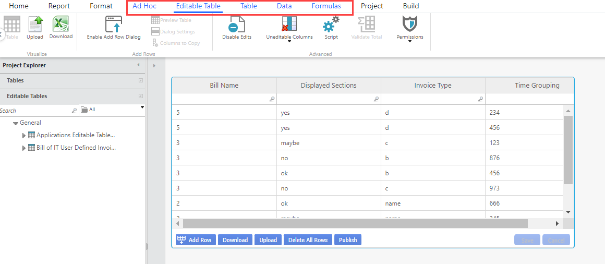

## Subir

Puede cargar una tabla editable de una de las maneras siguientes:

- Seleccione **Cargar** en la cinta Tablas editables.
- Seleccione el botón Cargar en la parte inferior de la tabla. Este botón sólo aparece cuando se activa la opción **Activar/Desactivar carga** en la ventana emergente [Propiedades avanzadas](set-table-properties.html "Se aplica a: TBM Studio 12.0 y posteriores").

Para saber más sobre las opciones de carga, consulte el [componente Carga de tablas.](../table-report-upload-component.html "Se aplica a: TBM Studio 12.9.3 y posteriores")

## Descargar

Este botón está disponible por defecto para todas las tablas editables. Al seleccionar este botón, aparece la siguiente ventana emergente.

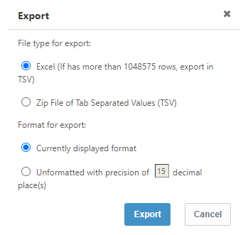

Haga la elección adecuada y seleccione el botón **Exportar**.

## Activar el cuadro de diálogo Añadir fila

Seleccione el botón **Activar Diálogo Añadir Fila** configure y añada una nueva fila con datos pre-rellenados.

Haga clic en el botón **Añadir fila** para ver el cuadro de diálogo que tiene la columna y los datos y, a continuación, seleccione la fila que desea añadir en el informe actual.

## Desactivar ediciones

Este campo toma una expresión de texto dinámico. Si la expresión se evalúa como true, se desactivará la edición de la tabla. En el ejemplo siguiente, el usuario ddavis no podrá editar la tabla.

> `{$CurrentUser:Users.ID}="ddavis@ABCCompany.com"`

Para obtener más información sobre el texto dinámico, consulte [Insertar texto dependiente del contexto en el HTML](../html.html "Se aplica a: TBM Studio 12.0 y posteriores").

Desde 12.11.6, el botón **Borrar todas las filas** aparecerá incluso cuando la expresión sea 'true'.

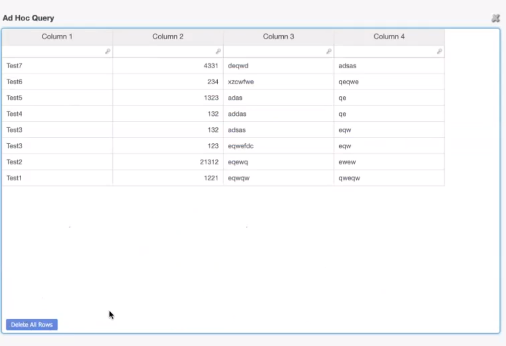

## Columnas no editables

Se aplica a 12.10.10 y posteriores

Este campo le permite hacer que una columna no sea editable. Expanda la opción **Tablas no editables** para ver la lista de columnas que pueden hacerse no editables.

## Script

ApptioScript es el lenguaje de scripting que se utiliza para crear las aplicaciones empresariales interactivas sobre la plataforma Apptio.

ApptioScript se puede utilizar para realizar muchas operaciones, como editar tablas, enviar correo electrónico, estados de transición en el flujo de trabajo o programar lo que sucede cuando el usuario hace clic en un botón. [Consulte ApptioScript](../../apptioscript/about.html "ApptioScript es el lenguaje de scripting que se utiliza para crear las aplicaciones empresariales interactivas sobre la plataforma Apptio.") y los [ejemplos de ApptioScript](../../apptioscript/apptioscript_examples.html "Utilice los siguientes ejemplos para repasar los usos de ApptioScript.").

## Validar total

Validador de columna total
:   Se utiliza para validar los totales de las filas. Por ejemplo, puede que desee que una fila de números sume 100. También puede buscar valores que se encuentren entre un valor bajo y un valor alto. Cuando se utiliza esta función, se añade una columna de Totales a la derecha de la tabla. Los valores que quedan fuera de los parámetros se resaltan en rojo.

    Para definir los validadores, haga clic en el icono situado a la derecha del campo. Aparecerá el cuadro de diálogo **Validador de columnas totales** como se muestra a continuación. Seleccione **Total** en el primer campo, seleccione un calificador en el segundo campo e introduzca un valor en el tercer campo. Puede añadir varias entradas para especificar valores mínimos y máximos. Para añadir una segunda entrada, haga clic en el signo + situado debajo de la primera entrada.

    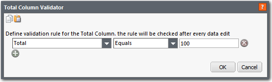

Validador de filas totales
:   Se utiliza para validar los totales de las filas. Por ejemplo, puede que desee que una columna de porcentajes sume 100%. También puede buscar valores que se encuentren entre un valor bajo y un valor alto. Cuando se utiliza esta función, se añade una fila de **totales** en la parte inferior de la tabla. Los valores que quedan fuera de los parámetros se resaltan en rojo.

    Para definir los validadores, haga clic en el icono situado a la derecha del campo. El cuadro de diálogo **Validador de filas totales** aparece como se muestra a continuación. Seleccione **Total** en el primer campo, seleccione un calificador en el segundo campo e introduzca un valor en el tercer campo. Puede añadir varias entradas para especificar valores mínimos y máximos. Para añadir una segunda entrada, haga clic en el signo + situado debajo de la primera entrada.

    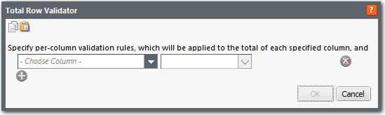

## Permisos

Esta sección le permite conceder/denegar permisos para las siguientes acciones en una fila. El permiso predeterminado para el **permiso Eliminar todas las filas** es *admin y partner*, mientras que el resto de los permisos tienen *todos* como valor predeterminado.

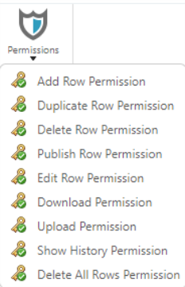

## Añadir permiso de fila

Especifica los roles que podrán añadir filas a la tabla. Las opciones son *Everyone* y *Selected Roles*. Para especificar las funciones, haga clic en el icono **Seleccionar funciones** y elija la(s) función(es) en el menú desplegable.

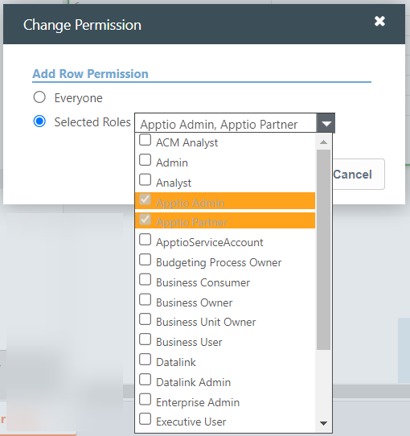

## Permiso para duplicar filas

Especifique los roles que podrán duplicar las filas de una tabla.

## Permiso para eliminar filas

Especifique los roles que podrán eliminar filas de la tabla.

## Publicar permiso de fila

Especifique los roles que podrán publicar filas en la tabla.

## Permiso para editar filas

Especifique los roles que podrán editar las filas de la tabla.

## Descargar permiso

Especifique los roles que podrán descargar la tabla.

## Permiso de carga

Especifique los roles que podrán cargar la tabla.

## Mostrar permisos del historial

Especifica los roles que podrán ver el historial de cambios realizados en la tabla.

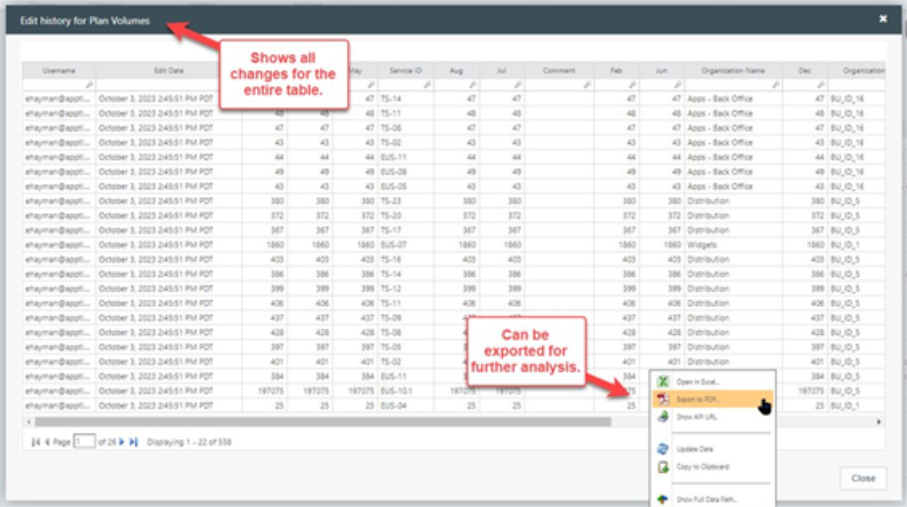

## Borrar todas las filas Permiso

Especifique los roles que podrán eliminar todas las filas de una tabla editable.

## Borrar todas las filas

Este botón sólo aparece cuando se activa la opción **Eliminar todas las filas** en la ventana emergente [Propiedades avanzadas](set-table-properties.html "Se aplica a: TBM Studio 12.0 y posteriores"). Al seleccionar este botón, aparece la ventana emergente de advertencia que se muestra.

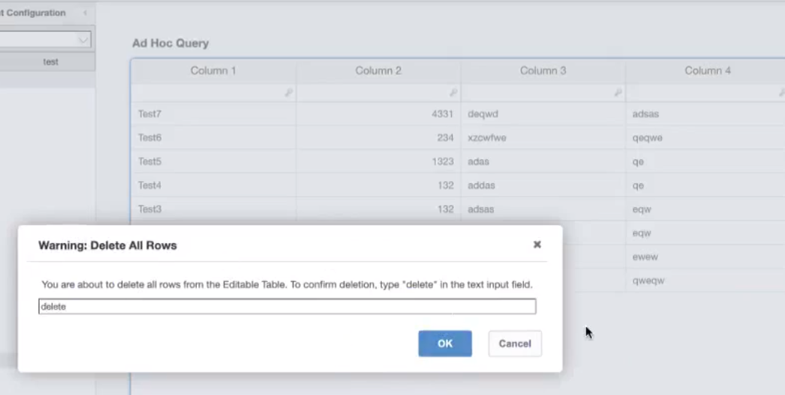

Introduzca "eliminar" y seleccione el botón **OK**. La tabla está en blanco, pero todos los cambios se capturan en la sección Mostrar cambios.

Nota: Si introduce un valor distinto de "eliminar", el botón **Aceptar** permanecerá desactivado.

Si todas las celdas del conjunto filtrado de filas visibles están bloqueadas, todos los botones (Añadir fila, Eliminar fila y Duplicar fila) estarán desactivados, pero el botón Eliminar todas las filas permanecerá activado.

## Habilitar columna de casillas de verificación

**12.11.5 y posteriores** : la columna de casilla de verificación de selección aparece solo cuando habilita la opción **Habilitar columna de casilla de verificación** en la ventana emergente [Propiedades avanzadas](set-table-properties.html "Se aplica a: TBM Studio 12.0 y posteriores"). Filtre valores específicos y, a continuación, utilice el botón ApptioScript para editar el valor de la celda o eliminar la fila.

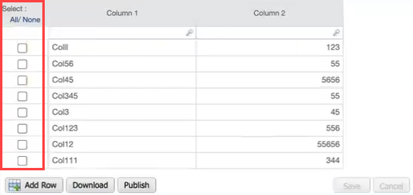

Seleccione o arrastre el cursor por varias filas. haga clic con el botón derecho y seleccione la opción **Eliminar fila**.

A partir de **12.11.6** en adelante, puede hacer lo siguiente:

- A partir de unos valores filtrados, seleccione una fila o filas concretas y edite el valor de la celda o elimine esa fila o filas utilizando el botón ApptioScript.

## Publicar

Seleccione este botón para publicar los datos de las tablas generadas en las tablas padre. Para más información, consulte [Publicar cambios manualmente en la superficie de informes](../../data_studio/table-update-schedule.html "Se aplica a: TBM Studio 12.6 y posteriores").

## Suprima

Esta función permite suprimir/ocultar datos en tablas extensas y editables.

**12.11.5 y posteriores** : El informe de tabla editable se suprime sólo cuando se activa la opción **Suprimir solicitud inicial de datos** en la ventana emergente [Propiedades avanzadas](set-table-properties.html "Se aplica a: TBM Studio 12.0 y posteriores").

Si se selecciona la opción **Suprimir solicitud de datos inicial**, todos los datos se ocultarán en la tabla. Aparecerá un mensaje "*Seleccione el filtro que prefiera para recuperar los datos. Nota: Se ha desactivado la carga automática del informe.*".

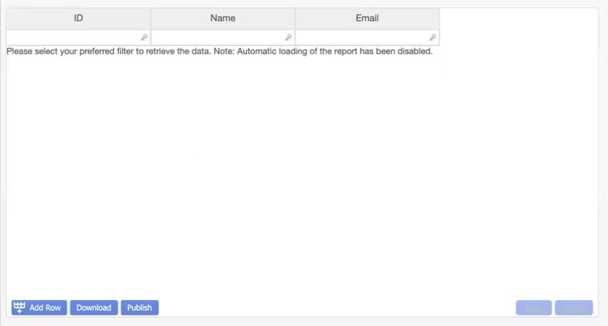

Para ver los datos de su elección, debe aplicar [rebanadores compactos](../compact-slicers.html "Se aplica a: TBM Studio 12.0 y posteriores") o filtros de filas.

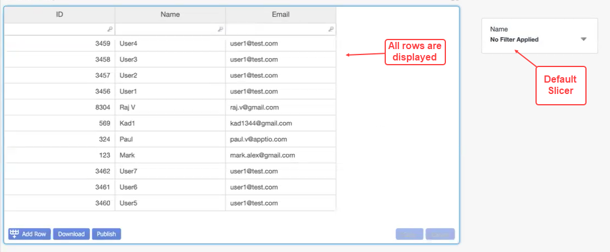

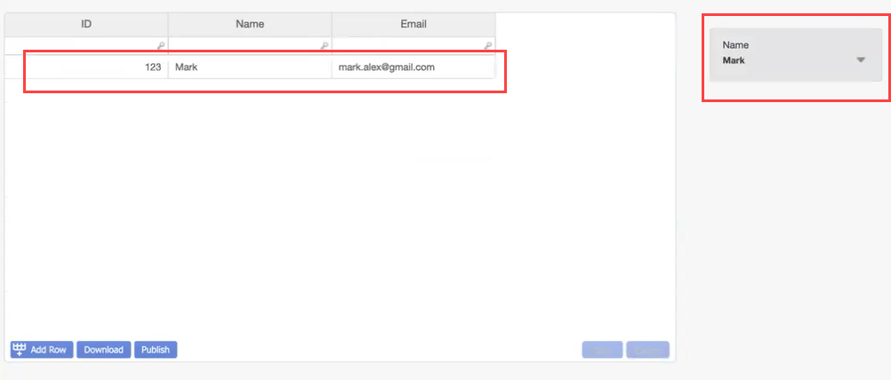

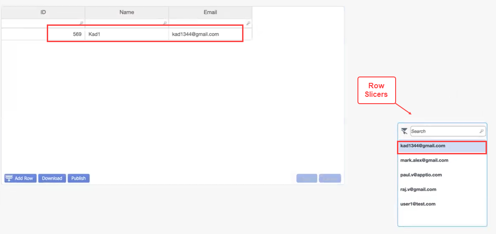

También puede actualizar los datos manualmente, automáticamente o seleccionando **Actualizar datos** en el menú del botón derecho del ratón.
