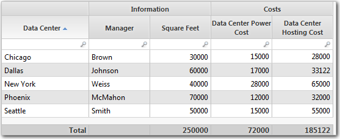
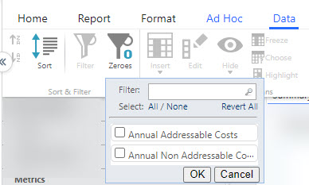
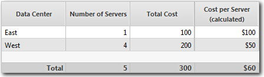

# Modificar la estructura de la tabla

**Se aplica a** : TBM Studio 12.0 y posteriores

Después de añadir una tabla a un informe, puede realizar modificaciones como ordenar el contenido, ocultar columnas y congelar columnas. Realice estas modificaciones seleccionando los iconos de las pestañas **Tabla** y **Datos** o haciendo clic con el botón derecho del ratón en la cabecera de una columna para que aparezca un menú emergente.

## Renombrar una columna

Para renombrar una columna, haga clic con el botón derecho del ratón en la cabecera de la columna y seleccione **Renombrar** en el menú emergente. Introduzca un nuevo nombre para la columna.

## Columnas de grupo

Puede agrupar dos o más columnas en una tabla y poner una cabecera encima de las columnas. En la siguiente imagen, hay dos grupos de columnas: **Información** y **Costes**.

Para agrupar columnas:

1. Mantenga presionada la tecla **Ctrl** (tecla **Alt** en Mac) y haga clic en el encabezado de cada columna que estará en el grupo.
2. Haga clic con el botón derecho del ratón y seleccione **Agrupar columnas** en el menú emergente.
3. En el cuadro de diálogo **Agrupar columnas**, introduzca el encabezado que se colocará encima de las columnas y haga clic en **Aceptar**. **NOTA:** Puede utilizar texto dinámico en la cabecera. Para obtener información sobre el texto dinámico, consulte [Insertar texto dependiente del contexto en HTML](../html.html "Se aplica a: TBM Studio 12.0 y posteriores").

Para desagrupar columnas, haga clic con el botón derecho del ratón en la cabecera de la columna y seleccione **Desagrupar columnas** en el menú emergente.

## Mover una columna

Para mover una columna, haz clic en la cabecera de la columna y arrástrala hacia la izquierda o la derecha hasta una nueva posición en la tabla.

## Cambiar el tamaño de una columna

Para cambiar el tamaño de una columna, realice una de las siguientes acciones:

- Sitúe el puntero del ratón sobre el límite derecho de la columna. Cuando el icono del puntero cambie de una mano a una flecha, haga clic y arrastre hacia la izquierda o hacia la derecha.
- Haga clic con el botón derecho en la cabecera de la columna, haga clic en **Formato**, haga clic en **Establecer anchura** e introduzca la anchura en píxeles.

## Mostrar y ocultar columnas

Para ocultar una columna de una tabla, haga clic con el botón derecho en el nombre de la columna en el área **Valores** del panel **Configuración de componentes** y seleccione Ocultar. El nombre de la columna aparece en gris.

Para mostrar una columna oculta en una tabla, haga clic con el botón derecho en el nombre de la columna en el área **Valores** del panel **Configuración de componentes** y seleccione **Mostrar**.

## Congelar una columna

En tablas grandes, puede congelar una o varias columnas para evitar que se desplacen horizontalmente fuera de la vista. Al congelar una columna, ésta se desplaza al extremo izquierdo de la tabla y queda bloqueada en esa posición. Al desplazar la tabla hacia la derecha, la columna congelada permanece en su sitio. Puedes congelar más de una columna.

Para congelar una columna, realice una de las siguientes acciones:

- Seleccione la columna y, a continuación, el icono **Congelar** en la pestaña **Datos**.
- Haga clic con el botón derecho en la cabecera de la columna, haga clic en **Formato** y haga clic en **Congelar columna**.

Para descongelar una columna, haga clic con el botón derecho en la cabecera de la columna, haga clic en **Formato** y haga clic en **Descongelar columna**.

## Ordenar filas de una tabla

Puede ordenar una tabla por una o varias columnas. La ordenación puede ser ascendente o descendente. Para ordenar una tabla, utilice los controles **Ordenar** de la pestaña **Datos**.

Para ordenar una tabla por una sola columna, seleccione la columna y haga clic en el icono **Ascendente** o **Descendente**.

Para ordenar una tabla por varias columnas, haga clic en el icono **Ordenar**. La aplicación muestra un cuadro de diálogo en el que puede seleccionar hasta cuatro columnas para la clasificación.

## Ceros en una tabla

Puede utilizar este filtro para eliminar los valores cero de sus informes. Para utilizarlo, vaya a la pestaña **Datos** de un informe editable y seleccione **Ceros**.

Introduzca el nombre del informe o seleccione la casilla de verificación de los informes y haga clic en **Aceptar**. También puede seleccionar **Todos** / **Ninguno** para seleccionar / deseleccionar todos los informes.

Para eliminar el filtro de ceros aplicado a los informes, selecciónelos y haga clic en **Revertir todo**.

## Ocultar la fila Total

Por defecto, las tablas muestran una fila de **Total** en la parte inferior. Para ocultar una fila de **Total**, haga clic en la pestaña **Datos**, haga clic en **Suma** y desactive la opción **Mostrar fila de Total**.

La fila Total es lo suficientemente inteligente como para elegir la acción adecuada para las columnas de una tabla. Suma sólo columnas numéricas. Además, las columnas calculadas muestran el resultado de los totales. Por ejemplo, suponga que tiene la tabla que se muestra a continuación:

La columna **Coste por servidor** se calcula dividiendo el coste total por el número de servidores. El valor de Coste por servidor en la fila **Total** también se calcula basándose en 5 servidores con un coste total de 300 $: 300 $/5 = 60 $. La fila Total muestra un valor de 60 $ en lugar de 150 $.

## Visualizar la columna Totales

Por defecto, las tablas no muestran una columna de **Totales**. Para mostrar la columna, haga clic en **Suma** en la pestaña **Datos** y marque la opción **Mostrar columna total**.

## Mostrar la fila Otros

Si hay muchas filas en una tabla y desea limitar el número de filas mostradas, puede añadir una fila **Otra**. Para añadir la fila, haga clic en **Suma** en la pestaña **Datos** y marque la opción **Mostrar otra fila**. La fila Otros aparece en la parte inferior de la tabla. Muestra el total de toda la tabla menos los valores mostrados en la página actual de la tabla.
