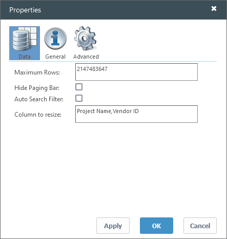

# Establecer propiedades de la tabla

**Se aplica a** : TBM Studio 12.0 y posteriores

Hay una amplia gama de propiedades disponibles para las tablas que controlan el aspecto de una tabla. Muchas de las propiedades están disponibles en la cinta de opciones. Otros están disponibles en el cuadro de diálogo **Propiedades de la tabla**.

Véase también [Cómo: Crear una tabla generada](https://community.apptio.com/docs/DOC-8377 "(se abre en una pestaña o una ventana nueva)")

## Abrir el cuadro de diálogo Propiedades

Haga clic con el botón derecho del ratón en la barra Total de la tabla y seleccione **Propiedades**.

Aparece el cuadro de diálogo Propiedades.

El cuadro de diálogo Propiedades organiza las propiedades de la tabla en las siguientes pestañas:

- Datos
- Tema general
- Avanzado

Para previsualizar los cambios, seleccione **Aplicar**. Para guardar los cambios, seleccione **OK**.

Nota: Algunas tablas tendrán un subconjunto de estos campos. Los campos marcados con un asterisco ( \* ) sólo se aplican a las tablas heredadas.

## Propiedades de datos

| **Campo** | **Descripción** |
| --- | --- |
| **Filas máximas** | Especifica el tamaño de página para la tabla de paginación. Por ejemplo, si establece 20 **filas máximas** para una tabla con 15 filas, no habrá barra de paginación, sólo una barra de desplazamiento. |
| **Ocultar barra de paginación** | Oculta la barra de paginación de las tablas multipágina. Si está oculto, sólo se muestra el número de filas designado en el campo **Filas máximas**. El usuario no puede visualizar filas adicionales. Utilice esta opción cuando desee que sólo se muestre un número x de filas en una tabla. Por ejemplo, los 10 routers más utilizados. |
| **Incluir columnas** | Abra la lista desplegable y seleccione las columnas que desea incluir en la tabla. Cuando utilice esta función, debe seleccionar todas las columnas que desee mostrar en la tabla, incluidas las columnas que se muestran actualmente. |
| **Excluir columnas** | Abra la lista desplegable y seleccione las columnas que desea excluir de la tabla. |
| **Filtro de búsqueda automática** | Esta opción añade campos de búsqueda debajo de cada encabezado de columna, como se muestra a continuación. Puede introducir texto de búsqueda en los campos.    Al introducir texto en un campo, la tabla mostrará sólo las filas que contengan el texto. El filtro no distingue entre mayúsculas y minúsculas. Para las columnas numéricas, puede utilizar los operadores estándar: <, <=, >, >=. Para las columnas de etiquetas, se admite "=" para coincidencias exactas sensibles a mayúsculas y minúsculas. Por ejemplo, =Facturación incluirá Facturación pero excluirá Extracto de Facturación. |
| **Mostrar filas para las que todos los valores métricos son 0\*** | Por defecto, si una fila de la tabla tiene ceros en todas las columnas métricas, la fila no se muestra. Puede visualizar la fila marcando esta opción. |
| **Columna a redimensionar** | Permite ajustar automáticamente las columnas seleccionadas de la tabla para que se ajusten al espacio disponible en el informe.  Introduzca los nombres de las columnas separados por una coma, por ejemplo Nombre del proyecto,ID del proveedor. |

## Propiedades generales

| **Campo** | **Descripción** |
| --- | --- |
| **Nombre** | Introduzca un nombre para que aparezca en la cabecera de la tabla, encima del componente. El nombre aparece cuando se selecciona la opción **Mostrar encabezado**. |
| **Leyenda** | Introduzca información adicional sobre la tabla. La información se muestra en función de la configuración del campo **Posición del título**. Puede utilizar código HTML en el campo, pero el código HTML no puede incluir enlaces. La restricción del código HTML es por motivos de seguridad. |
| **Posición del pie de foto** | En la lista, seleccione una posición del título en relación con la tabla: **Arriba**, **Abajo**, **Izquierda** o **Derecha**. Para ocultar el pie de foto, seleccione **Ocultar**. |
| **Mostrar cabecera** | La cabecera del componente muestra el contenido del campo **Nombre**. Seleccione esta opción para hacer visible la cabecera de la tabla. En el modo Edición, puede mostrar una cabecera oculta deteniendo el puntero del ratón sobre la tabla. |
| **Mostrar borde** | Seleccione esta opción para mostrar un borde alrededor de la tabla. En el modo Edición, puede mostrar un borde oculto deteniendo el cursor sobre la tabla. |
| **Wrap Título** | Ajusta el texto introducido en el campo **Nombre** a la anchura de la tabla. |

## Propiedades avanzadas

| **Campo** | **Descripción** |
| --- | --- |
| **Datos URL \*** | Muestra la ruta de acceso a la tabla que suministra los datos para este informe. Puede introducir una función de tabla en este campo haciendo clic en el icono **Editar ruta de datos**  situado a la derecha del campo. La aplicación muestra el cuadro de diálogo **Editar ruta**. **Atención** : no modifique la ruta si no está muy familiarizado con las rutas de datos. |
| **Actualización automática al finalizar los cálculos** | Cuando la aplicación muestra una tabla, lo hace con los datos calculados disponibles en ese momento. En muchos casos, la aplicación puede estar calculando nuevos valores en segundo plano. Si desea que se muestren los resultados una vez finalizados los cálculos, marque esta opción. Esta opción sólo se aplica a la tabla seleccionada en ese momento.  Esta opción sólo es relevante cuando la **Política de cálculo** (en el cuadro de diálogo **Cálculo de proyectos** ) de un proyecto está configurada como **Publicación dinámica**. |
| **Activar/desactivar carga** | Activa el botón **Cargar** para una tabla editable. |
| **Añadir datos al cargar** | Los administradores utilizan esta opción para establecer el comportamiento de carga de la tabla en "añadir" o "sobrescribir". |
| **Suprimir la solicitud inicial de datos** | Suprime los datos del informe por primera vez. |
| **Añadir columna de casilla de verificación** | Activa la columna de casillas de verificación en las tablas editables. |
| **Ediciones con fecha** | Esta opción permite el arrastre de valores. Al habilitarla, cualquier modificación realizada en una columna numérica se trasladará a todas las columnas numéricas siguientes situadas a su derecha. |
| **Permitir borrar todas las filas** | Activa el botón **Eliminar todas las filas** de una tabla editable. |
| **Período de datos** | Determina los datos que aparecen en la tabla. La opción por defecto, **Fecha actual del proyecto**, muestra los datos correspondientes al periodo de tiempo actualmente seleccionado.  **Inicio del proyecto actual** garantiza que los datos se introducen en el mes de inicio del proyecto.  Si selecciona una opción distinta de **Fecha actual del proyecto**, la aplicación muestra un pequeño icono de candado en la esquina inferior derecha de la tabla. El icono indica que los datos introducidos en una tabla se aplicarán al periodo de tiempo seleccionado. |
| **Ocultar aviso de bloqueo horario** | Si ha establecido en el campo **Período de tiempo de los datos** un valor distinto de **Hora actual del proyecto**, aparecerá un icono de candado en la esquina inferior derecha de la tabla. Al marcar esta opción se oculta el icono. |
| **Ocultar la advertencia de hidratación** | En el modo Edición, si coloca un componente en un informe objeto que se basa en una unidad diferente a la del propio informe, la aplicación muestra un icono de advertencia  y un mensaje de texto en la esquina inferior derecha del componente. No se muestran en el modo Vista. Si selecciona esta opción, las advertencias no se mostrarán en el modo Edición.  Por ejemplo, suponga que tiene un objeto Unidades de Negocio y que desglosa un informe de la Unidad de Negocio A con un gráfico y una tabla que muestran datos sobre la Unidad de Negocio A. En el mismo informe, desea mostrar información sobre la Unidad de Negocio B con fines comparativos. Añada una tabla al informe para mostrar la información. Como lo ha hecho intencionadamente, no quiere que la aplicación muestre el aviso de hidratación, por lo que selecciona la opción **Ocultar aviso de hidratación**. |
| **Acortar automáticamente los nombres de las nuevas columnas punteadas** | Muestra sólo la parte del nombre de una columna que sigue a la "." punto. Por ejemplo, si el nombre de la columna es Data Center Costs.Data Center Hosting Cost, el nombre se mostraría como Data Center Hosting Cost. |
| **Líneas por fila** | Establece el número de líneas de cada fila de la tabla. El valor predeterminado es cero, lo que permite que el contenido de la celda se ajuste. Si introduce un valor en este campo, todas las filas de la tabla se mostrarán con ese número de líneas. El texto que no cabe en la celda se trunca. |
| **Max. Columnas a mostrar** | Limita el número de columnas que se pueden mostrar en una tabla. Tenga en cuenta que una tabla con muchas columnas puede afectar al rendimiento. |
| **Incluir columna PK** | Incluirá la columna por defecto en el gráfico/tabla, esté o no especificada en la lista normal de 'columnas a incluir'. En las tablas no agrupadas, suele ser el identificador del objeto que respalda el componente del informe. En las tablas agrupadas, suele ser la columna utilizada para la agrupación. |
| **Pivote Fila Col** | La columna de la tabla de origen que proporciona los valores para la primera columna de la tabla pivotada. |
| **Pivote Col Col** | La columna de la tabla de origen que proporciona los encabezados para las columnas de datos de la tabla pivotante. |
| **Pivote Val Col** | La columna de la tabla de origen que proporciona los valores para las celdas de la tabla pivotante. |
| **Utilizar alias de columna** | En circunstancias en las que tenga dos objetos con las mismas columnas mostradas en la misma tabla, como Consumer.Master Table.L0 Nombre y Provider.Master Table.L0 Nombre, marcando esta opción es posible configurar correctamente las columnas en la tabla. **Recomendación** : deje esta opción seleccionada. |
