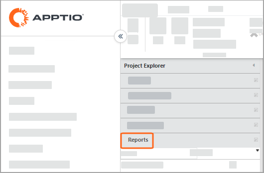
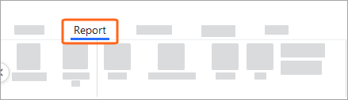
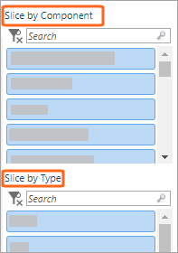
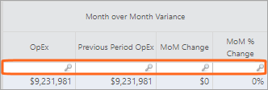
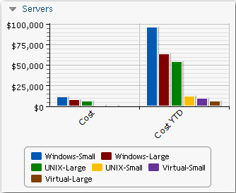
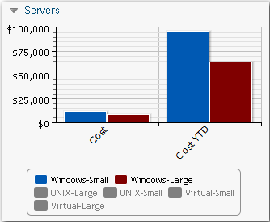
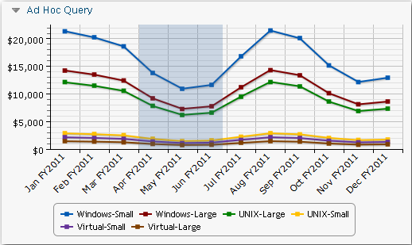
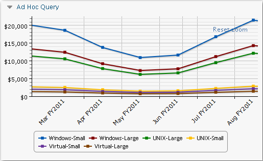

# Trabajar con informes

**Se aplica a** : TBM Studio 12.0 y posteriores

Lo más probable es que se hayan creado varios informes para presentar los datos que ha generado Apptio. A menudo se trata de datos sobre costes, pero también pueden ser de otro tipo.

Los administradores pueden configurar los permisos a nivel de colecciones de informes y a nivel de informes individuales. Para obtener más información, consulte [Crear y gestionar colecciones de informes](creating-report-collections.html "Se aplica a: TBM Studio 12.0 y posteriores") y [Trabajar con permisos de informes](control-access-reports-11755.html "Se aplica a: Apptio TBM Studio 12.7 y posteriores.").

## Ver un informe

Para ver un informe, seleccione Informes en el Explorador de proyectos.

También puede seleccionar informes en la pestaña Informe que aparece después de retirar un informe.

## Filtrar un informe

Si en un informe hay una o varias rebanadoras, utilícelas para filtrar el informe. Haga clic en cualquier combinación de las entradas de una o varias de las cortadoras.

Para borrar todos los filtros, haga clic en el icono de borrado de restablecimiento de filtros .

Para buscar las entradas del filtro, introduzca texto en el campo Buscar.

## Búsqueda automática

En las tablas de los informes, es posible que aparezcan campos de búsqueda debajo de los encabezados de las columnas. Puede introducir texto en estos campos para filtrar la tabla por ese término de búsqueda.

Si introduce texto en el campo Buscar, sólo se mostrarán las filas que contengan el texto. El filtro no distingue entre mayúsculas y minúsculas y acepta tanto texto como números, incluidos los decimales. ¡Puede anteponer al texto el prefijo! para buscar entradas que no contengan texto. Para columnas numéricas, puede utilizar los operadores estándar: =,<, <=, >, >=,!=. Para buscar una celda vacía, introduzca la palabra EN BLANCO en el cuadro de filtro. ¡Para buscar celdas que no estén vacías, introduzca!EN BLANCO en el cuadro de filtro. No se admiten comodines como el asterisco (\*) y el signo de número #. Si busca valores = 0, se incluirán los números inferiores a 1 x 10-7.

Las opciones de búsqueda se resumen en la siguiente tabla:

| Opción | Columna de números | Columna de texto | Descripción |
| --- | --- | --- | --- |
| !BLANK | Sí | Sí | Introduzca esta palabra para buscar celdas que no estén vacías. |
| texto | Nee | Sí | Buscar filas que no contengan el texto. |
| && | Sí | Sí | Función AND. Por ejemplo, Guardar && Maestro devuelve todas las entradas que contienen la palabra Guardar y Maestro. Puede introducir más de un && en una búsqueda. Puede utilizar la función && o || en una búsqueda, pero no ambas. |
| = | Sí | Sí | Cuando se utiliza con texto, la coincidencia distingue entre mayúsculas y minúsculas. |
| >, <, >=, <=, != | Sí | Nee | Utilice estos operadores con columnas numéricas. |
| BLANK | Sí | Sí | Introduzca esta palabra para buscar celdas vacías. |
| Texto | Nee | Sí | Buscar filas que contengan el texto. |
| || | Sí | Sí | Función OR. Por ejemplo, Guardar || Maestro devuelve todas las entradas que contengan la palabra Guardar o Maestro. Puede introducir más de un || en una búsqueda. Puede utilizar la función || o && en una búsqueda, pero no ambas. |

## Ocultar elementos en los gráficos

En los gráficos, puede ocultar elementos en la leyenda.

En todos los tipos de gráficos con leyenda, puede ocultar los elementos seleccionados en la leyenda para centrarse en datos específicos de los gráficos. Para ocultar un elemento, haga clic sobre él en la leyenda. El elemento aparece en gris. Por ejemplo, suponga que tiene el cuadro Servidores que se muestra en la siguiente imagen:

Desea centrarse únicamente en servidores Windows. Haga clic en los otros cuatro elementos de la leyenda para obtener el gráfico que se muestra en la imagen siguiente:

Cuando se desplaza el puntero del ratón sobre una barra de un gráfico de barras, la información sobre herramientas muestra el valor de la barra. En un gráfico de barras apiladas, la información sobre herramientas muestra el valor y el porcentaje del elemento en la barra. Si tiene elementos ocultos en el gráfico, el porcentaje refleja los elementos mostrados actualmente.

## Ampliar gráficos

En los gráficos de líneas, puede ampliar periodos de tiempo específicos manteniendo pulsado el botón del ratón y arrastrando el puntero del ratón horizontalmente por el gráfico. Por ejemplo, suponga que tiene el gráfico de líneas que se muestra en la siguiente imagen. Quieres ampliar la imagen para ver las cifras del segundo trimestre, así que arrastras el puntero del ratón de abril a junio.

El resultado se muestra en la siguiente imagen. Para restablecer el gráfico, seleccione Restablecer zoom en la esquina superior derecha del gráfico. Cuando se sale de un informe, se restablecen todos los zooms.

