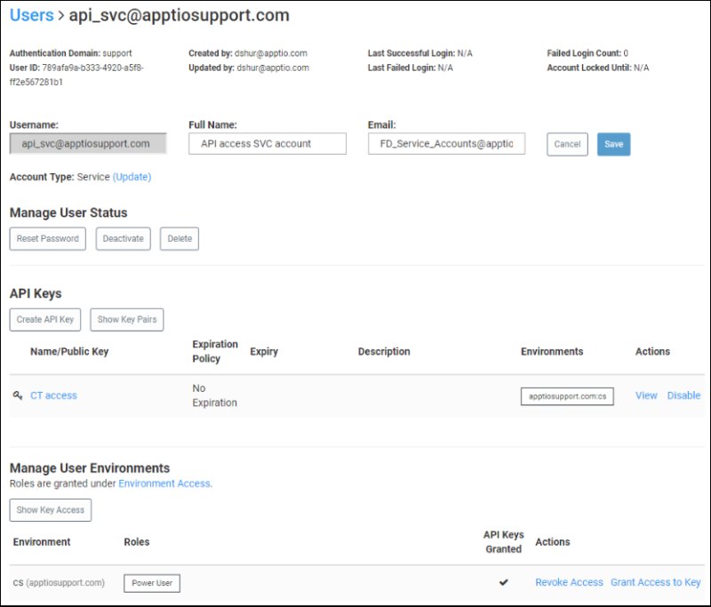

# Tutorial de API: Descarga y carga de la tabla v.12 Costing Standard utilizando la herramienta Postman

## Requisitos

- Una cuenta de usuario en Enhanced Access Administration configurada con claves API. Para más información, consulte [Enhanced Access Administration API: Descripción general de las claves API y Preguntas frecuentes](/docs/SSFG2DK/frontdoor/admin-guide/eaa-api/overview-api-keys-faq.html).
  - La cuenta de usuario debe estar en el dominio Enhanced Access Administration auth donde reside la aplicación Costing Standard (CT).
  - Una vez creada, la clave debe tener acceso al entorno adecuado. Haga clic en el enlace **Conceder acceso** situado junto al nombre de la clave.
  - El usuario debe tener una función de usuario avanzado para acceder a CT y, posiblemente, privilegios de administrador en Datalink
    (Classic) si se va a utilizar la misma cuenta en ambas aplicaciones. Si la función de usuario avanzado no es la estándar o ha sido modificada, asegúrese de que los permisos de la función están establecidos en Permitir acceso a entornos y Permitir exportación.
- La aplicación Costing Standard con el acceso del usuario (mencionado anteriormente) al entorno.
- La aplicación Postman para este ejemplo. Aplicaciones similares, como SoapUI,, pueden utilizarse mediante los mismos principios.

## Usuario en Enhanced Access Administration



## Configurar un entorno Postman

Este procedimiento le permite guardar variables de entorno dentro de Postman. Esto es útil para encadenar diferentes solicitudes en apoyo de las pruebas de modo que usted no tiene que copiar y pegar el Apptio -opentoken repetidamente.

Para configurar el entorno:

1. [Crea un nuevo entorno **Postman**](https://learning.postman.com/docs/postman/variables-and-environments/variables/ "(se abre en una pestaña o una ventana nueva)").

   
2. Establezca las variables de entorno adecuadas. En las siguientes imágenes, utilizamos env, pub, secret y token.

- **env** - Al principio está en blanco; se rellenará más adelante.
- **pub** - El componente público de su clave API.
- **secret** - El componente secreto de su clave API.
- **token** - Al principio está en blanco - se rellenará más tarde.


## Obtener un Opentoken de Frontdoor

Para obtener documentación sobre este ejemplo, consulte [Enhanced Access Administration API: Autenticación mediante claves API](https://community.apptio.com/docs/DOC-10522 "(se abre en una pestaña o una ventana nueva)").

Publicar solicitud URL : [https://frontdoor.apptio.com/service/apikeylogin](https://frontdoor.apptio.com/service/apikeylogin "(se abre en una pestaña o una ventana nueva)")

Cabeceras:

- Aceptar: application/json
- Tipo de contenido: application/json


Cuerpo (**NOTA** : Establezca el cuerpo en formato RAW seleccionando el botón de opción adecuado):

`{"keyAccess":"{{pub}}","keySecret":"{{secret}}"}`


En **Pruebas**, configure lo siguiente. Esto establecerá el valor de su variable de entorno **Token** cuando se ejecute el POST:

`pm.environment.set("token",
pm.cookies.get('apptio-opentoken'));`


Haga clic en **Guardar** y, a continuación, en **Enviar** para este POST. Ahora debería ver el Apptio -opentoken en las cookies:


Y en tus variables de entorno:


## Utilizar nombre de usuario/contraseña para autenticarse

El uso de claves API es el método preferido para la autenticación por razones de seguridad. Sin embargo, si utiliza un nombre de usuario y una contraseña en lugar de claves API, deberá crear variables de entorno para el ID de usuario y la contraseña. Entonces, el cuerpo aparecerá similar al siguiente ejemplo.


Para más información, consulte [Frontdoor API: Autenticación básica mediante nombre de usuario y contraseña](https://community.apptio.com/docs/DOC-10529 "(se abre en una pestaña o una ventana nueva)").

## Obtener el ID de entorno

La llamada para obtener un ID de entorno no es necesaria si ya sabes cuál es el ID. El ID no cambia a menos que se modifique una aplicación como la configuración de CT Enhanced Access Administration . Para más información, consulte [Frontdoor API: Obtener información del entorno de usuario](https://community.apptio.com/docs/DOC-10459 "(se abre en una pestaña o una ventana nueva)").

**NOTA** : Asegúrese de sustituir su nombre de dominio por el marcador de posición **yourdomain.com** y su nombre de entorno Enhanced Access Administration (normalmente es **main** ) por el marcador de posición **yourfrontdoorenv** en el siguiente URL :

Solicitud GET URL : [https://frontdoor.apptio.com/api/environment/yourdomain.com/yourfrontdoorenv](https://frontdoor.apptio.com/api/environment/yourdomain.com/yourfrontdoorenv "(se abre en una pestaña o una ventana nueva)")

Cabeceras:

- tipo de contenido: application/json
- apptio-opentoken: {{token}}


Utiliza lo siguiente en las **Pruebas** :

```
var jsonData = pm.response.json();

pm.environment.set("env", jsonData.id);
```

Haga clic en **Guardar** y, a continuación, en **Enviar**. Deberías ver el ID del entorno en el cuerpo:


Y en las variables de tu entorno:


## Cargar una tabla

Para más información, consulte los ejemplos en Introducción a la [API de](../../admin/the-apptio-api.html "Se aplica a: TBM Studio 12.0 y posteriores") [plataforma APIPlatform](../../admin/the-apptio-api.html "Se aplica a: TBM Studio 12.0 y posteriores").

Cabeceras:

- tipo de contenido: application/json
- apptio-opentoken: {{token}}
- apptio-entorno-actual: {{env}}


En el cuerpo, especifique el archivo que desea cargar:


Haga clic en **Guardar** y, a continuación, en **Enviar**. Si todo está correctamente configurado, debería obtener un json en el cuerpo de la respuesta similar al de este ejemplo.


## Descargar una tabla

Para más información, consulte los ejemplos en Introducción a la [API de la plataforma](../../admin/the-apptio-api.html "Se aplica a: TBM Studio 12.0 y posteriores").

Nota: Asegúrese de sustituir los valores adecuados a su situación en el siguiente ejemplo URL :

URL de solicitud GET: consulte la sección Tabla de [API: Descarga de datos](studio_api_download_data.html "Se aplica a: TBM Studio v11.x, v12.0, v12.1, v12.2 y posteriores") [API: Descarga de datos](studio_api_download_data.html "Se aplica a: TBM Studio v11.x, v12.0, v12.1, v12.2 y posteriores") para obtener detalles sobre cómo obtener una URL de API de tabla.

Cabeceras:

- tipo de contenido: text/tab-separated-values
- apptio-opentoken: {{token}}
- apptio-entorno-actual: {{env}}


## Descargar una tabla de informes

URL de solicitud GET: consulte [API: Descarga de datos](studio_api_download_data.html "Se aplica a: TBM Studio v11.x, v12.0, v12.1, v12.2 y posteriores") [API: Descarga de datos](studio_api_download_data.html "Se aplica a: TBM Studio v11.x, v12.0, v12.1, v12.2 y posteriores") para obtener detalles sobre cómo obtener una URL reportAPI.

Cabeceras:

- tipo de contenido: text/tab-separated-values
- apptio-opentoken: {{token}}
- apptio-entorno-actual: {{env}}


Para obtener más información sobre la API, consulte [Plataforma APIPlataforma](../../admin/the-apptio-api.html "Se aplica a: TBM Studio 12.0 y posteriores") [API](../../admin/the-apptio-api.html "Se aplica a: TBM Studio 12.0 y posteriores").
