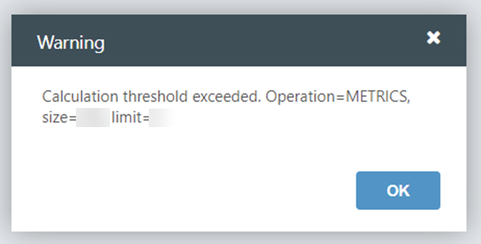

# Recuento métrico permitido superado

El recuento de métricas permitido es el número total de métricas que puede tener su proyecto. Esto incluye métricas calculadas y modeladas.

Si ha alcanzado este límite e intenta crear una nueva métrica, aparecerá el siguiente mensaje de error:

## Recomendación de configuración para el error Allowable Metric Count exceeded

Para resolver este error:

1. En la vista **Explorador de proyectos** > seleccione **Métricas**
2. Seleccione la métrica que desea eliminar
3. En la pestaña **Inicio**, seleccione **Salida**
4. Seleccione de nuevo la métrica resaltada
5. En la pestaña **Inicio**, seleccione **Borrar**
6. elija **OK** para continuar

Si necesita más ayuda para reducir el número total de métricas, póngase en contacto con el servicio de asistencia Apptio.
