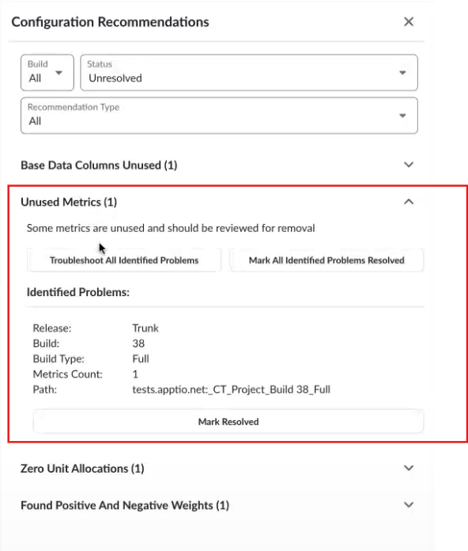
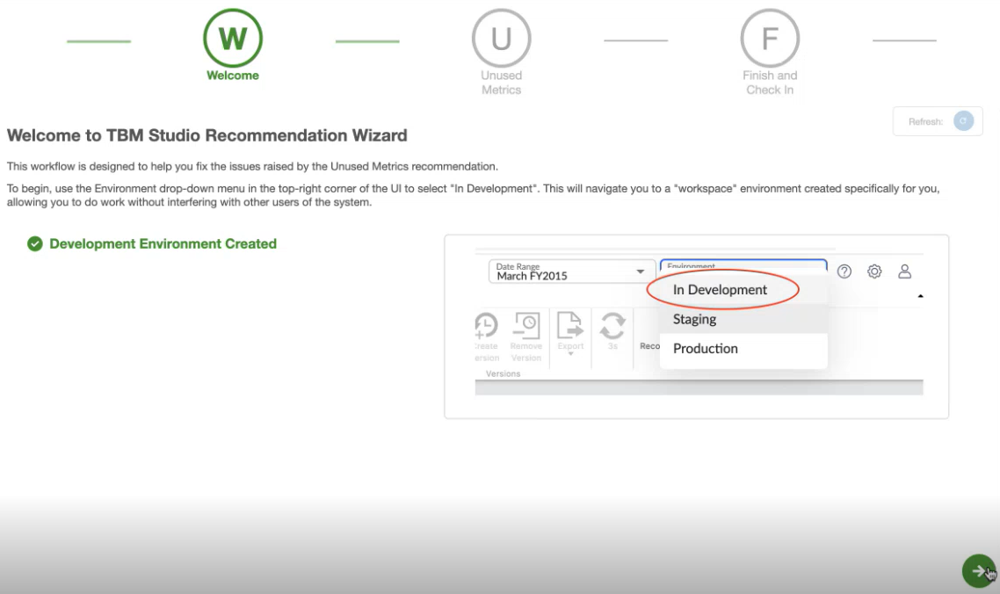
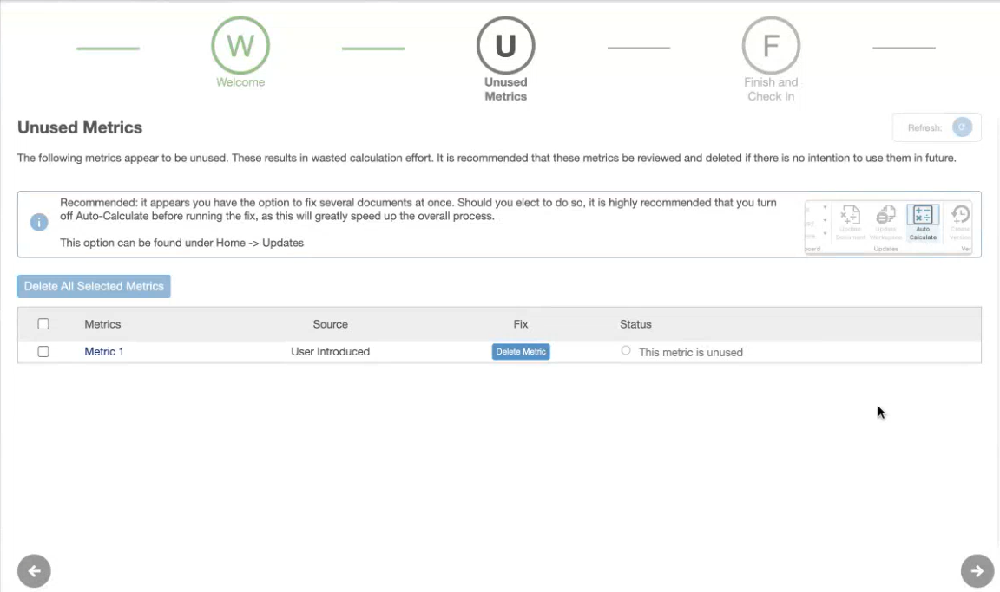
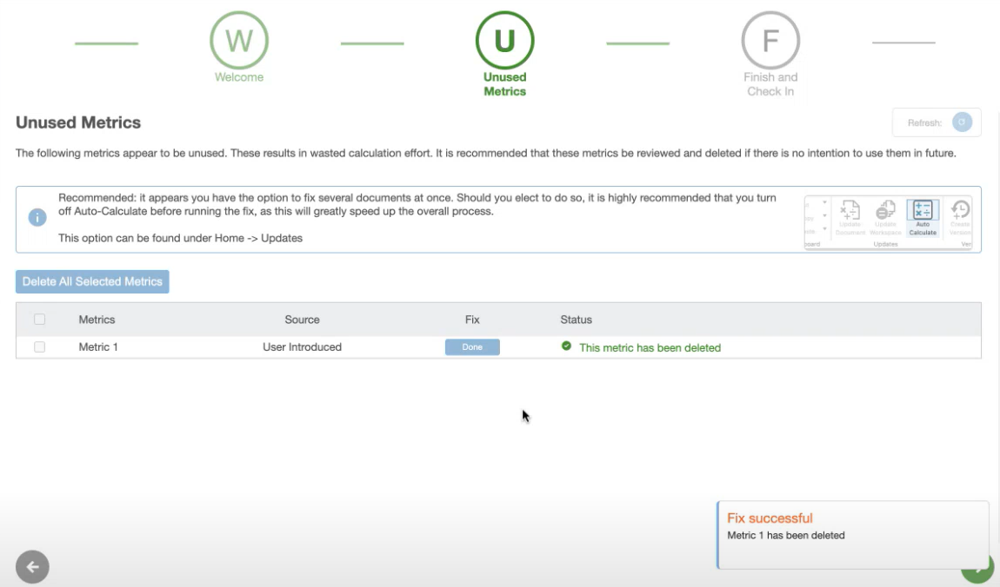
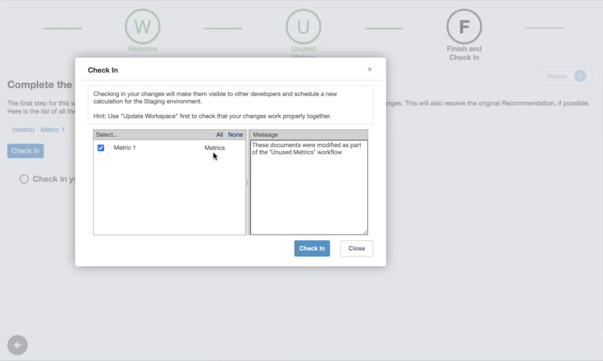

# Métricas no utilizadas

Esta función proporciona recomendaciones automáticas sobre las métricas calculadas no utilizadas, ofreciendo visibilidad de las métricas creadas por el usuario que no se utilizan en otras métricas o informes. El sistema comprobará automáticamente los cambios y marcará las incidencias como resueltas.

Vaya a **TBM Studio** > ficha **Recomendaciones** > **Métricas no utilizadas** y, a continuación, seleccione **Solucionar todos los problemas identificados**.

Cambie al espacio de trabajo **Desarrollo** y seleccione **Siguiente**.

Haga clic en el icono **Siguiente**.

Seleccione el botón **Eliminar métrica**. Se elimina la métrica no utilizada.

Seleccione **Siguiente** y, a continuación, **Checkin** en la última página.

