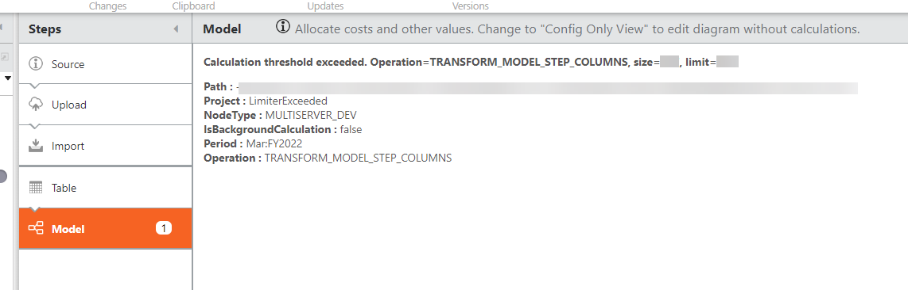
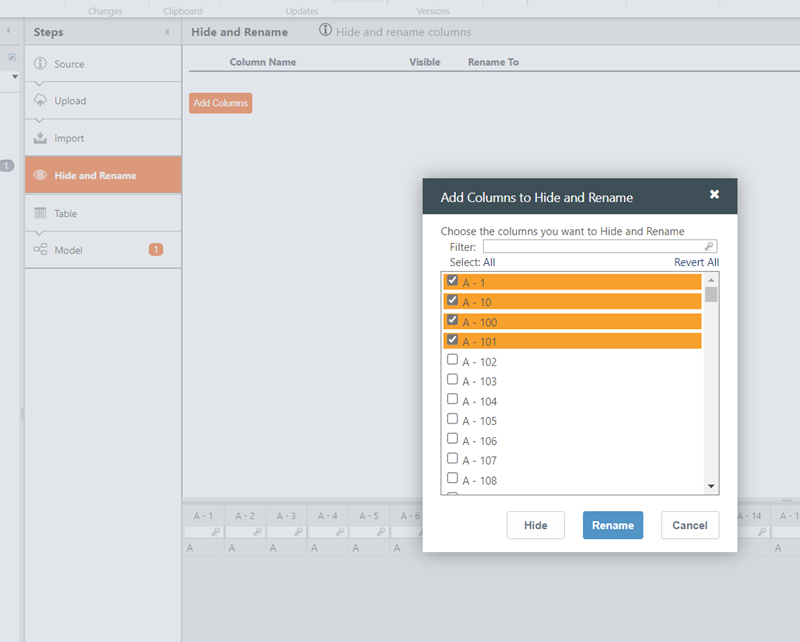

# Transformar columnas de pasos del modelo

Existe un número máximo de columnas que puede utilizar en su tabla con un paso de modelo. Si sobrepasa este límite, TBM Studio tarda más en calcular los resultados, y además no calcula el objeto modelo. Esto da como resultado números incorrectos en cualquier modelo que utilice este objeto.

## Recomendación de configuración para las columnas de pasos del modelo de transformación error superado

Para resolver este error, añada un paso de ocultar y renombrar y oculte las columnas que no sean necesarias.

Para añadir un paso de ocultar y renombrar:

1. En la vista **Explorador del proyecto** > seleccione **Tablas**
2. Seleccione el menú desplegable del proyecto, seleccione la tabla necesaria para el proyecto
3. En la pestaña **Inicio**, seleccione **Salida**
4. Añade el paso desde el icono + que aparece en la configuración del paso
5. Seleccione **Ocultar y Renombrar** en la configuración del paso y, a continuación, seleccione **Añadir columnas**
6. Seleccione las columnas que desea ocultar para situarse por debajo del límite.

   
