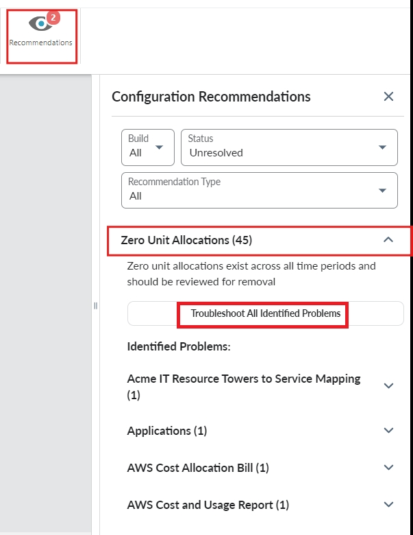
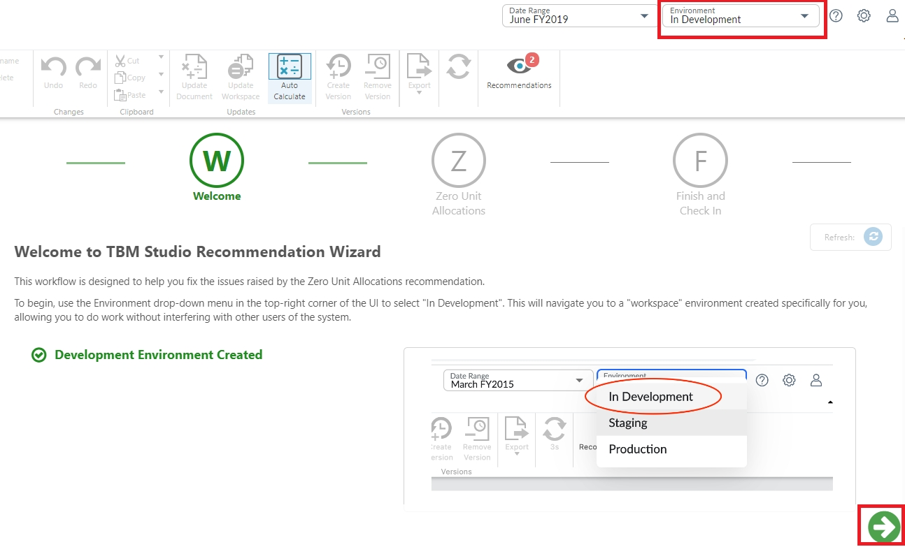
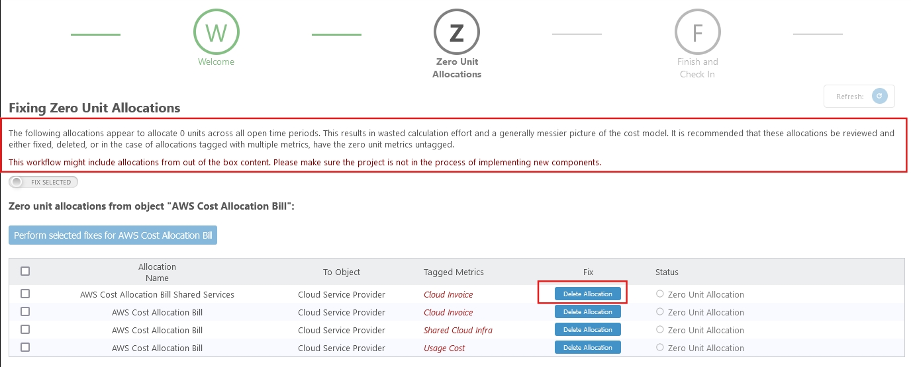
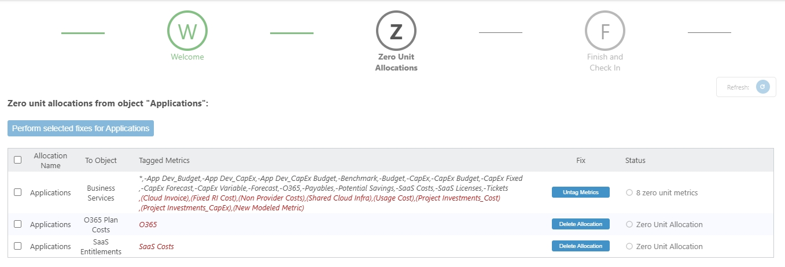
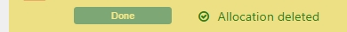
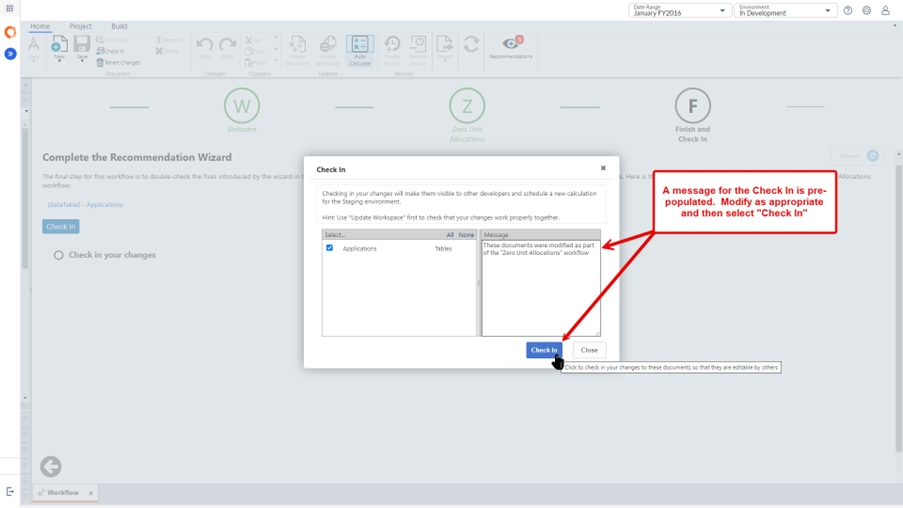

# Asignaciones no utilizadas

Navegue a **TBM Studio** >� pestaña **Recomendaciones** > **Asignaciones de unidad cero**, y luego seleccione **Solucionar todos los problemas identificados**.

Cambie al espacio de trabajo **Desarrollo** y seleccione **Siguiente**.

Puede ver la descripción del problema y las medidas que se tomarán para resolverlo. Las asignaciones no utilizadas se enumeran debajo de cada objeto modelo. Puedo ver las asignaciones no utilizadas por Nombre de asignación, A objeto y Métricas etiquetadas para el objeto de factura Asignación de costes AWS.

Seleccione el botón **Borrar asignación** para fijar individualmente.

Desplazándose hacia abajo hasta el objeto modelo "Aplicaciones", se pueden ver Asignaciones con múltiples Métricas Etiquetadas. Las métricas en "negro" son asignaciones activas, mientras que las métricas en "rojo" son asignaciones no utilizadas.

He seleccionado la casilla de verificación *App Dev\_Budget,Budget* Business Services y el botón **Perform selected fixes for Applications**.

Del mismo modo, tome las medidas adecuadas para el resto de las secciones.

Una vez completado, cambia el estado de la Asignación no utilizada.

Seleccione **Siguiente** y, a continuación, **Checkin** en la última página.

