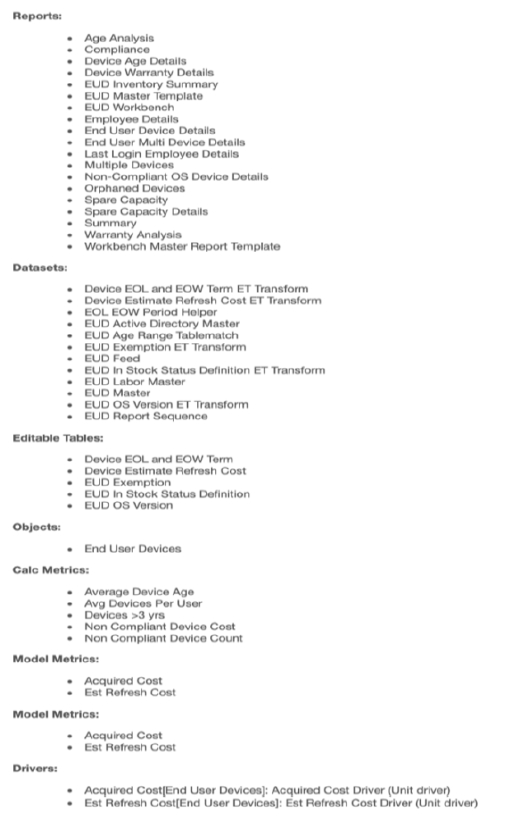
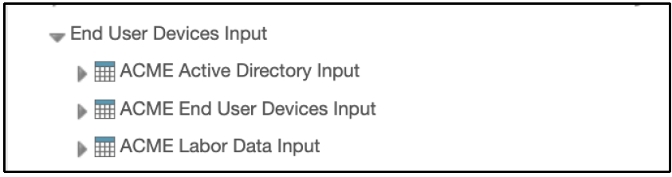
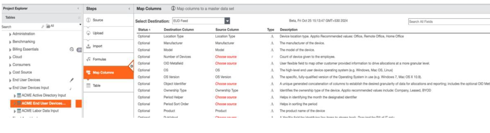
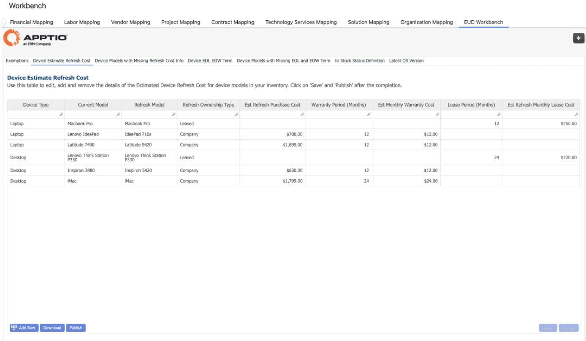
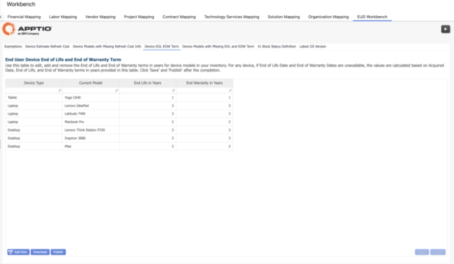
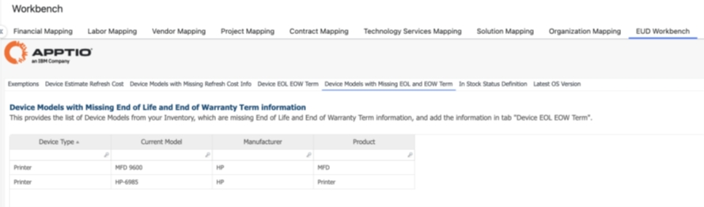
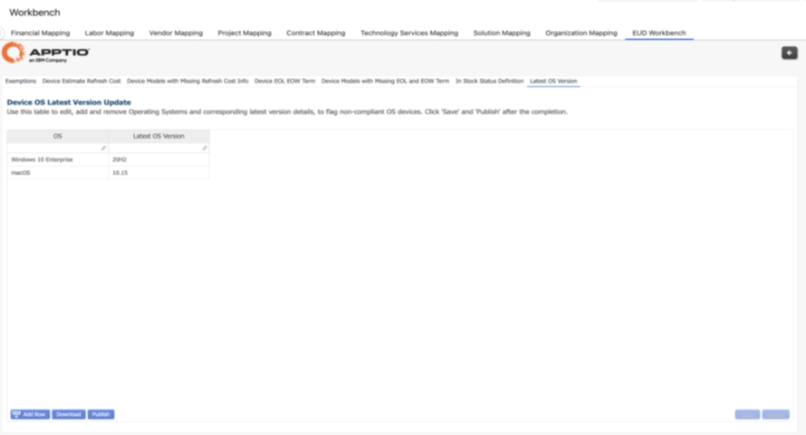
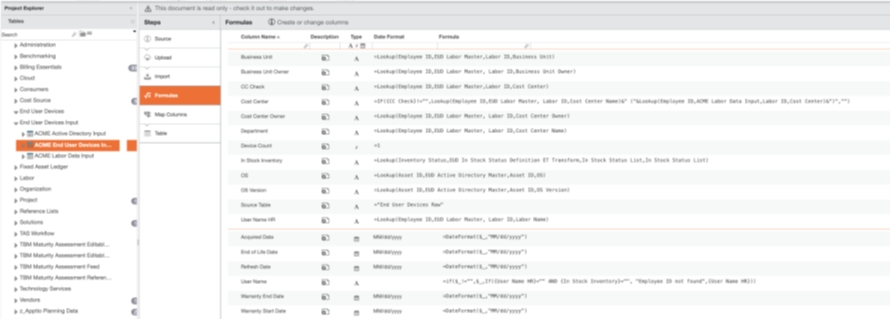
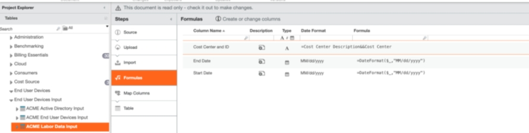

# Configure os dispositivos do usuário final

Conclua estas etapas para começar a usar os dispositivos do usuário final

**Instale o componente Dispositivos do usuário final**

(TBM Studio): Criar um projeto.

1. (TBM Studio): Os dispositivos do usuário final suportam várias moedas. Clique [aqui](#multi-cu "(Abre em uma nova guia ou janela)") para ver os detalhes da configuração.
2. (TBM Studio): Configure as definições de horário e faça o check-in das alterações.
3. (TBM Studio): Instalar o componente **Custo - Dispositivos do usuário final** no projeto.

O que há no componente?

1. (TBM Studio): Crie três tabelas de entrada para garantir que os detalhes relevantes sejam carregados.

Active Directory

Dispositivos do usuário final

Dados trabalhistas

Amostra para referência - O nome das tabelas pode ser específico do cliente.

1. (TBM Studio): Salve e faça o check-in das alterações.
2. (TBM Studio): Consulte a seção [Apêndice](#appendix "(Abre em uma nova guia ou janela)") para obter uma revisão das fórmulas de transformação usadas no projeto de referência.
3. (TBM Studio): Mapeie as tabelas a seguir para as tabelas Master e Feed correspondentes:

EUD Active Directory Master (tabela do Active Directory)

EUD Labor Master (dados trabalhistas)

EUD Feed (Dispositivos do usuário final)

1. (TBM Studio): Salve e faça o check-in das alterações.

Se houver alguma alteração, faça o upload da tabela de entrada em uma base adhoc/mensal para garantir a precisão dos relatórios.

Use o formato de data "MM/dd/aaaa" para todos os uploads e transformações de dados para evitar alterações de fórmula nas tabelas mestre.

**Bancada de trabalho EUD**

1. (Visualização de relatório): Navegue até Workbench > Workbench EUD > Isenções

Use essa tabela para editar, adicionar e remover usuários para isenção de dispositivo de relatórios e painéis.

Clique em Save (Salvar) e pressione Publish (Publicar) para propagar para todos os relatórios e modelos, "EUD Exemptions ET Transform"

1. (Visualização de relatório): Navegue até Workbench > Workbench EUD > Estimativa de custo de atualização do dispositivo

Use esta tabela para editar, adicionar e remover os detalhes do custo estimado de atualização do dispositivo para os modelos de dispositivos em seu inventário 

Clique em Save (Salvar) e pressione Publish (Publicar) para propagar para todos os relatórios e modelos, 'Device Estimate Refresh Cost ET Transform'.

1. (Visualização de relatório): Navegue até Workbench > Workbench EUD > Modelos de dispositivos com informações de custo de atualização ausentes

Verifique a lista de modelos de dispositivos de seu inventário, que estão faltando no Est Device Annual Refresh Cost.

1. (Visualização de relatório): Navegue até Workbench > Workbench EUD > Device EOL EOW Term

Use esta tabela para editar, adicionar e remover os termos de fim de vida útil e fim de garantia em anos para os modelos de dispositivos em seu inventário.

Clique em Save (Salvar) e pressione Publish (Publicar) para propagar para todos os relatórios e modelos, 'Device EOL and EOW Term ET Transform'.

1. (Visualização de relatório): Navegue até Workbench > Workbench EUD > Modelos de dispositivo com termo EOL e EOW ausentes

Isso fornece a lista de modelos de dispositivos do seu inventário que não têm informações sobre o fim da vida útil e o fim do prazo de garantia e adiciona as informações na guia "Device EOL EOW Term".

1. (Visualização de relatório): Navegue até Workbench > Workbench EUD > Definição em estoque

Use essa tabela para editar, adicionar e remover os diferentes status de dispositivo do usuário final que devem ser considerados como "Em estoque". A lista de status disponíveis nessa tabela é transformada em "Em estoque" em todos os relatórios do Insight do usuário final

Clique em Save (Salvar) e, em seguida, pressione Publish (Publicar) para propagar para todos os relatórios e modelos, 'EUD In Stock Status Definition ET Transform'.

1. (Visualização de relatório): Navegue até Workbench > EUD Workbench > Versão mais recente do sistema operacional

Use essa tabela para editar, adicionar e remover sistemas operacionais e os detalhes da versão mais recente correspondente, para sinalizar dispositivos com sistemas operacionais não compatíveis.

Clique em Save (Salvar) e pressione Publish (Publicar) para propagar para todos os relatórios e modelos, 'EUD OS Version ET Transform'.

1. (TBM Studio): Abra o modelo de dispositivos de usuário final e verifique as alocações de custo

**Custo de aquisição**

**Custo estimado de atualização**

Ambas as capturas de tela são para fins de referência e as alocações de custo podem variar de acordo com os dados

**Apêndice**

Fórmulas aplicadas para transformar os dados de entrada de referência para atender aos requisitos do EUD Master e do EUD Feed.

As fórmulas listadas abaixo destinam-se apenas a dados de referência. Os clientes podem atualizar essas fórmulas para se alinharem aos seus dados específicos e aos padrões do setor.

Instantâneo anexado das fórmulas aplicadas ao

**ACME Active Directory Entrada**

**Entrada de dispositivos de usuário final ACME**

**Entrada de dados trabalhistas da ACME**

**Múltiplas moedas**

Se o cliente usa várias moedas, esse seria um bom momento para configurar isso. A multimoeda é a mesma em Costing Essentials e em projetos de CT. Você pode consultar a [configuração de várias moedas](../../multi-currency/home.html) na Central de Ajuda.

No entanto, se o cliente usar um calendário não gregoriano, a versão mais recente do MCC não é compatível com o calendário não gregoriano. Se o seu cliente precisar de um calendário não gregoriano, siga a configuração do Legacy Multi-currency [aqui](../../studio/admin/configure-multi-currency.html).

Selecione a **moeda base** preferida.

**Tópico principal:** [Cálculo de custos e faturamento](../../costing-billing/home.html)
