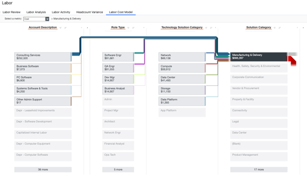
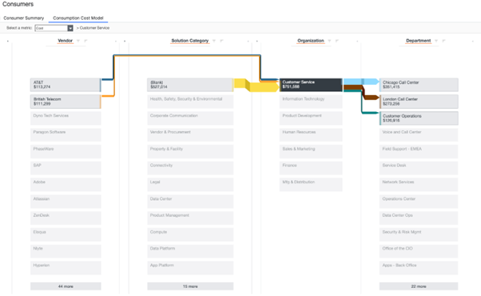

# Visão geral das visualizações de modelo

Os relatórios de visão geral do modelo oferecem uma visão abrangente dos fluxos de custos dentro do modelo, permitindo que os usuários visualizem e entendam as alocações de custos. Esse relatório foi desenvolvido para administradores e usuários avançados, oferecendo uma visão transparente e detalhada das consequências dos custos.

## Casos de uso

Este relatório resolve os seguintes casos de uso:

- Análise de alocações de custos para entender como os custos são distribuídos entre diferentes objetos
- Fornecer uma visão clara e transparente dos fluxos de custos para as partes interessadas
- Identificação de áreas para redução e otimização de custos
- Uso de dados de alocação de custos para informar as decisões de orçamento e previsão

## Personagens

- Admin
- Usuários avançados

## Perguntas respondidas

- Como os custos são alocados em diferentes objetos?
- Qual é a queda de custo para cada objeto?
- Como os custos fluem entre diferentes objetos?
- Quais são os principais fatores de custo no modelo?
- Como os custos podem ser otimizados e reduzidos?

## Visualização

Visualizações de modelos

**Visualizações do modelo -** *vistas apenas por Apptio Admin e Partner Admin*

Modelo de custo de mão de obra

Modelo de custo do fornecedor

Modelo de custo da solução

Modelo de custo de consumo

